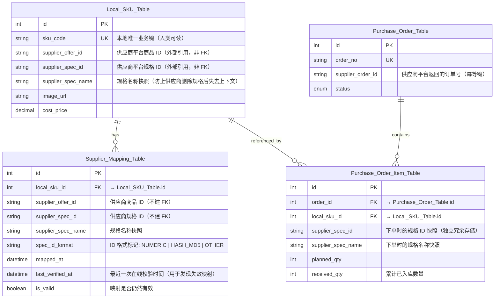
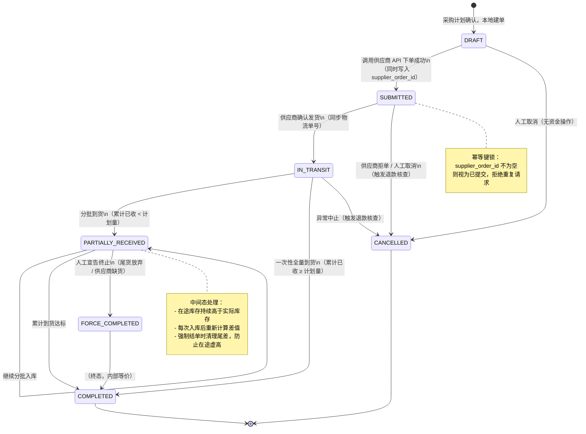
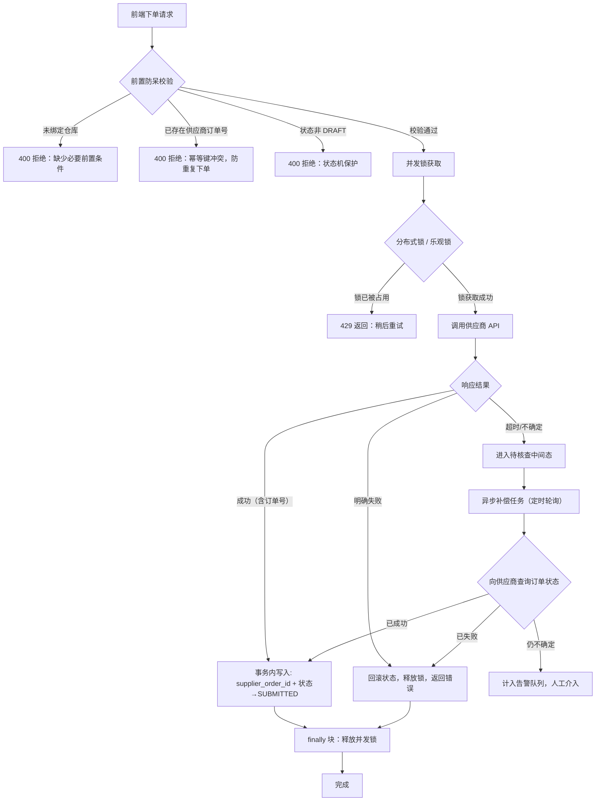
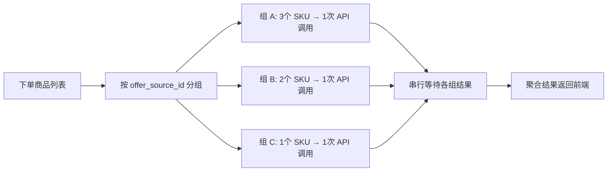
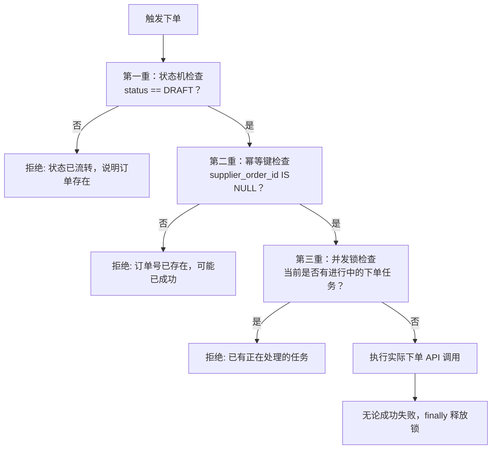
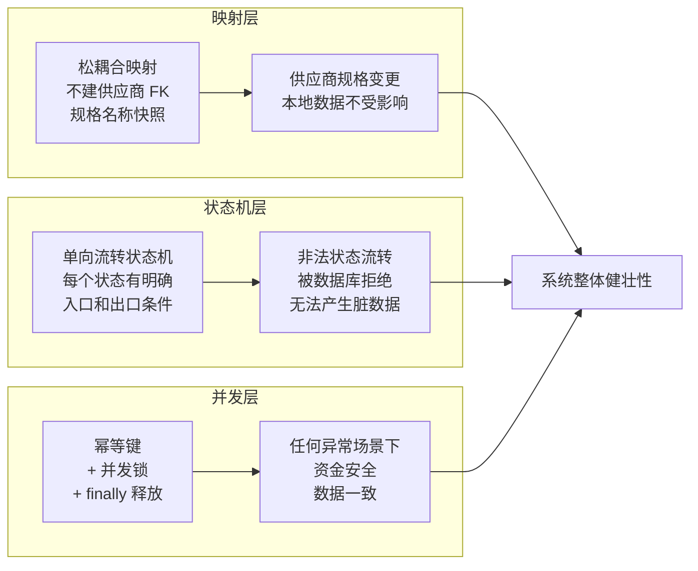

# 跨平台采购履约系统 —— 通用架构设计文档

> **文档定位**：本文档为技术无关、平台无关的通用架构抽象，脱离具体业务系统独立成文，适合跨团队技术交流与参考。  
> **适用场景**：任何需要对接第三方供应商平台（如批发/B2B 平台）并实现"本地 ERP 选品 → 线上自动化采购下单 → 物流跟踪 → 入库核销"全链路闭环的系统。

---

## 一、映射模型抽象：本地 SKU 与多规格供应商 SKU 的稳健绑定设计

### 1.1 核心挑战

第三方供应商平台（以下简称"供应商平台"）通常以"商品（Offer）+ 规格（Spec）"两级结构组织 SKU。核心挑战在于：

- **供应商规格 ID 不稳定**：供应商可能随时调整颜色、尺码等规格组合，导致旧的规格 ID 失效。
- **ID 格式多样**：供应商平台的规格 ID 可能是数字 ID、哈希字符串，甚至是 URL 编码，格式因平台而异，不能盲目信任。
- **跨平台松耦合需求**：本地 ERP 系统不能与供应商平台的 ID 体系产生强 DB 级依赖，否则一旦供应商平台 API 升级，将引发级联数据损坏。

### 1.2 推荐 ER 模型设计



### 1.3 关键设计决策说明

**决策一：映射关系不建数据库级外键约束（No Foreign Key to Supplier）**

`supplier_offer_id` 与 `supplier_spec_id` 均存储为普通字符串字段，不创建指向任何"供应商产品表"的 FK。原因：

- 供应商平台的 SKU 树随时可能发生变动（下架、改规格、合并），DB-FK 会导致本地数据受到供应商侧变更的牵连。
- 松耦合模式下，当供应商侧规格失效时，系统仅标记 `is_valid = false`，不会引发级联删除，业务数据保持完整。

**决策二：规格 ID 与规格名称双轨冗余存储**

下单时，除存储 `supplier_spec_id` 外，必须同时快照 `supplier_spec_name`（如"颜色:红色;尺码:XL"）。这样即使供应商规格 ID 失效，运营人员也能通过规格名称人工比对、重新绑定，不会丢失历史采购上下文。

**决策三：规格 ID 格式标准化校验**

不同供应商平台返回的规格 ID 格式差异极大。为防止上游格式变更导致下单失败，在写入映射表前应做格式校验：

```
验证逻辑（伪代码）：

IF spec_id 符合 32位十六进制 THEN
    spec_id_format = "HASH_MD5"
ELSE IF spec_id 仅含数字 THEN
    spec_id_format = "NUMERIC"
ELSE
    spec_id_format = "OTHER"
    → 触发告警，人工复核

下单时，按 spec_id_format 选择正确的字段名传给供应商 API。
```

**决策四：本地 SKU 的唯一业务键不使用数据库自增 ID**

对外引用本地 SKU 应使用 `sku_code`（人类可读的业务编码），而非自增 ID。原因：在多系统集成场景下，`id` 可能因数据库迁移而改变，而 `sku_code` 是稳定的业务标识。

---

## 二、状态机抽象：异步采购单的完整生命周期设计

### 2.1 核心挑战

向第三方供应商平台发起的采购单本质上是一个**分布式异步事务**：

- 下单操作是网络 IO，随时可能超时或返回不确定结果。
- 收货是分批次的线下行为，时间跨度可达数天到数周。
- 供应商侧的订单状态与本地状态存在同步延迟，需要轮询协调。
- 必须防止"已扣款但未拿到订单号"的资金损失场景。

### 2.2 完整状态流转图



### 2.3 各状态核心说明

| 状态 | 语义 | 关键数据操作 | 允许的后续操作 |
|------|------|------------|--------------|
| `DRAFT` | 本地已建单，尚未调供应商 API | 在途库存 `+= 计划量` | 提交下单、取消 |
| `SUBMITTED` | 供应商已受理，等待发货 | 回填 `supplier_order_id` | 同步物流状态、取消 |
| `IN_TRANSIT` | 供应商已发货，商品在途 | 记录物流单号 | 录入到货、强制结单 |
| `PARTIALLY_RECEIVED` | 首批货已到，等待尾款 | 累加 `received_qty`，扣减在途 | 继续入库、强制结单 |
| `COMPLETED` | 全量到货核销完毕 | 写库存流水，在途清零 | （终态） |
| `FORCE_COMPLETED` | 人工宣告终止 | 尾差在途库存强制归零 | （等价于终态） |
| `CANCELLED` | 订单终止 | 按阶段回滚在途库存 | （终态） |

### 2.4 中间态（`PARTIALLY_RECEIVED`）的处理策略

中间态是最容易出现数据不一致的阶段。推荐以下三原则：

**原则一：入库量累加，而非覆盖**

每次到货操作执行 `received_qty += 本次实盘量`，而非直接设置 `received_qty = 本次实盘量`。系统根据 `received_qty >= planned_qty` 来判断是否流转到 `COMPLETED`。

**原则二：在途库存实时扣减**

```
在途扣减公式：
new_in_transit = MAX(0, current_in_transit - 本次入库量)

使用 MAX(0, ...) 防止并发导致在途库存出现负数。
```

**原则三：强制结单时执行尾差清理**

当人工触发强制结单（`FORCE_COMPLETED`）时，系统必须：

1. 遍历所有子项，计算每个 SKU 的未到货量 = `planned_qty - received_qty`。
2. 对每个 SKU 执行：`in_transit = MAX(0, in_transit - 未到货量)`。
3. 这一步确保永远不会到达的货物不会持续虚占在途库存，导致补货决策失误。

### 2.5 撤销（Rollback）的数据恢复矩阵

高危操作：允许从任意中间态回滚到 `DRAFT`，需要恢复所有副作用：

| 撤销前状态 | 库存恢复操作 | 其他副作用处理 |
|-----------|------------|--------------|
| `DRAFT` | 在途 `-= 计划量` | 无 |
| `SUBMITTED` | 在途 `-= 计划量` | 清空 `supplier_order_id`，触发退款核查告警 |
| `IN_TRANSIT` | 在途 `-= 计划量` | 清空物流单号 |
| `PARTIALLY_RECEIVED` | 实物库存 `-= 已收量`；在途 `+= 计划量` | 写反向库存流水（MANUAL_ADJUST）；触发退款核查 |
| `COMPLETED` | 实物库存 `-= 已收量` | 写反向库存流水；强制人工复核 |

---

## 三、并发与异常兜底抽象：防超限、防重单、防资金损失

### 3.1 核心挑战

| 挑战 | 描述 |
|------|------|
| 限流 | 供应商 API 有 QPS 上限，高并发场景下瞬时超限会导致批量失败 |
| 网络超时 | 下单请求已发出但响应超时，系统无法判断是否成功 |
| 重复下单 | 超时重试时可能对同一采购计划重复调用下单接口 |
| 并发写冲突 | 多个员工同时操作同一采购单时引发数据竞争 |

### 3.2 整体防护架构图



### 3.3 API 限流应对策略

**策略一：令牌桶 / 漏桶限速**

在调用供应商 API 的客户端层（Adapter 层）维护一个速率控制器：

```
速率控制器（伪逻辑）：

CONFIG: max_requests_per_second = N  ← 来自配置，非硬编码

before_each_request():
    wait_time = rate_limiter.acquire_token()
    if wait_time > 0:
        sleep(wait_time)
    proceed()
```

**策略二：批量任务串行化**

定时同步任务（如批量同步供应商订单状态）必须采用**串行遍历**而非并发执行：

```
推荐模式（串行）：
for order in active_orders:
    try:
        sync_single_order(order.id)
    catch Exception as e:
        log_error(order.id, e)
        continue   ← 单条失败不中断全局循环

禁止模式（并发）：
Promise.all(active_orders.map(o => sync_single_order(o.id)))
↑ 会在毫秒内打满 API 限额，并且一处报错可能导致整批失败
```

**策略三：按供应商商品归组，分组串行提交**

供应商平台通常不支持跨店铺的混合下单。下单前应先对商品按所属店铺/来源归组，每组独立串行发起下单请求：



### 3.4 防重复下单：幂等键机制

下单流程中最危险的场景是：**请求已发出、钱已扣、但响应超时**，系统不知道单子是否建成功。

**三重防护设计：**



**超时场景的安全处理流程：**

```
1. 设置超时阈值（如 30s），超时后：
   a. 不立即将状态标记为失败（因为供应商可能已接受）
   b. 将订单置于 PENDING_VERIFICATION 待核查状态
   c. 触发异步补偿任务，以幂等方式向供应商查询"是否存在该笔订单"
   d. 查询成功 → 补填订单号，流转为 SUBMITTED
   e. 查询确认失败 → 回滚状态，通知运营人工核对资金
   f. 查询仍不确定 → 每 N 分钟重试，超过最大重试次数后转人工告警
```

### 3.5 并发锁设计：防止同一采购单被并发操作

**场景**：两个用户同时点击"确认入库"按钮，导致库存被重复累加。

**推荐方案：数据库乐观锁 + 版本号**

```
Purchase_Order_Table 增加字段：
  version INT DEFAULT 0

入库操作伪逻辑：
  UPDATE purchase_orders
  SET received_qty = received_qty + :delta,
      version = version + 1
  WHERE id = :id
    AND version = :expected_version  ← 乐观锁条件

IF affected_rows == 0:
  → 说明已被并发修改，返回 409 Conflict，让客户端刷新后重试
```

**或：使用内存级互斥锁（适合单节点部署）**

```
SyncLockMap = {}  // 全局 Map，key=任务类型+资源ID，value=布尔

before_operation(resource_id):
    lock_key = "purchase_order:" + resource_id
    IF SyncLockMap[lock_key] == true:
        return 429  ← 已有进行中的操作
    SyncLockMap[lock_key] = true

finally:
    SyncLockMap[lock_key] = false  ← 无论成功失败，必须在 finally 中释放
```

> **铁律**：锁的释放**必须**在 `finally` 块中执行，不能依赖 `try` 正常分支。否则一旦发生异常，锁将永久占用，导致该资源的所有后续操作全部拒绝（俗称"死锁"）。

### 3.6 防资金损失的最终兜底策略

| 场景 | 防护措施 |
|------|---------|
| 下单 API 超时 | 幂等键 + 异步补偿轮询，确认成功前不重新发起 |
| 供应商扣款但未返回订单号 | 待核查中间态 + 人工告警队列 |
| 操作员误操作（撤销已付款订单） | 撤销操作需要特定权限；已付款状态的撤销必须触发退款核查工单 |
| 分批入库数量录入有误 | `received_qty` 只能累加，不允许直接覆盖；如需更正，必须通过显式调整流水（MANUAL_ADJUST）实现，确保审计可追溯 |
| 强制结单清理在途时多扣 | 使用 `MAX(0, in_transit - undelivered)` 防止在途库存出现负数 |

---

## 四、架构总结：三大核心设计原则



| 设计维度 | 核心原则 | 避免的问题 |
|---------|---------|----------|
| **映射模型** | 外部 ID 字符串化存储，快照规格名称，不建 DB-FK | 供应商规格变更导致本地数据级联损坏 |
| **状态机** | 单向流转，中间态必须有明确的进出条件和补偿操作 | 采购单卡死在中间态，在途库存永久虚高 |
| **并发兜底** | 幂等键 + 乐观锁 + finally 释放锁 + 异步补偿 | 重复下单、资金损失、死锁 |

---

*文档版本：通用抽象版 v1.0 | 最后更新：2026-04*  
*本文档不含任何特定平台名称、API 参数、环境变量或业务表名，可对外公开分发。*
