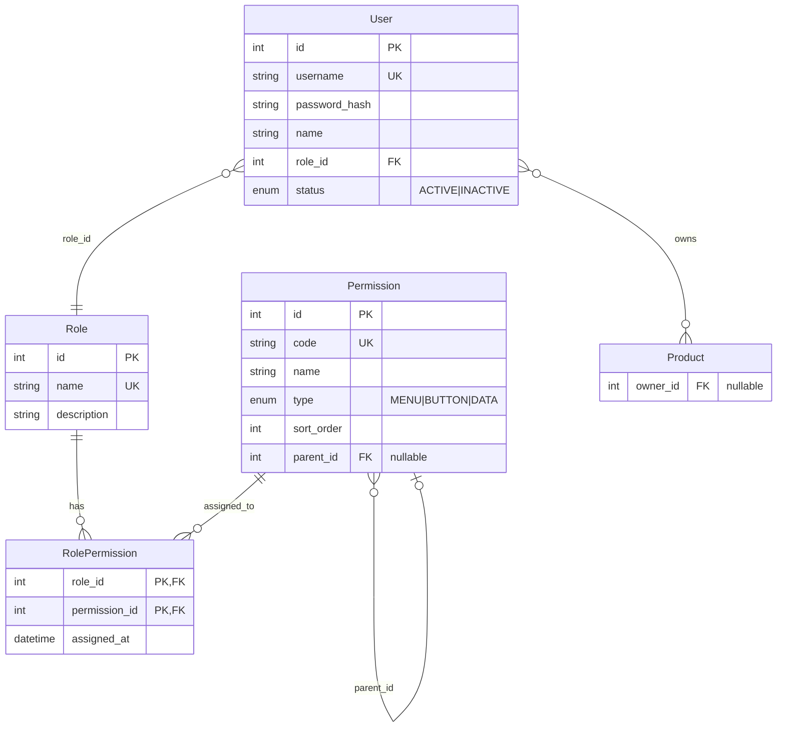
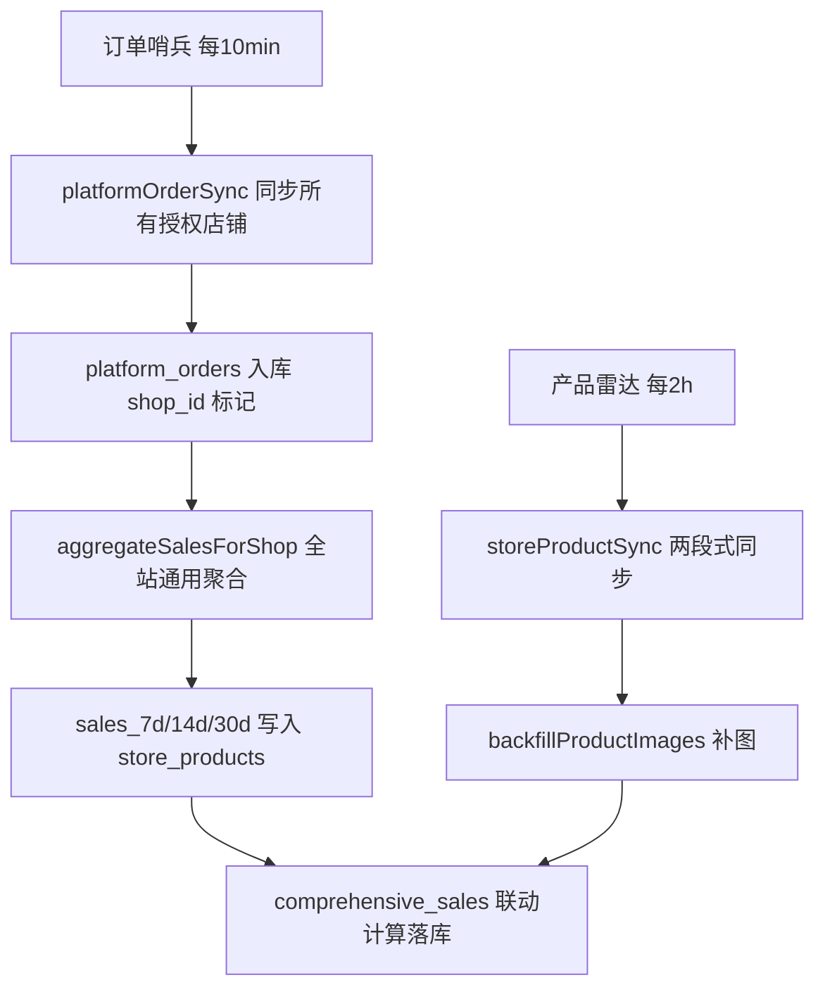

# EMAG 跨境电商管理系统 — 架构文档

> 本文档为开发铁律的落地说明，新功能开发前必须静默读取。重大模块完成后需主动询问是否更新。

---

## 1. 后端目录结构树 (Backend Directory Tree)

```
backend/
├── prisma/
│   ├── schema.prisma          # 唯一数据模型定义，表结构修改仅此入口
│   ├── migrations/            # Prisma 迁移历史
│   └── seed.ts                # 初始化角色、权限、种子数据
├── scripts/                   # 独立运维脚本（迁移、补全、诊断）
│   ├── init-permissions.ts    # ★ 权限菜单初始化（upsert 17个节点+授权超管）
│   ├── sync-store-products.ts
│   ├── sync-platform-orders.ts
│   ├── backfill-product-images.ts
│   ├── backfill-product-urls.ts
│   ├── diagnose-sales.ts      # 销量诊断
│   ├── diagnose-sales2.ts
│   ├── diagnose-sales3.ts
│   ├── verify-sales.ts        # 销量核对
│   ├── migrate-data.ts
│   ├── migrate-emag-region.ts
│   ├── migrate-bgn-to-eur.ts
│   ├── cleanup-placeholder-images.ts
│   ├── inspect-emag-product-response.ts
│   ├── inspect-emag-images.ts
│   ├── check-shop-api.ts
│   ├── fetch-order.ts
│   ├── sync-order-by-id.ts
│   ├── fix-site.ts
│   ├── fix-status-mapping.ts
│   ├── reset-status-text.ts
│   ├── wash-status-db.ts
│   ├── test-platform-orders-query.ts
│   └── preload-file-polyfill.js
├── src/
│   ├── index.ts               # 入口：Express 挂载、Cron 启动、健康检查
│   ├── adapters/              # 第三方 API 适配器
│   │   └── onebound.adapter.ts # 万邦 1688 item_get 解析（采购计划规格关联）
│   ├── lib/                   # 基础设施
│   │   ├── prisma.ts          # Prisma Client 单例
│   │   └── syncStatus.ts      # 并发同步锁（防死锁、finally 释放）
│   ├── middleware/
│   │   └── auth.ts            # JWT 认证、requirePermission 权限守卫；req.user 注入 userId/roleId/roleName/permissions
│   ├── routes/                # HTTP 路由（无独立 controllers，路由即入口）
│   │   ├── auth.ts            # POST /api/auth/login  — 登录（实时查库返回 permissions 数组）
│   │   │                      # GET  /api/auth/me     — 当前用户信息（实时权限码，刷新页面用）
│   │   ├── product.ts         # 公海产品(PENDING)查询、意向产品(SELECTED)增删改查、库存SKU管理
│   │   │                      #   ★ 意向产品数据隔离：超管看全部，普通员工只看自己(ownerId)
│   │   │                      #   ★ 库存SKU全员可见（无 ownerId 过滤）；isDeleted=true 自动过滤
│   │   │                      #   DELETE /api/products/inventory/:id — 智能混合删除
│   │   │                      #     → 无关联数据：物理删除（hard），返回 deleteType='hard'
│   │   │                      #     → 有 FK 约束(P2003)：软删除归档（soft），返回 deleteType='soft'
│   │   ├── order.ts           # 采购单、平台订单 CRUD
│   │   ├── user.ts            # 员工管理（增删改查）
│   │   ├── role.ts            # 角色 CRUD（含超管保护）
│   │   │                      #   GET    /api/roles          — 角色列表（含权限数/用户数）
│   │   │                      #   GET    /api/roles/:id             — 角色详情（含 permissionIds/permissionCodes，供权限回显）
│   │   │                      #   POST   /api/roles                 — 新增角色
│   │   │                      #   PUT    /api/roles/:id             — 编辑角色名称/描述
│   │   │                      #   PUT    /api/roles/:id/permissions — 覆盖式更新角色权限（事务原子，超管禁改）
│   │   │                      #   DELETE /api/roles/:id             — 删除角色（超管角色禁删；有用户时禁删）
│   │   ├── permission.ts      # 权限菜单 API（★ 新增）
│   │   │                      #   GET /api/permissions/tree  — 权限树状结构（供前端打勾勾使用）
│   │   │                      #   GET /api/permissions       — 权限平铺列表（供角色回显已选权限）
│   │   ├── shop.ts            # 店铺授权（增删改查）+ GET /api/shops/authorized（仪表盘下拉专用）
│   │   ├── emag.ts            # eMAG 业务（类目、发布、同步触发）
│   │   ├── storeProducts.ts   # 店铺在售产品（同步、补图、综合日销回填、库存绑定）
│   │   │                      #   GET  /api/store-products          — 分页列表（mappingStatus=mapped/unmapped/all 筛选；优先 Product 表查图片/成本）
│   │   │                      #   POST /api/store-products/sync     — 手动全量同步
│   │   │                      #   POST /api/store-products/map      — 绑定库存 SKU（★ SKU 字符串优先匹配，inventorySkuId 兜底；pnk+shopId 或 storeProductId 定位平台产品）
│   │   ├── dashboard.ts       # 业绩看板（stats、shops 下拉）
│   │   ├── translate.ts       # 翻译代理（MyMemory API 转发，ro→zh 等）
│   │   └── alibaba.ts         # 1688 OAuth、规格解析、下单、子单同步
│   ├── services/              # 核心业务逻辑
│   │   ├── emagClient.ts      # eMAG API 客户端（Adapter）：BaseURL/货币/域名按 region 查表
│   │   │                      # ★ 正向代理：所有 HTTPS 请求经 EMAG_PROXY_URL 代理转发（固定 IP 白名单）
│   │   ├── emagProduct.ts     # product_offer/read、product/read、documentation/find_by_eans
│   │   ├── emagProductNormalizer.ts  # 唯一 Normalizer：解析、图片提纯、输出统一结构
│   │   ├── storeProductSync.ts       # 两段式同步编排（补全 mainImage）
│   │   ├── alibabaOrder.ts           # 1688 下单 payload 组装与发送
│   │   ├── alibabaOrderSync.ts       # 1688 子单详情同步（buyerView），isFetch1688OrderError 类型守卫
│   │   ├── platformOrderSync.ts      # 平台订单同步（多店全量/增量）
│   │   ├── inventorySync.ts          # 库存推送到 eMAG
│   │   ├── syncCron.ts               # 订单哨兵(10min)、产品雷达(2h)、库存同步(1h)
│   │   ├── salesStats.ts             # 全站销量聚合（无 shopId/region 硬编码）
│   │   ├── dashboardStats.ts         # 看板数据（getStatsFromLocalDB / getStatsByDateRange）
│   │   ├── emagOrder.ts              # eMAG 订单相关操作
│   │   ├── emagLogistics.ts          # eMAG 物流查询
│   │   ├── emagRateLimit.ts          # 限流与延迟（3 req/s）
│   │   └── importPublicSea.ts        # 公海产品 JSON 批量导入
│   └── utils/
│       ├── shopCrypto.ts      # 店铺凭证 AES-256 加解密
│       └── alibaba.ts         # 1688 API 签名、HTTP 调用、callAlibabaAPIPost
└── package.json
```

### 核心目录职责

| 目录 | 职责 |
|------|------|
| `src/lib` | 数据库连接、同步锁等基础设施，无业务逻辑 |
| `src/middleware` | 认证与权限校验，`req.user` 注入 `{ userId, username, roleId, roleName, permissions[] }` |
| `src/routes` | 接收请求、调用 services、返回统一 `{ code, data, message }` |
| `src/services` | 业务逻辑、API 调用、Normalizer、同步编排 |
| `src/utils` | 纯工具函数，无副作用或可复用加解密 |
| `src/adapters` | 封装第三方平台 API（万邦/1688），提供规范化输出接口 |

---

## 2. 动态权限 RBAC 关联图 (Mermaid ER Diagram)



### 数据隔离原则（.cursorrules 约定）

- **菜单/按钮级控制**：前端根据 `permissions` 数组渲染菜单与按钮，无权限则不展示。
- **数据级过滤（三产品池模型）**：

| 产品池 | Prisma 查询条件 | 访问控制 |
|--------|----------------|---------|
| 公海产品 | `{ status: 'PENDING', ownerId: null }` | 全员可见 |
| 意向产品 | `{ status: 'SELECTED' }` | ★ 超管看全部；普通员工加 `ownerId: userId` 过滤 |
| 库存 SKU | `Inventory` 全表 | 全员可见（无 ownerId 过滤） |

- **超管判定逻辑**（`src/routes/product.ts`）：
  ```typescript
  // 优先检查 roleName，再检查超高权限码
  const isSuperAdmin =
    user.roleName?.includes('admin') ||
    user.roleName?.includes('超级管理员') ||
    user.permissions?.includes('*') ||
    user.permissions?.includes('ALL') ||
    (user.permissions?.includes('MANAGE_ACCOUNTS') &&
      user.permissions?.includes('MANAGE_ROLES'));
  ```
- **禁止硬编码角色 ID**：不得出现 `if (roleId === 1)`，一律通过 `roleName` 或 `Permission.code` 判断。
- **角色 CRUD 保护**：`DELETE /api/roles/:id` 内置双重保护——禁止删除名称含"超级管理员"的角色；禁止删除仍绑定用户的角色（返回 409）。

---

## 3. eMAG 核心业务流线图 — 两段式深层抓取 + 库存 SKU 绑定兜底

```mermaid
graph TD
    A[定时任务 / 手动触发] --> B[getEmagCredentials 初始化 Adapter]
    B --> C[product_offer/read Offer API 抓取]
    C --> D[Adapter 按 shop.region 查表获取 BaseURL/货币/域名]
    D --> E[Normalizer 清洗 emagProductNormalizer]
    E --> F[images 数组提取 display_type=1 主图]
    F --> G[StoreProduct Upsert 入库 — 有图覆盖/无图保留旧值]
    G --> H[第二阶段: 提取无图 SKU]
    H --> I{documentation/find_by_eans 预拉 EAN 图}
    I --> J[product/read Catalog API 批量抓图]
    J --> K[Normalizer 再次清洗]
    K --> L[补全 main_image 回写 StoreProduct]
    L --> M[GET /api/store-products 列表接口]
    M --> N[查 Product 表获取 localImage/cost，兜底 Inventory 表]
    N --> O[图片回退: emagImage \|\| localImage]
    O --> P[统一输出 image/imageUrl/main_image]
```

### 流程说明

| 阶段 | 组件 | 说明 |
|------|------|------|
| 触发 | `syncCron` / `POST /api/store-products/sync` | 产品雷达每 2 小时；手动可指定 shopId |
| Adapter | `emagClient.getEmagCredentials` | 从 `shop_authorizations` 读取 region，查 `REGION_*` 字典获取 BaseURL、货币、域名 |
| Offer API | `emagProduct.readProductOffers` | `product_offer/read` 分页拉取 SKU、价格、库存 |
| Normalizer | `emagProductNormalizer.normalizeEmagProduct` | 唯一数据清洗管线，无条件信任 eMAG 返回的图片 URL |
| images 主图 | `extractFirstImageFromArray` | 按 eMAG 官方文档：`display_type===1` 为主图 url，无则取首项；支持 JSON 字符串自动解析 |
| Upsert | `prisma.storeProduct.upsert` | `shopId + pnk` 唯一键；有新图片时覆盖，API 无图时保留 DB 已有值（防止清空 1688 绑定图片） |
| 无图提取 | `StoreProduct.findMany` | `mainImage` 为 null 或空 |
| Catalog API | `emagProduct.readProductsByPnk` | `product/read` 批量查询完整产品详情（含 images） |
| 补全入库 | `prisma.storeProduct.updateMany` | 回写 `mainImage`、`imageUrl` |
| **库存 SKU 绑定兜底** | `StoreProduct.mappedInventorySku` (String?) | 存储 `Product.sku` 字符串（**无 FK 约束**）；列表接口用该值去 `Product` 表查图片/成本，兜底 `Inventory` 表；图片优先级：**平台图 > 本地库存图** |
| 列表接口 | `GET /api/store-products` | 先查 `Product` 表批量获取 `imageUrl`/`purchasePrice`，缺失时再查 `Inventory` 表；`finalImage = emagImage \|\| localImage`；统一输出 `image`/`imageUrl`/`main_image` |

> **跟卖产品图片说明**：eMAG 的 `product_offer/read` 对跟卖(follow)产品不返回图片。采用【库存 SKU 绑定兜底策略】：通过 `POST /api/store-products/map` 手动绑定。
>
> **绑定接口参数解析优先级（2026-03-12 修正）**：
> - **库存 SKU 定位**：★ 优先按 `inventorySku` 字符串查 `Product.sku`（唯一业务键，最可靠）；字符串未命中时才按 `inventorySkuId` 查 `Product.id` 兜底。原因：前端传的 `inventorySkuId` 可能与 `Product.id` 不一致。
> - **平台产品定位**：支持 `pnk+shopId`（自动查 `StoreProduct` 联合索引）或直传 `storeProductId`。
>
> **架构变更说明（2026-03-12）**：`StoreProduct.mappedInventorySku` 原有 `→ Inventory.sku` 的 DB 级外键约束已移除。"库存 SKU" 主数据现统一在 `Product` 表管理，`Inventory` 表作为历史兜底数据源保留。

---

## 4. 多店销量聚合与综合日销体系

### 4.1 核心字段说明

| 字段 | 所在表 | 说明 |
|------|--------|------|
| `sales_7d` / `sales_14d` / `sales_30d` | `store_products` | 近 7/14/30 天的订单实销量，由 `salesStats.ts` 聚合写入 |
| `comprehensive_sales` | `store_products` | 综合日销 = `(sales7d/7×0.3) + (sales14d/14×0.3) + (sales30d/30×0.4)`，保留两位小数 |

### 4.2 销量聚合管线 (`salesStats.ts`)

**原则：全站通用，绝无 shopId/region 硬编码。**

```
aggregateSalesForShop(shopId)
  └── 从 platform_orders 聚合订单销量
        WHERE shop_id = shopId          ← 动态传入，覆盖所有站点
        AND   status IN (有效状态集)     ← 通过 shopId 关联 region，查表动态匹配
        AND   order_date >= NOW() - INTERVAL '30 days'
  └── 按 vendor_sku（归一化后）GROUP BY，统计 d7/d14/d30 销量
  └── 批量 UPDATE store_products SET sales_7d, sales_14d, sales_30d
  └── 触发 comprehensive_sales 联动计算（见 4.3）
```

**时区处理**：日期窗口（7/14/30天）使用 UTC 统一计算，不依赖店铺所在时区，避免多站点数据不一致。

**订单状态映射**：通过 `shop_authorizations.region` 查 `REGION_CONFIG` 字典，动态获取该站点的有效订单状态（如 RO=`Finalizat`、BG/HU 对应值），不在聚合函数内硬编码任何状态字符串。

### 4.3 综合日销计算与落库

综合日销公式（固化在 `backfillComprehensiveSales` 与 Normalizer 双入口）：

```typescript
const comprehensiveSales = parseFloat(
  ((sales7d / 7) * 0.3 + (sales14d / 14) * 0.3 + (sales30d / 30) * 0.4).toFixed(2)
);
```

**触发时机（两处联动）**：
1. **同步管线触发**：`syncCron.ts` 的 `runProductRadar`（每 2 小时）在 `backfillProductImages` 完成后，自动调用 `backfillComprehensiveSales()`，全站无差别回填。
2. **手动 API 触发**：`POST /api/store-products/backfill-comprehensive-sales` 支持按需全量补算。

### 4.4 服务端排序管线 (`GET /api/store-products`)

前端传入 `sortBy`（snake_case 字段名）和 `sortOrder`（`ascend`/`descend`），后端通过 `FIELD_MAP` 将其转换为 Prisma camelCase 字段并动态注入 `orderBy`：

```
req.query.sortBy = 'comprehensive_sales'
req.query.sortOrder = 'descend'
  └── FIELD_MAP['comprehensive_sales'] → 'comprehensiveSales'
  └── 'descend' → 'desc'
  └── prisma.storeProduct.findMany({ orderBy: { comprehensiveSales: 'desc' } })
```

默认排序：`syncedAt: 'desc'`（最新同步优先）。

### 4.5 多站点数据一致性保障



**防回归机制**：`salesStats.ts` 诊断日志仅输出当前 shopId 下销量最高的 Top3 SKU（动态取值），严禁出现任何硬编码 SKU 或 region 字符串。

---

## 5. 1688 采购计划规格解析（万邦 API）

| 组件 | 说明 |
|------|------|
| `src/adapters/onebound.adapter.ts` | 万邦 1688 item_get Adapter，读取 `ONEBOUND_API_KEY`、`ONEBOUND_API_SECRET` |
| `POST /api/alibaba/parse-link` | 解析 1688 链接 → 调用 `get1688Item(numIid)` → `normalizeOneboundSkus` 提纯 |

**数据提纯**：绝不返回万邦原始 JSON。遍历 `res.item.skus.sku`，映射为 `{ skuId, specName, price, stock }[]`，兼容前端 `specId`/`specName`/`price`/`imageUrl` 结构。

**防坠毁**：`try...catch` 包裹万邦调用，超时 15s，失败返回 `{ code: 500, message: '万邦接口解析失败，请重试或检查链接' }`。

---

## 6. 1688 下单拆单与防错位

| 规则 | 说明 |
|------|------|
| **严格 ID 匹配** | `cargoParamList` 每项 `offerId`/`specId` 必须取自当前 product，禁止循环外共用变量；`specId` 强制 `String()` 转换 |
| **按 offerId 拆单** | 1688 不支持跨店，按 `offerId` 分组，每组独立调用 `alibaba.trade.fastCreateOrder` |
| **脏数据过滤** | 过滤 `externalProductId` 为空或无效的 product，返回友好提示 |
| **强制日志** | 发起 HTTP 请求前打印 `=== FINAL 1688 ORDER PAYLOAD ===` + `=== 1688 ORDER SUBMIT PAYLOAD ===` |
| **specId 双轨** | 1688 期望 specId 为 32 位 MD5 哈希；万邦返回 `spec_id`，优先于纯数字 `sku_id`；cargoParamList 同时传 `specId` 与 `skuId` 双重保险 |

---

## 7. 仪表盘店铺下拉框数据源

| 接口 | 用途 | 过滤条件 |
|------|------|----------|
| `GET /api/shops` | 店铺管理页全量列表 | 无，返回所有店铺 |
| `GET /api/shops/authorized` | 仪表盘下拉框专用 | `platform=emag`、`status=active`，无 region 硬编码 |
| `GET /api/dashboard/shops` | 同上（别名） | 同上 |

**RBAC**：当前架构无 `UserShop` 表，所有已登录用户可见全部 eMAG 活跃店铺，无按 userId 的数据隔离。

**调试日志**：上述接口返回前打印 `=== DASHBOARD SHOPS ===` + `shopName+region` 列表，便于核实后端是否查出完整数据。

---

## 8. API 路由总览

| 路由前缀 | 文件 | 主要功能 |
|---------|------|---------|
| `POST /api/auth/login` | `routes/auth.ts` | 登录（用户名+密码，返回 JWT + 实时权限码数组） |
| `GET /api/auth/me` | `routes/auth.ts` | 获取当前用户信息（实时查库返回最新权限码，供刷新页面恢复状态） |
| `GET/POST/PUT/DELETE /api/roles` | `routes/role.ts` | 角色 CRUD；超管保护、有用户禁删 |
| `GET /api/roles/:id` | `routes/role.ts` | 角色详情（含 `permissionIds`/`permissionCodes`，供权限回显） |
| `PUT /api/roles/:id/permissions` | `routes/role.ts` | 覆盖式更新角色权限（事务原子；超管禁改） |
| `GET /api/permissions/tree` | `routes/permission.ts` | ★ 权限树状结构（前端角色配置打勾用） |
| `GET /api/permissions` | `routes/permission.ts` | 权限平铺列表（角色回显已选权限） |
| `GET/POST/PUT/DELETE /api/users` | `routes/user.ts` | 员工管理 |
| `GET /api/products` | `routes/product.ts` | 公海产品列表（全员可见） |
| `GET /api/products/private` | `routes/product.ts` | 意向产品列表（★数据隔离：超管全看/员工看自己；★强制过滤：`status=SELECTED AND pnk NOT LIKE 'MAN-%'`，手动导入老 SKU 不进意向池，正常 eMAG 产品建库后继续留在意向池直到 PURCHASING） |
| `GET /api/products/inventory` | `routes/product.ts` | 库存 SKU 列表（全员可见） |
| `GET /api/store-products` | `routes/storeProducts.ts` | 店铺平台产品分页列表（含图片兜底、排序；`mappingStatus=mapped/unmapped/all` 关联状态筛选） |
| `POST /api/store-products/sync` | `routes/storeProducts.ts` | 手动触发全量同步 |
| `POST /api/store-products/backfill-comprehensive-sales` | `routes/storeProducts.ts` | 综合日销全量回填 |
| `POST /api/store-products/map` | `routes/storeProducts.ts` | 绑定平台产品与库存 SKU（★ SKU 字符串优先 → inventorySkuId 兜底；pnk+shopId 或 storeProductId 定位平台产品） |
| `GET/POST /api/shops` | `routes/shop.ts` | 店铺授权管理 |
| `GET /api/shops/authorized` | `routes/shop.ts` | 仪表盘下拉专用（eMAG 活跃店铺） |
| `GET /api/dashboard/*` | `routes/dashboard.ts` | 业绩看板数据 |
| `GET/POST /api/orders` | `routes/order.ts` | 采购单/平台订单 |
| `POST /api/alibaba/*` | `routes/alibaba.ts` | 1688 OAuth/解析/下单/子单同步 |
| `POST /api/emag/*` | `routes/emag.ts` | eMAG 类目同步/产品发布 |
| `POST /api/translate` | `routes/translate.ts` | 翻译代理（MyMemory API 转发，罗马尼亚语→中文等，需登录） |

---

## 9. 待前端补充

- 前端目录结构（React 18 + Vite + Ant Design）
- 路由与页面映射（React Router）
- 权限码与菜单树对应关系
- 公海/入选/采购单/角色管理等核心页面交互流
- 环境变量 `.env.local` 与 Vite `proxy` 联调配置说明

---

*文档版本：基于 backend + prisma/schema.prisma 生成，最后更新：权限菜单初始化（init-permissions.ts）+ GET /api/permissions/tree API*
