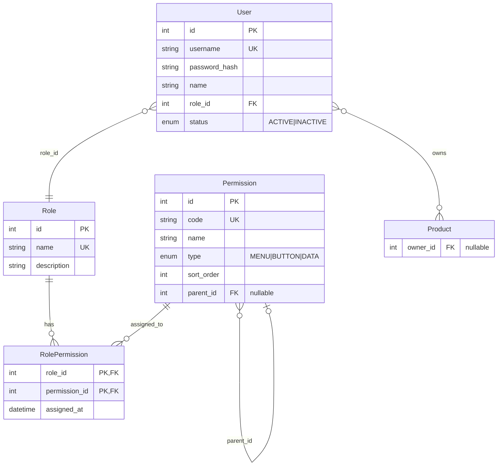
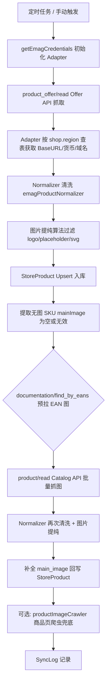

# EMAG 跨境电商管理系统 — 架构文档

> 本文档为开发铁律的落地说明，新功能开发前必须静默读取。重大模块完成后需主动询问是否更新。

---

## 1. 后端目录结构树 (Backend Directory Tree)

```
backend/
├── prisma/
│   ├── schema.prisma          # 唯一数据模型定义，表结构修改仅此入口
│   ├── migrations/            # Prisma 迁移历史
│   └── seed.ts                # 初始化角色、权限、种子数据
├── scripts/                   # 独立运维脚本（迁移、补全、诊断）
│   ├── sync-store-products.ts
│   ├── sync-platform-orders.ts
│   ├── backfill-product-images.ts
│   ├── backfill-product-urls.ts
│   └── ...
├── src/
│   ├── index.ts               # 入口：Express 挂载、Cron 启动、健康检查
│   ├── lib/                   # 基础设施
│   │   ├── prisma.ts          # Prisma Client 单例
│   │   └── syncStatus.ts      # 并发同步锁（防死锁、finally 释放）
│   ├── middleware/
│   │   └── auth.ts            # JWT 认证、requirePermission 权限守卫
│   ├── routes/                # HTTP 路由（无独立 controllers，路由即入口）
│   │   ├── auth.ts            # POST /api/auth/login
│   │   ├── product.ts         # 公海产品 CRUD、入选、采购单
│   │   ├── order.ts           # 采购单、平台订单
│   │   ├── user.ts            # 员工管理
│   │   ├── role.ts            # 角色与权限
│   │   ├── shop.ts            # 店铺授权
│   │   ├── emag.ts            # eMAG 业务（类目、发布、同步触发）
│   │   ├── storeProducts.ts    # 店铺在售产品、手动同步
│   │   ├── dashboard.ts       # 业绩看板
│   │   └── alibaba.ts         # 1688 授权
│   ├── services/              # 核心业务逻辑
│   │   ├── emagClient.ts      # eMAG API 客户端（Adapter）：BaseURL/货币/域名按 region 查表
│   │   ├── emagProduct.ts     # product_offer/read、product/read、documentation/find_by_eans
│   │   ├── emagProductNormalizer.ts  # 唯一 Normalizer：解析、图片提纯、输出统一结构
│   │   ├── storeProductSync.ts       # 两段式同步编排、backfillProductUrls/Images
│   │   ├── productImageCrawler.ts    # 商品页爬虫补图（API 无图时的兜底）
│   │   ├── platformOrderSync.ts     # 平台订单同步
│   │   ├── inventorySync.ts        # 库存推送到 eMAG
│   │   ├── syncCron.ts              # 订单哨兵(10min)、产品雷达(2h)、库存同步(1h)
│   │   ├── emagRateLimit.ts         # 限流与延迟
│   │   ├── salesStats.ts            # 销售统计
│   │   ├── dashboardStats.ts        # 看板数据
│   │   └── ...
│   └── utils/
│       ├── shopCrypto.ts      # 店铺凭证 AES-256 加解密
│       └── alibaba.ts         # 1688 工具
└── package.json
```

### 核心目录职责

| 目录 | 职责 |
|------|------|
| `src/lib` | 数据库连接、同步锁等基础设施，无业务逻辑 |
| `src/middleware` | 认证与权限校验，`req.user` 注入 `userId/roleId/permissions` |
| `src/routes` | 接收请求、调用 services、返回统一 `{ code, data, message }` |
| `src/services` | 业务逻辑、API 调用、Normalizer、同步编排 |
| `src/utils` | 纯工具函数，无副作用或可复用加解密 |

---

## 2. 动态权限 RBAC 关联图 (Mermaid ER Diagram)



### 数据隔离原则（.cursorrules 约定）

- **菜单/按钮级控制**：前端根据 `permissions` 数组渲染菜单与按钮，无权限则不展示。
- **数据级过滤**：涉及业务流转的数据（如入选产品 `Product`、采购单、订单），查询时必须联合 `req.user.userId` 与角色数据权限进行 Prisma 级过滤。例如：
  - 公海产品：`where: { status: 'PENDING' }` 或按角色可见范围
  - 已入选产品：`where: { ownerId: req.user.userId }` 或按数据权限扩展
- **禁止硬编码角色**：不得出现 `if (role === 'ADMIN')`，一律通过 `Permission.code` 判断。

---

## 3. eMAG 核心业务流线图 — 两段式深层抓取 (Mermaid Flowchart)



### 流程说明

| 阶段 | 组件 | 说明 |
|------|------|------|
| 触发 | `syncCron` / `POST /api/store-products/sync` | 产品雷达每 2 小时；手动可指定 shopId |
| Adapter | `emagClient.getEmagCredentials` | 从 `shop_authorizations` 读取 region，查 `REGION_*` 字典获取 BaseURL、货币、域名 |
| Offer API | `emagProduct.readProductOffers` | `product_offer/read` 分页拉取 SKU、价格、库存 |
| Normalizer | `emagProductNormalizer.normalizeEmagProduct` | 唯一数据清洗管线，解析 attachments/images/description |
| 图片提纯 | `isInvalidImageUrl` | 过滤 `logo`、`emag-placeholder`、`.svg`、`temporary-images`、`1x1` |
| Upsert | `prisma.storeProduct.upsert` | `shopId + pnk` 唯一键，有则更新无则创建 |
| 无图提取 | `StoreProduct.findMany` | `mainImage` 为 null/空/无效链接 |
| Catalog API | `emagProduct.readProductsByPnk` | `product/read` 批量查询完整产品详情（含 images） |
| 补全入库 | `prisma.storeProduct.updateMany` | 回写 `mainImage`、`imageUrl` |
| 兜底 | `productImageCrawler.fetchMainImageFromProductPage` | 当 API 无图时，从 product_url 爬取 og:image |

---

## 4. 待前端补充

- 前端目录结构
- 路由与页面映射
- 权限码与菜单树对应关系
- 公海/入选/采购单等核心页面交互流

---

*文档版本：基于 backend + prisma/schema.prisma 生成，最后更新：架构沉淀任务*
