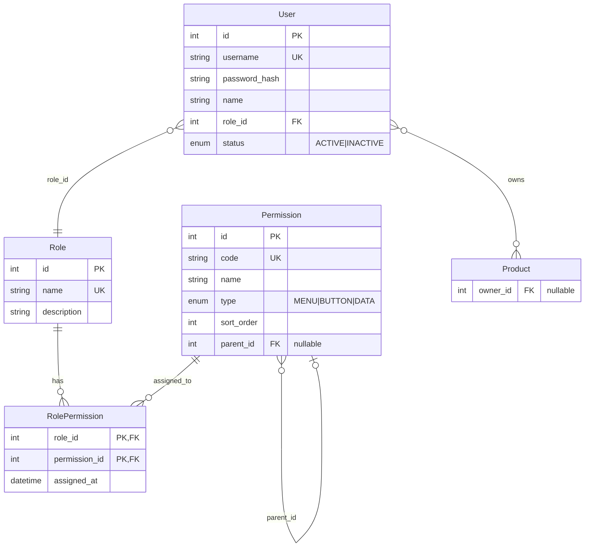
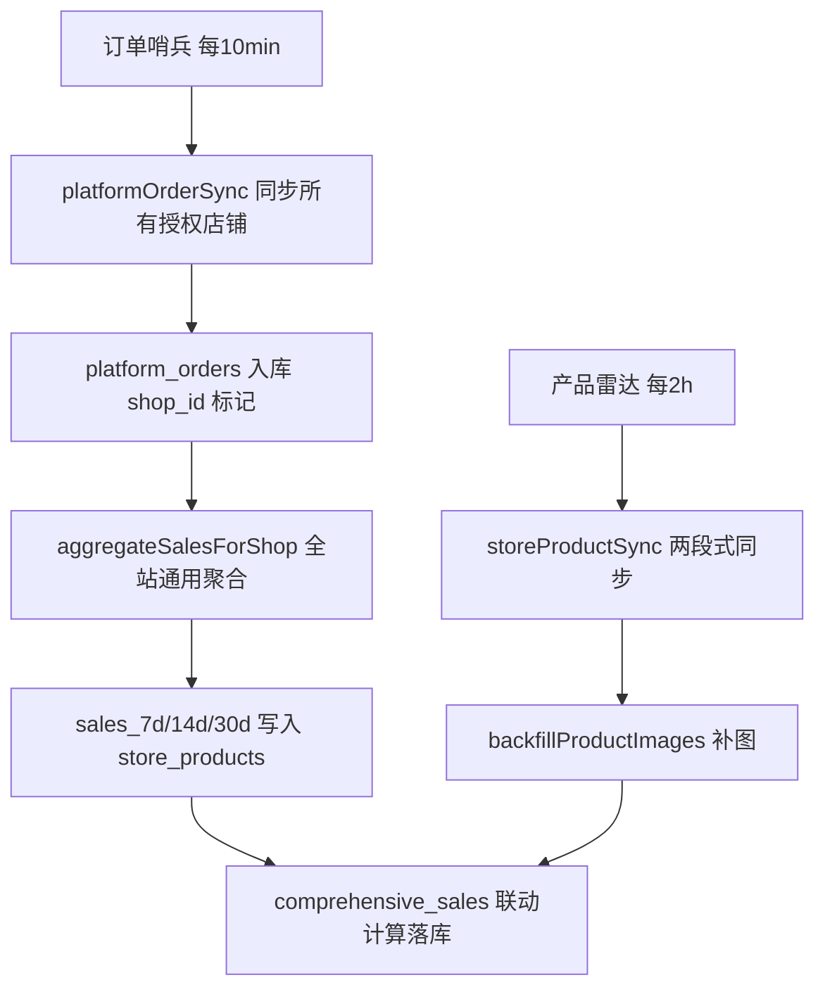

# EMAG 跨境电商管理系统 — 架构文档

> 本文档为开发铁律的落地说明，新功能开发前必须静默读取。重大模块完成后需主动询问是否更新。

---

## 1. 后端目录结构树 (Backend Directory Tree)

```
backend/
├── prisma/
│   ├── schema.prisma          # 唯一数据模型定义，表结构修改仅此入口
│   ├── migrations/            # Prisma 迁移历史
│   └── seed.ts                # 初始化角色、权限、种子数据
├── scripts/                   # 独立运维脚本（迁移、补全、诊断）
│   ├── init-permissions.ts    # ★ 权限菜单初始化（upsert 20个节点+授权超管；含仓储管理/仓库列表/FBE发货单）
│   ├── sync-store-products.ts
│   ├── sync-platform-orders.ts
│   ├── backfill-product-images.ts
│   ├── backfill-product-urls.ts
│   ├── diagnose-sales.ts      # 销量诊断
│   ├── diagnose-sales2.ts
│   ├── diagnose-sales3.ts
│   ├── verify-sales.ts        # 销量核对
│   ├── migrate-data.ts
│   ├── migrate-emag-region.ts
│   ├── migrate-bgn-to-eur.ts
│   ├── cleanup-placeholder-images.ts
│   ├── inspect-emag-product-response.ts
│   ├── inspect-emag-images.ts
│   ├── check-shop-api.ts
│   ├── fetch-order.ts
│   ├── sync-order-by-id.ts
│   ├── fix-site.ts
│   ├── fix-status-mapping.ts
│   ├── reset-status-text.ts
│   ├── wash-status-db.ts
│   ├── test-platform-orders-query.ts
│   └── preload-file-polyfill.js
├── src/
│   ├── index.ts               # 入口：Express 挂载、Cron 启动、健康检查
│   ├── adapters/              # 第三方 API 适配器
│   │   └── onebound.adapter.ts # 万邦 1688 item_get 解析（采购计划规格关联）
│   ├── lib/                   # 基础设施
│   │   ├── prisma.ts          # Prisma Client 单例
│   │   └── syncStatus.ts      # 并发同步锁（防死锁、finally 释放）
│   ├── middleware/
│   │   └── auth.ts            # JWT 认证、requirePermission 权限守卫；req.user 注入 userId/roleId/roleName/permissions
│   ├── routes/                # HTTP 路由（无独立 controllers，路由即入口）
│   │   ├── auth.ts            # POST /api/auth/login  — 登录（实时查库返回 permissions 数组）
│   │   │                      # GET  /api/auth/me     — 当前用户信息（实时权限码，刷新页面用）
│   │   ├── product.ts         # 公海产品(PENDING)查询、意向产品(SELECTED)增删改查、库存SKU管理
│   │   │                      #   ★ 意向产品数据隔离：超管看全部，普通员工只看自己(ownerId)
│   │   │                      #   ★ 库存SKU全员可见（无 ownerId 过滤）；isDeleted=true 自动过滤
│   │   │                      #   DELETE /api/products/inventory/:id — 智能混合删除
│   │   │                      #     → 无关联数据：物理删除（hard），返回 deleteType='hard'
│   │   │                      #     → 有 FK 约束(P2003)：软删除归档（soft），返回 deleteType='soft'
│   │   ├── order.ts           # 采购单、平台订单 CRUD
│   │   ├── user.ts            # 员工管理（增删改查）
│   │   ├── role.ts            # 角色 CRUD（含超管保护）
│   │   │                      #   GET    /api/roles          — 角色列表（含权限数/用户数）
│   │   │                      #   GET    /api/roles/:id             — 角色详情（含 permissionIds/permissionCodes，供权限回显）
│   │   │                      #   POST   /api/roles                 — 新增角色
│   │   │                      #   PUT    /api/roles/:id             — 编辑角色名称/描述
│   │   │                      #   PUT    /api/roles/:id/permissions — 覆盖式更新角色权限（事务原子，超管禁改）
│   │   │                      #   DELETE /api/roles/:id             — 删除角色（超管角色禁删；有用户时禁删）
│   │   ├── permission.ts      # 权限菜单 API（★ 新增）
│   │   │                      #   GET /api/permissions/tree  — 权限树状结构（供前端打勾勾使用）
│   │   │                      #   GET /api/permissions       — 权限平铺列表（供角色回显已选权限）
│   │   ├── shop.ts            # 店铺授权（增删改查）+ GET /api/shops/authorized（仪表盘下拉专用）
│   │   ├── emag.ts            # eMAG 业务（类目、发布、同步触发）
│   │   ├── storeProducts.ts   # 店铺在售产品（同步、补图、综合日销回填、库存绑定）
│   │   │                      #   GET  /api/store-products          — 分页列表（mappingStatus=mapped/unmapped/all 筛选；优先 Product 表查图片/成本）
│   │   │                      #   POST /api/store-products/sync     — 手动全量同步
│   │   │                      #   POST /api/store-products/map      — 绑定库存 SKU（★ SKU 字符串优先匹配，inventorySkuId 兜底；pnk+shopId 或 storeProductId 定位平台产品）
│   │   ├── dashboard.ts       # 业绩看板（stats、shops 下拉）
│   │   ├── translate.ts       # 翻译代理（MyMemory API 转发，ro→zh 等）
│   │   ├── fbeShipment.ts     # FBE 发货单管理（在途库存闭环，POST/GET /api/fbe-shipments，PUT /:id/status）
│   │   ├── inventory.ts       # 进销存核心（POST batch-adjust / PUT purchase-orders receive / GET logs）
│   │   ├── warehouse.ts       # 仓库管理（GET/POST /api/warehouses，PUT /:id — 含 skuCount 聚合、名称唯一性校验）
│   │   ├── alibaba.ts         # 1688 OAuth、规格解析、下单、子单同步
│   │   └── purchase.ts        # 采购管理（重构版）：create-local（一品一单）/ place-1688-order（解耦下单）
│   ├── services/              # 核心业务逻辑
│   │   ├── emagClient.ts      # eMAG API 客户端（Adapter）：BaseURL/货币/域名按 region 查表
│   │   │                      # ★ 正向代理：所有 HTTPS 请求经 EMAG_PROXY_URL 代理转发（固定 IP 白名单）
│   │   ├── emagProduct.ts     # product_offer/read、product/read、documentation/find_by_eans
│   │   ├── emagProductNormalizer.ts  # 唯一 Normalizer：解析、图片提纯、输出统一结构
│   │   ├── storeProductSync.ts       # 两段式同步编排（补全 mainImage）
│   │   ├── alibabaOrder.ts           # 1688 下单 payload 组装与发送
│   │   ├── alibabaOrderSync.ts       # 1688 子单详情同步（buyerView），isFetch1688OrderError 类型守卫
│   │   ├── platformOrderSync.ts      # 平台订单同步（多店全量/增量）
│   │   ├── inventorySync.ts          # 库存推送到 eMAG
│   │   ├── syncCron.ts               # 订单哨兵(10min)、产品雷达(2h)、库存同步(1h)
│   │   ├── salesStats.ts             # 全站销量聚合（无 shopId/region 硬编码）
│   │   ├── dashboardStats.ts         # 看板数据（getStatsFromLocalDB / getStatsByDateRange）
│   │   ├── emagOrder.ts              # eMAG 订单相关操作
│   │   ├── emagLogistics.ts          # eMAG 物流查询
│   │   ├── emagRateLimit.ts          # 限流与延迟（3 req/s）
│   │   └── importPublicSea.ts        # 公海产品 JSON 批量导入
│   └── utils/
│       ├── shopCrypto.ts      # 店铺凭证 AES-256 加解密
│       └── alibaba.ts         # 1688 API 签名、HTTP 调用、callAlibabaAPIPost
└── package.json
```

### 核心目录职责

| 目录 | 职责 |
|------|------|
| `src/lib` | 数据库连接、同步锁等基础设施，无业务逻辑 |
| `src/middleware` | 认证与权限校验，`req.user` 注入 `{ userId, username, roleId, roleName, permissions[] }` |
| `src/routes` | 接收请求、调用 services、返回统一 `{ code, data, message }` |
| `src/services` | 业务逻辑、API 调用、Normalizer、同步编排 |
| `src/utils` | 纯工具函数，无副作用或可复用加解密 |
| `src/adapters` | 封装第三方平台 API（万邦/1688），提供规范化输出接口 |

---

## 2. 动态权限 RBAC 关联图 (Mermaid ER Diagram)



### 数据隔离原则（.cursorrules 约定）

- **菜单/按钮级控制**：前端根据 `permissions` 数组渲染菜单与按钮，无权限则不展示。
- **数据级过滤（三产品池模型）**：

| 产品池 | Prisma 查询条件 | 访问控制 |
|--------|----------------|---------|
| 公海产品 | `{ status: 'PENDING', ownerId: null }` | 全员可见 |
| 意向产品 | `{ status: 'SELECTED' }` | ★ 超管看全部；普通员工加 `ownerId: userId` 过滤 |
| 库存 SKU | `Inventory` 全表 | 全员可见（无 ownerId 过滤） |

- **超管判定逻辑**（`src/routes/product.ts`）：
  ```typescript
  // 优先检查 roleName，再检查超高权限码
  const isSuperAdmin =
    user.roleName?.includes('admin') ||
    user.roleName?.includes('超级管理员') ||
    user.permissions?.includes('*') ||
    user.permissions?.includes('ALL') ||
    (user.permissions?.includes('MANAGE_ACCOUNTS') &&
      user.permissions?.includes('MANAGE_ROLES'));
  ```
- **禁止硬编码角色 ID**：不得出现 `if (roleId === 1)`，一律通过 `roleName` 或 `Permission.code` 判断。
- **角色 CRUD 保护**：`DELETE /api/roles/:id` 内置双重保护——禁止删除名称含"超级管理员"的角色；禁止删除仍绑定用户的角色（返回 409）。

---

## 3. eMAG 核心业务流线图 — 两段式深层抓取 + 库存 SKU 绑定兜底

```mermaid
graph TD
    A[定时任务 / 手动触发] --> B[getEmagCredentials 初始化 Adapter]
    B --> C[product_offer/read Offer API 抓取]
    C --> D[Adapter 按 shop.region 查表获取 BaseURL/货币/域名]
    D --> E[Normalizer 清洗 emagProductNormalizer]
    E --> F[images 数组提取 display_type=1 主图]
    F --> G[StoreProduct Upsert 入库 — 有图覆盖/无图保留旧值]
    G --> H[第二阶段: 提取无图 SKU]
    H --> I{documentation/find_by_eans 预拉 EAN 图}
    I --> J[product/read Catalog API 批量抓图]
    J --> K[Normalizer 再次清洗]
    K --> L[补全 main_image 回写 StoreProduct]
    L --> M[GET /api/store-products 列表接口]
    M --> N[查 Product 表获取 localImage/cost，兜底 Inventory 表]
    N --> O[图片回退: emagImage \|\| localImage]
    O --> P[统一输出 image/imageUrl/main_image]
```

### 流程说明

| 阶段 | 组件 | 说明 |
|------|------|------|
| 触发 | `syncCron` / `POST /api/store-products/sync` | 产品雷达每 2 小时；手动可指定 shopId |
| Adapter | `emagClient.getEmagCredentials` | 从 `shop_authorizations` 读取 region，查 `REGION_*` 字典获取 BaseURL、货币、域名 |
| Offer API | `emagProduct.readProductOffers` | `product_offer/read` 分页拉取 SKU、价格、库存 |
| Normalizer | `emagProductNormalizer.normalizeEmagProduct` | 唯一数据清洗管线，无条件信任 eMAG 返回的图片 URL |
| images 主图 | `extractFirstImageFromArray` | 按 eMAG 官方文档：`display_type===1` 为主图 url，无则取首项；支持 JSON 字符串自动解析 |
| Upsert | `prisma.storeProduct.upsert` | `shopId + pnk` 唯一键；有新图片时覆盖，API 无图时保留 DB 已有值（防止清空 1688 绑定图片） |
| 无图提取 | `StoreProduct.findMany` | `mainImage` 为 null 或空 |
| Catalog API | `emagProduct.readProductsByPnk` | `product/read` 批量查询完整产品详情（含 images） |
| 补全入库 | `prisma.storeProduct.updateMany` | 回写 `mainImage`、`imageUrl` |
| **库存 SKU 绑定兜底** | `StoreProduct.mappedInventorySku` (String?) | 存储 `Product.sku` 字符串（**无 FK 约束**）；列表接口用该值去 `Product` 表查图片/成本，兜底 `Inventory` 表；图片优先级：**平台图 > 本地库存图** |
| 列表接口 | `GET /api/store-products` | 三路图片兜底：①按 SKU 查 `Product.imageUrl`（主路径）→ ②若 Product 命中但 imageUrl 为 null，再查 `Inventory.localImage` 补图（修复漏查 Bug）→ ③按 pnk 查 Product（SKU 路径全失效时保底）；`finalImage = emagImage \|\| localImage`；统一输出 `image`/`imageUrl`/`main_image`。**`in_transit_quantity` 按当前 `shopId` 实时隔离聚合**（条件：`FbeShipmentItem.shipment.shopId === 当前店 AND status='SHIPPED'`），彻底杜绝跨店污染 |

> **跟卖产品图片说明**：eMAG 的 `product_offer/read` 对跟卖(follow)产品不返回图片。采用【库存 SKU 绑定兜底策略】：通过 `POST /api/store-products/map` 手动绑定。
>
> **绑定接口参数解析优先级（2026-03-12 修正）**：
> - **库存 SKU 定位**：★ 优先按 `inventorySku` 字符串查 `Product.sku`（唯一业务键，最可靠）；字符串未命中时才按 `inventorySkuId` 查 `Product.id` 兜底。原因：前端传的 `inventorySkuId` 可能与 `Product.id` 不一致。
> - **平台产品定位**：支持 `pnk+shopId`（自动查 `StoreProduct` 联合索引）或直传 `storeProductId`。
>
> **架构变更说明（2026-03-12）**：`StoreProduct.mappedInventorySku` 原有 `→ Inventory.sku` 的 DB 级外键约束已移除。"库存 SKU" 主数据现统一在 `Product` 表管理，`Inventory` 表作为历史兜底数据源保留。

---

## 4. 多店销量聚合与综合日销体系

### 4.1 核心字段说明

| 字段 | 所在表 | 说明 |
|------|--------|------|
| `sales_7d` / `sales_14d` / `sales_30d` | `store_products` | 近 7/14/30 天的订单实销量，由 `salesStats.ts` 聚合写入 |
| `comprehensive_sales` | `store_products` | 综合日销 = `(sales7d/7×0.3) + (sales14d/14×0.3) + (sales30d/30×0.4)`，保留两位小数 |

### 4.2 销量聚合管线 (`salesStats.ts`)

**原则：全站通用，绝无 shopId/region 硬编码。**

```
aggregateSalesForShop(shopId)
  └── 从 platform_orders 聚合订单销量
        WHERE shop_id = shopId          ← 动态传入，覆盖所有站点
        AND   status IN (有效状态集)     ← 通过 shopId 关联 region，查表动态匹配
        AND   order_date >= NOW() - INTERVAL '30 days'
  └── 按 vendor_sku（归一化后）GROUP BY，统计 d7/d14/d30 销量
  └── 批量 UPDATE store_products SET sales_7d, sales_14d, sales_30d
  └── 触发 comprehensive_sales 联动计算（见 4.3）
```

**时区处理**：日期窗口（7/14/30天）使用 UTC 统一计算，不依赖店铺所在时区，避免多站点数据不一致。

**订单状态映射**：通过 `shop_authorizations.region` 查 `REGION_CONFIG` 字典，动态获取该站点的有效订单状态（如 RO=`Finalizat`、BG/HU 对应值），不在聚合函数内硬编码任何状态字符串。

### 4.3 综合日销计算与落库

综合日销公式（固化在 `backfillComprehensiveSales` 与 Normalizer 双入口）：

```typescript
const comprehensiveSales = parseFloat(
  ((sales7d / 7) * 0.3 + (sales14d / 14) * 0.3 + (sales30d / 30) * 0.4).toFixed(2)
);
```

**触发时机（两处联动）**：
1. **同步管线触发**：`syncCron.ts` 的 `runProductRadar`（每 2 小时）在 `backfillProductImages` 完成后，自动调用 `backfillComprehensiveSales()`，全站无差别回填。
2. **手动 API 触发**：`POST /api/store-products/backfill-comprehensive-sales` 支持按需全量补算。

### 4.4 服务端排序管线 (`GET /api/store-products`)

前端传入 `sortBy`（snake_case 字段名）和 `sortOrder`（`ascend`/`descend`），后端通过 `FIELD_MAP` 将其转换为 Prisma camelCase 字段并动态注入 `orderBy`：

```
req.query.sortBy = 'comprehensive_sales'
req.query.sortOrder = 'descend'
  └── FIELD_MAP['comprehensive_sales'] → 'comprehensiveSales'
  └── 'descend' → 'desc'
  └── prisma.storeProduct.findMany({ orderBy: { comprehensiveSales: 'desc' } })
```

默认排序：`syncedAt: 'desc'`（最新同步优先）。

### 4.5 多站点数据一致性保障



**防回归机制**：`salesStats.ts` 诊断日志仅输出当前 shopId 下销量最高的 Top3 SKU（动态取值），严禁出现任何硬编码 SKU 或 region 字符串。

### 4.6 双轮防漏单扫描机制（2026-04-03 启用）

**问题根因**：eMAG 订单在创建后如果买家不操作（状态不变化），`modified` 字段保持为 null，仅靠 `modifiedAfter` 无法命中此类订单，导致漏单。

**修复方案**：`readOrdersForAllStatuses` 实现双轮扫描：

| 轮次 | 参数 | 模式 | 策略 |
|------|------|------|------|
| 第一轮 | `modifiedAfter` | 严格 | 任何分页失败立即抛出，防漏单铁律 |
| 第二轮 | `createdAfter` | 宽松 | 单状态失败仅跳过本状态，不中断整体同步 |

**参数格式铁律**（文档 v4.4.7 §5.4）：
- `createdAfter` / `createdBefore` 必须以**顶层扁平字段**传入，格式 `YYYY-mm-dd HH:ii:ss`
- 历史错误：嵌套 `{ created: { from: "..." } }` 会触发 eMAG API `500 "Error processing data"`
- `modifiedAfter` 使用嵌套格式 `{ modified: { from: "..." } }`（两者 API 风格不统一）

**时区处理**：所有时间参数通过 `toRomanianTimeStr(utcDate)` 转换（`date-fns-tz` + IANA `Europe/Bucharest`），自动处理 EET/EEST 夏令冬令切换，避免 2-3h 偏差。

**异常隔离架构**：
- `syncAllPlatformOrders` 使用 `Promise.allSettled`，每店独立隔离，HU 超时不阻断 RO/BG
- created 轮单状态异常仅 `console.warn` 跳过，不向上 throw
- modified 轮失败则整个店铺同步中止并记录到 `result.errors`

**运维补单工具**：
- `scripts/backfill-platform-orders.ts`：7 天串行补单脚本，`createdAfter` 过滤，幂等 upsert
- `scripts/diagnose-orders-dryrun.ts`：只读诊断脚本，按日期统计 API 返回量 vs DB 入库量

---

## 5. 1688 采购计划规格解析（万邦 API）

| 组件 | 说明 |
|------|------|
| `src/adapters/onebound.adapter.ts` | 万邦 1688 item_get Adapter，读取 `ONEBOUND_API_KEY`、`ONEBOUND_API_SECRET` |
| `POST /api/alibaba/parse-link` | 解析 1688 链接 → 调用 `get1688Item(numIid)` → `normalizeOneboundSkus` 提纯 |

**数据提纯**：绝不返回万邦原始 JSON。遍历 `res.item.skus.sku`，映射为 `{ skuId, specName, price, stock }[]`，兼容前端 `specId`/`specName`/`price`/`imageUrl` 结构。

**防坠毁**：`try...catch` 包裹万邦调用，超时 15s，失败返回 `{ code: 500, message: '万邦接口解析失败，请重试或检查链接' }`。

---

## 6. 采购管理（重构版 —— 建单与 1688 下单解耦）

### 6.1 采购单完整生命周期

```
采购计划页（GET /api/products/purchasing）
  │  只显示: status=PURCHASING + purchaseOrderId=null + ownerId=当前用户
  │
  ├── 移除产品: POST /api/products/remove-from-plan
  │     MAN- → 物理删除  |  真实产品 → SELECTED（退意向池）
  │
  ├── 修改数量: PATCH /api/products/:id/plan-quantity
  │     只操作计划中(purchaseOrderId=null)的产品
  │
  ▼  POST /api/purchases/create-local（warehouseId 必传，纯本地 DB，绝不调 1688）
  │  ★ 一品一单：每个产品独立一条 PurchaseOrder + PurchaseOrderItem
  │  ★ 产品状态 PURCHASING → ORDERED，purchaseOrderId=PO.id（进入采购管理）
  │  ★ rollback 时：ORDERED → PURCHASING，purchaseOrderId=null（重回计划列表）
  │  ★ 【在途联动】事务内 WarehouseStock.upsert(inTransitQuantity += qty)
  │  状态 → PENDING（待下单）
  │
  ├── POST /:id/place-1688-order  → PLACED（1688 API 自动下单）
  ├── POST /:id/bind-1688-order   → PLACED（手动回填 1688 单号）
  ├── POST /:id/mark-purchasing   → PLACED（线下采购标记，无需 1688 交互）
  │
PLACED（采购中）→ IN_TRANSIT（运输中，待后续物流同步）
  │
  ▼  POST /:id/stock-in { warehouseId, items? }     （首次或继续入库）
PARTIAL（部分入库）←→ 继续 stock-in 直至累计量 >= 计划量
  ★ 累加 PurchaseOrderItem.receivedQuantity（历次到货总量）
  ★ WarehouseStock.stockQuantity += 本次实盘量
  ★ GREATEST(0, inTransitQuantity - 本次实盘量)（在途联动扣减）
  ★ 判断：totalReceived >= totalPlan → RECEIVED；否则 → PARTIAL
  │
  ├── 方案 A：继续 stock-in（等后续批次到货）
  └── 方案 B：POST /:id/force-complete（人工宣告终止，清理残留在途）
        ★ 强制 status → RECEIVED
        ★ 遍历欠量（item.quantity - item.receivedQuantity）
        ★ GREATEST(0, inTransitQuantity - undeliveredQty)（永不到货量归零，防虚高）
RECEIVED（已全部入库）
  ★ 写 PURCHASE_IN 库存流水 + 产品 status 回归 SELECTED
```

### 6.2 新增 API

| 接口 | 文件 | 说明 |
|------|------|------|
| `GET /api/products/purchasing` | `routes/product.ts` | 采购计划列表（动态视图）：查 `status=PURCHASING AND purchaseOrderId IS NULL`；**已通过 create-local 建单的产品自动隐藏** |
| `PUT /api/products/batch-to-purchasing` | `routes/product.ts` | 从库存SKU/平台产品批量推入采购计划；**★ 必须同时清空 `purchaseOrderId: null`**，防止二次入计划的产品因残留旧采购单ID被过滤掉 |
| `PUT /api/products/:id/publish` | `routes/product.ts` | 意向产品确认采购（SELECTED→PURCHASING）；**★ 同上，需清空 `purchaseOrderId`** |
| `POST /api/products/remove-from-plan` | `routes/product.ts` | **从采购计划移除产品**（body: `{ productIds: number[] }`）；只操作 `status=PURCHASING + purchaseOrderId=null` 的计划中产品；MAN- 手工产品物理删除，真实 eMAG 产品退回 SELECTED |
| `PATCH /api/products/:id/plan-quantity` | `routes/product.ts` | **修改计划中产品的预定采购数量**（body: `{ quantity: number }`）；只允许修改 `PURCHASING + purchaseOrderId=null` 的产品，已建单的拒绝修改 |
| `POST /api/purchases/create-local` | `routes/purchase.ts` | **采购计划→建单（warehouseId 必传）**；一品一单；建单后产品 `status→ORDERED + purchaseOrderId=PO.id`，从计划列表彻底消失进入采购管理；**★ 同时 `WarehouseStock.inTransitQuantity += qty`（在途库存+）** |
| `POST /api/purchases/fix-in-transit` | `routes/purchase.ts` | **【历史修复接口】** 遍历所有 `status IN (PENDING,PLACED,IN_TRANSIT)` 的活跃采购单，按 `(productId, warehouseId)` 分组重算在途数量，幂等覆盖写入 `WarehouseStock.inTransitQuantity` |
| `GET /api/purchases` | `routes/purchase.ts` | 采购单分页列表（含子单、关联产品、仓库信息），支持 `tabStatus`/`keyword` 过滤搜索，返回 `tabCounts` 徽标计数 |
| `GET /api/purchases/:id` | `routes/purchase.ts` | 采购单详情（深度 include items + products + warehouse） |
| `POST /api/purchases/:id/place-1688-order` | `routes/purchase.ts` | 手动触发 1688 真实下单，仅 PENDING 状态可执行；调用 `createAlibabaOrder` → 回填订单号 → PLACED |
| `POST /api/purchases/:id/bind-1688-order` | `routes/purchase.ts` | 手动绑定 1688 订单号（线下已下单回填），事务更新 item.alibabaOrderId + PO.status→PLACED + Product.externalOrderId |
| `POST /api/purchases/:id/mark-purchasing` | `routes/purchase.ts` | 线下采购标记：直接 PENDING→PLACED，无需 1688 交互，可选回填外部单号 |
| `POST /api/purchases/:id/stock-in` | `routes/purchase.ts` | **精准入库（支持分批）**：接收 `warehouseId` + 可选 `items[]{productId,receivedQuantity}`；累加 `PurchaseOrderItem.receivedQuantity`；WarehouseStock.upsert(stockQuantity += 实盘量) + `GREATEST(0,inTransitQuantity-实盘量)`；重聚合 stockActual + PURCHASE_IN 流水；**★ 状态判断：totalReceived≥totalPlan → RECEIVED，否则 → PARTIAL** |
| `POST /api/purchases/:id/force-complete` | `routes/purchase.ts` | **强制结单**：PARTIAL/PLACED/IN_TRANSIT→RECEIVED；**★ 核心：遍历欠量(item.quantity-item.receivedQuantity)，对每个产品执行 `GREATEST(0,inTransitQuantity-undeliveredQty)` 清理永不到货的在途残量，防止在途库存虚高** |
| `POST /api/purchases/:id/rollback` | `routes/purchase.ts` | **高危撤销（任意状态→PENDING）**：若原为 RECEIVED，事务内逐 SKU 扣减 WarehouseStock + 重聚合 stockActual + MANUAL_ADJUST 流水；**★ 同时 `inTransitQuantity += qty`（还原在途）**；清空 items.alibabaOrderId；主单 status→PENDING + warehouseId→null；产品 status→PURCHASING + externalOrderId→null |
| `PATCH /api/purchases/:id/warehouse` | `routes/purchase.ts` | 前置绑定目标入库仓库（RECEIVED 状态禁止修改）；校验仓库存在且 ACTIVE；更新 PO.warehouseId 并返回 warehouse 实体 |
| `PATCH /api/purchases/:id/logistics` | `routes/purchase.ts` | 手动回填物流信息（支持线下采购）；可更新 logisticsCompany / trackingNumber / logisticsStatus / supplierName / alibabaOrderId；至少传一个字段；任意状态可操作 |
| `POST /api/purchases/:id/sync-1688` | `routes/purchase.ts` | 一键同步 1688 订单状态、供应商名称、物流单号；调用 `alibaba.trade.get.buyerView`；无 alibabaOrderId 则 400；1688 接口失败返回 502 |
| `POST /api/purchases/:id/sync-logistics` | `routes/purchase.ts` | **专项物流落库**：调用 `alibaba.trade.getLogisticsInfos.buyerView`，提取 `logisticsCompanyName`/`logisticsBillNo`/`logisticsId` 写入主单 |
| `GET /api/purchases/:id/logistics-trace` | `routes/purchase.ts` | 查询物流轨迹流转节点（三级降级）：①优先 `alibaba.trade.getLogisticsTraceInfo.buyerView`（按订单号直查）→ ②已落库 `trackingNumber` + `alibaba.logistics.trace.info.get` → ③先 `buyerView` 拿运单号再查轨迹；节点统一倒序（最新在前），返回 `source` 字段标记数据来源 |
| `GET /api/alibaba/product-specs` | `routes/alibaba.ts` | 根据 offerId 拉取 1688 商品规格列表（三级降级：万邦 → 1688 官方 → 历史订单反查），返回 `{ specId, specName, price, stock }[]` |
| `PATCH /api/alibaba/quick-map` | `routes/alibaba.ts` | 快捷单点更新产品 `externalSkuId`（specId）；32位 MD5 强校验；供下单弹窗内联选规格后即时补全映射 |
| `GET /api/purchases/:id/products` | `routes/purchase.ts` | 采购单子表明细（前端展开行专用）；按 Product.purchaseOrderId 反向查产品 + PurchaseOrderItem 1688字段，productIds JSON 精准桥接，合并后返回完整行数据 |

### 6.3 采购单 Tab 状态过滤与深度搜索

`GET /api/purchases` 支持以下过滤维度：

| 参数 | 说明 |
|------|------|
| `tabStatus` (兼容 `tab_status`/`tab`/`status`) | ALL=全部, PENDING=未下单, PURCHASING=采购中(PLACED/IN_TRANSIT), COMPLETED=已完成(RECEIVED) |
| `keyword` (兼容 `search`) | 穿透搜索：主单号 OR 1688子单号(items.alibabaOrderId) OR 关联产品SKU(products.sku) |

返回数据额外包含 `tabCounts: { ALL, PENDING, PURCHASING, COMPLETED }` 计数，供前端渲染 Tab 徽标。

### 6.3.1 下单前置校验（防呆规则）

`place-1688-order` 和 `mark-purchasing` 均在执行前强制检查：
1. `PurchaseOrder.warehouseId` 不为 null（必须先通过 `PATCH /:id/warehouse` 绑定仓库）
2. `status === PENDING`（仅未下单状态可执行）
3. 无已存在的 `alibabaOrderId`（防重复下单）

### 6.4 Schema 变更（OrderStatus 枚举 + PurchaseOrder 模型）

- `OrderStatus` 新增 `PENDING` 值（待下单，内部建单完成，尚未调 1688）
- `OrderStatus` 新增 `PARTIAL` 值（部分入库，累计已收 < 计划数量，等待剩余货物或人工强制结单）
- `PurchaseOrderItem` 新增 `receivedQuantity Int @default(0)`（累计已入库数量，支持分批到货追踪）
- `PurchaseOrder` 新增：`warehouseId`（目标入库仓）、`remark`、`updatedAt`
- `PurchaseOrder` 扩充物流与供应商字段：`alibabaOrderId`（1688 主订单号）、`supplierName`（供应商名称）、`logisticsCompany`（物流公司）、`trackingNumber`（运单号）、`logisticsStatus`（物流状态文本）
- 新建 `src/services/alibabaService.ts`：封装五个 1688 服务函数：
  - `syncOrderDetail`（`alibaba.trade.get.buyerView`）— 同步订单状态 + 供应商 + 物流单号；**物流解析路径已修正**：1688 实际字段为 `result.nativeLogistics.logisticsItems[]`（而非 `result.logisticsOrders[]`），每项取 `logisticsBillNo`（运单号）和 `logisticsCompanyName`
  - `syncLogisticsInfos`（`alibaba.trade.getLogisticsInfos.buyerView`）— 专项物流单列表（注：当前 1688 应用权限不含此 API，返回 `gw.APIUnsupported`，已降级容错）
  - `getLogisticsTrace`（`alibaba.logistics.trace.info.get`）— 按运单号查轨迹（旧路径兜底）
  - `getLogisticsTraceByOrder`（`alibaba.trade.getLogisticsTraceInfo.buyerView`）— **按订单号直查轨迹（首选路径）**，节点字段 `acceptTime` + `remark`，内部已排倒序
  - `syncPurchaseOrderFromAlibaba(orderId, alibabaOrderId, orderNo)`— **单订单完整同步（Cron 与手动共用）**，调用 `syncOrderDetail`、更新 `PurchaseOrderItem` 子单状态、原子落库主单物流字段
- `src/services/syncCron.ts` 新增 **【1688采购同步】** 任务（`SyncType: alibaba_purchase_sync`）：
  - Cron 表达式 `0 */6 * * *`（每 6 小时执行一次）
  - 精准筛选：`status IN (PLACED, IN_TRANSIT)` 且 `alibabaOrderId IS NOT NULL`；排除 `RECEIVED`、`PENDING`
  - 串行 `for...of` 执行，单条失败不中断全局，每条独立 `try/catch`
  - 执行结果写入 `SyncLog` 表（`syncType=alibaba_purchase_sync`）

### 6.5 1688 下单拆单与防错位（原有规则不变）

| 规则 | 说明 |
|------|------|
| **严格 ID 匹配** | `cargoParamList` 每项 `offerId`/`specId` 必须取自当前 product，禁止循环外共用变量；`specId` 强制 `String()` 转换 |
| **按 offerId 拆单** | 1688 不支持跨店，按 `offerId` 分组，每组独立调用 `alibaba.trade.fastCreateOrder` |
| **脏数据过滤** | 过滤 `externalProductId` 为空或无效的 product，返回友好提示 |
| **强制日志** | 发起 HTTP 请求前打印 `=== FINAL 1688 ORDER PAYLOAD ===` + `=== 1688 ORDER SUBMIT PAYLOAD ===` |
| **specId 双轨** | 1688 期望 specId 为 32 位 MD5 哈希；万邦返回 `spec_id`，优先于纯数字 `sku_id`；cargoParamList 同时传 `specId` 与 `skuId` 双重保险 |

---

## 7. 仪表盘店铺下拉框数据源

| 接口 | 用途 | 过滤条件 |
|------|------|----------|
| `GET /api/shops` | 店铺管理页全量列表 | 无，返回所有店铺 |
| `GET /api/shops/authorized` | 仪表盘下拉框专用 | `platform=emag`、`status=active`，无 region 硬编码 |
| `GET /api/dashboard/shops` | 同上（别名） | 同上 |

**RBAC**：当前架构无 `UserShop` 表，所有已登录用户可见全部 eMAG 活跃店铺，无按 userId 的数据隔离。

**调试日志**：上述接口返回前打印 `=== DASHBOARD SHOPS ===` + `shopName+region` 列表，便于核实后端是否查出完整数据。

---

## 8. 仪表盘统计接口（全局大盘）

**入口**：`GET /api/dashboard/stats`（同时挂载 `POST`）

**设计原则**：
- **永远全量扫描**，无视 `shopId` 参数，前端无需传参。
- **彻底废弃 GMV**，只做 `count`，降低数据库负载。
- **单次 DB 查询 + 内存派生**：拉取近30天订单（仅 `shopId + orderTime`），内存分组后同时生成两块数据。

### 响应结构

```json
{
  "today": "2026-03-31",
  "dailyTrends": [
    { "date": "2026-03-02", "shopId": 9, "shopName": "本土B店", "region": "RO", "orderCount": 35 }
  ],
  "storeSummaries": [
    { "shopId": 9, "shopName": "本土B店", "region": "RO", "yesterdayOrders": 32, "last7DaysOrders": 178, "last30DaysOrders": 1559 }
  ],
  "dataSource": "platform_orders"
}
```

### 数据块说明

| 字段 | 用途 | 维度 |
|---|---|---|
| `dailyTrends` | 多折线图原始数据，前端按 `shopId` 分组画线 | 30天 × 9店 = 270条，含零值保证连续 |
| `storeSummaries` | 昨日/近7天/近30天统计表，按近30天单量降序 | 每店1条 |

**实现方式**：单次 `prisma.platformOrder.findMany` + 内存双层 Map（`shopId → date → count`），无 raw SQL，无并发查询。

---

## 9. 一站式全局大盘接口（推荐使用）

**入口**：`GET /api/dashboard/global-stats?startDate=YYYY-MM-DD&endDate=YYYY-MM-DD`

- `startDate` / `endDate`：趋势图日期区间（可选，默认近 7 天）。绝不需要 `shopId`。
- 汇总周期（昨日/7天/30天）固定，不受趋势区间影响。

**查库策略（Promise.all 并行 2 查）**：
| 查询 | 方式 | 目的 |
|---|---|---|
| Q1 | `shopAuthorization.findMany` | 店铺元数据（~10行，极快） |
| Q2 | `prisma.$queryRaw GROUP BY shop_id, DATE(order_time)` | DB 层直接聚合，返回每日每店单量行 |

**终极 JSON 结构**：
```json
{
  "generatedAt": "2026-03-31T09:25:28.301Z",
  "dateRange": { "start": "2026-03-25", "end": "2026-03-31" },
  "globalSummary": {
    "totalOrdersInRange": 444,
    "yesterdayOrders": 69,
    "last7DaysOrders": 444,
    "last30DaysOrders": 2872
  },
  "storeSummaries": [{
    "shopId": 9, "shopName": "本土B店", "region": "RO",
    "ordersInRange": 178,
    "yesterdayOrders": 32,   "yesterday_orders": 32,
    "last7DaysOrders": 178,  "last_7_days_orders": 178,
    "last30DaysOrders": 1559,"last_30_days_orders": 1559
  }],
  "dailyTrends": [{
    "date": "2026-03-25", "shopId": 9, "shopName": "本土B店", "region": "RO",
    "orderCount": 35, "order_count": 35
  }],
  "dataSource": "platform_orders"
}
```

**字段命名规则**：camelCase（标准）+ snake_case（别名）双输出，前端任意约定均可命中。

---

## 8. API 路由总览

| 路由前缀 | 文件 | 主要功能 |
|---------|------|---------|
| `POST /api/auth/login` | `routes/auth.ts` | 登录（用户名+密码，返回 JWT + 实时权限码数组） |
| `GET /api/auth/me` | `routes/auth.ts` | 获取当前用户信息（实时查库返回最新权限码，供刷新页面恢复状态） |
| `GET/POST/PUT/DELETE /api/roles` | `routes/role.ts` | 角色 CRUD；超管保护、有用户禁删 |
| `GET /api/roles/:id` | `routes/role.ts` | 角色详情（含 `permissionIds`/`permissionCodes`，供权限回显） |
| `PUT /api/roles/:id/permissions` | `routes/role.ts` | 覆盖式更新角色权限（事务原子；超管禁改） |
| `GET /api/permissions/tree` | `routes/permission.ts` | ★ 权限树状结构（前端角色配置打勾用） |
| `GET /api/permissions` | `routes/permission.ts` | 权限平铺列表（角色回显已选权限） |
| `GET/POST/PUT/DELETE /api/users` | `routes/user.ts` | 员工管理 |
| `GET /api/products` | `routes/product.ts` | 公海产品列表（全员可见） |
| `GET /api/products/private` | `routes/product.ts` | 意向产品列表（★数据隔离：超管全看/员工看自己；★强制过滤：`status=SELECTED AND pnk NOT LIKE 'MAN-%'`，手动导入老 SKU 不进意向池，正常 eMAG 产品建库后继续留在意向池直到 PURCHASING） |
| `GET /api/products/inventory` | `routes/product.ts` | 库存 SKU 列表（全员可见，**含 warehouseStocks 多仓分布 + stockTotal 汇总**） |
| `GET /api/store-products` | `routes/storeProducts.ts` | 店铺平台产品分页列表（含图片兜底、排序；`mappingStatus=mapped/unmapped/all` 关联状态筛选；`search` 参数对 **sku/ean/pnk/name/vendorSku 五维 OR 模糊匹配**，支持扫码枪作业） |
| `POST /api/store-products/sync` | `routes/storeProducts.ts` | 手动触发全量同步 |
| `POST /api/store-products/backfill-comprehensive-sales` | `routes/storeProducts.ts` | 综合日销全量回填 |
| `POST /api/store-products/map` | `routes/storeProducts.ts` | 绑定平台产品与库存 SKU（★ SKU 字符串优先 → inventorySkuId 兜底；pnk+shopId 或 storeProductId 定位平台产品） |
| `GET/POST /api/shops` | `routes/shop.ts` | 店铺授权管理 |
| `GET /api/shops/authorized` | `routes/shop.ts` | 仪表盘下拉专用（eMAG 活跃店铺） |
| `GET /api/dashboard/*` | `routes/dashboard.ts` | 业绩看板数据 |
| `GET/POST /api/orders` | `routes/order.ts` | 采购单/平台订单（**含图片富化链路**：订单 SKU → StoreProduct.mainImage → Product.imageUrl 兜底，列表/详情共用 `buildOrderImageMap`） |
| `POST /api/alibaba/*` | `routes/alibaba.ts` | 1688 OAuth/解析/下单/子单同步 |
| `POST /api/emag/*` | `routes/emag.ts` | eMAG 类目同步/产品发布 |
| `POST /api/translate` | `routes/translate.ts` | 翻译代理（MyMemory API 转发，罗马尼亚语→中文等，需登录） |
| `POST /api/fbe-shipments` | `routes/fbeShipment.ts` | 创建 FBE 发货单（**shopId 必填**，含跨店铺防呆校验；shipmentNumber 可选自定义） |
| `GET /api/fbe-shipments` | `routes/fbeShipment.ts` | 发货单列表（分页 + 明细 + `productCount`/`totalQuantity` 聚合字段）|
| `PUT /api/fbe-shipments/:id` | `routes/fbeShipment.ts` | 编辑发货单（改单号/备注/明细数量，**仅 PENDING/ALLOCATING 可编辑**） |
| `GET /api/fbe-shipments/:id` | `routes/fbeShipment.ts` | 发货单详情 |
| `PUT /api/fbe-shipments/:id/status` | `routes/fbeShipment.ts` | **4阶段状态机（核心）**：PENDING→ALLOCATING(仅改状态)，ALLOCATING→SHIPPED(**★强校验 stockActual≥qty 否则400回滚**，-stockActual+FBE_OUT流水,+inTransitQty)，SHIPPED→ARRIVED(-inTransitQty+receivedQty)，PENDING/ALLOCATING→CANCELLED(无库存变动)，SHIPPED→CANCELLED(-inTransitQty,+stockActual归还) |
| `PATCH /api/fbe-shipments/:id/costs` | `routes/fbeShipment.ts` | 登记/更新运费：接收 `overseasFreight`（海外头程）和 `domesticFreight`（国内运费），任意状态可更新；返回含 `totalCost = totalProductValue + overseasFreight + domesticFreight` 的汇总 |
| `DELETE /api/fbe-shipments/:id` | `routes/fbeShipment.ts` | **超管专属删除**（`requireSuperAdmin`，非超管→403）；$transaction 内按状态回滚库存：PENDING/ALLOCATING→释放 lockedQuantity；SHIPPED→归还 stockQuantity + 扣减 inTransitQuantity + 写 MANUAL_ADJUST 流水；ARRIVED/CANCELLED→无库存操作；最后级联删除 items + 主单 |
| `POST /api/inventory/batch-adjust` | `routes/inventory.ts` | 人工批量盘点调库，写 MANUAL_ADJUST 流水 |
| `PUT /api/inventory/purchase-orders/:id/receive` | `routes/inventory.ts` | 采购单确认入库，**+stockActual**，写 PURCHASE_IN 流水，状态→RECEIVED |
| `GET /api/inventory/logs` | `routes/inventory.ts` | 库存流水查询（分页，支持 productId/type/referenceId 过滤）|

### FBE 在途库存流转规则（4 阶段状态机）

> `FbeShipmentStatus` 枚举：`PENDING` → `ALLOCATING` → `SHIPPED` → `ARRIVED`（终态），任意阶段可 `CANCELLED`

| 状态流转 | stockActual 变化 | inTransitQuantity 变化 | 库存流水 | 防呆规则 |
|---|---|---|---|---|
| PENDING → ALLOCATING | 无 | 无 | 无 | 仅改单据状态 |
| ALLOCATING → SHIPPED | `- quantity` | `+ quantity` | FBE_OUT | **★ 强校验：lockedQty < qty 时 400 回滚；per-SKU try-catch 精准定位失败 SKU；多仓模式直接写 inventoryLog（不走 applyStockChange）** |
| SHIPPED → ARRIVED | 无 | `- quantity`（≥0 防负） | 无 | receivedQuantity 回填 |
| PENDING/ALLOCATING → CANCELLED | 无 | 无 | 无 | 未出库，无需处理 |
| SHIPPED → CANCELLED | `+ quantity` 归还 | `- quantity`（≥0 防负） | MANUAL_ADJUST | 撤销出库，归还本地库存 |
| PENDING → CANCELLED | 无变化 | 未发出直接取消 |

> `Product.inTransitQuantity`（`in_transit_quantity` INT）为 ERP 内部维护字段，与 `stockInTransit`（eMAG 平台同步值）并列独立存储。  
> `GET /api/store-products` 透出 `in_transit_quantity` 字段，该值按当前 `shopId` 实时从 `FbeShipmentItem` 聚合（状态=SHIPPED），严格隔离跨店数据，不再使用全局 `Product.inTransitQuantity`。

#### SHIPPED 多仓模式 InventoryLog 写入规则（v2，已修复）

> **历史 Bug**：原代码在多仓 SHIPPED 循环中先调用 `product.update({ stockActual: totalStock })`，再调用 `applyStockChange()`。后者内部会再次读取 `stockActual`（此时已被修改为 `totalStock`，即出库后的值），导致 `InventoryLog.beforeQuantity` 记录的是**出库后中间态**而非**出库前原始库存**，产生审计账单污染。
>
> **修复机制（2026-03-31）**：
> 1. 循环前统一快照所有 SKU 的 `stockActual`（`beforeStockMap`）。
> 2. 循环内直接调用 `tx.inventoryLog.create()`，使用快照 `beforeStock` 作为 `beforeQuantity`，`totalStock`（WarehouseStock 汇总值）作为 `afterQuantity`，保证账单绝对准确。
> 3. 不再在多仓 SHIPPED 路径调用 `applyStockChange()`（该函数仅用于兼容模式和其他场景）。

### 进销存闭环（InventoryLog）

| 触发场景 | stockActual 变化 | 流水 type | referenceId |
|---------|-----------------|-----------|-------------|
| `PUT /api/inventory/purchase-orders/:id/receive` | `+ purchaseQuantity` | PURCHASE_IN | 采购单 orderNo |
| `PUT /api/fbe-shipments/:id/status` → SHIPPED | `- quantity` | FBE_OUT | FBE 发货单 id |
| `POST /api/inventory/batch-adjust` | `newStock - oldStock` | MANUAL_ADJUST | null |

> `inventory_logs` 表完整记录每次库存变动的前后值（beforeQuantity / afterQuantity），实现可追溯的进销存台账。  
> `applyStockChange()` 函数（`routes/inventory.ts` 导出）是库存变动的通用原子工具，**在多仓 SHIPPED 路径中不再使用**（避免中间态读写冲突）。内置防负库存保护：当 `before + changeQty < 0` 时，`afterQuantity` 截止为 0 并打印 warn 日志，绝不静默吞没异常。

---

## 9. 待前端补充

- 前端目录结构（React 18 + Vite + Ant Design）
- 路由与页面映射（React Router）
- 权限码与菜单树对应关系
- 公海/入选/采购单/角色管理等核心页面交互流
- 环境变量 `.env.local` 与 Vite `proxy` 联调配置说明

---

### 多仓架构（Multi-Warehouse）

> 从单仓 `Product.stockActual` 升级为多仓 `Warehouse × WarehouseStock` 中间表架构。

#### 数据模型

| 模型 | 表名 | 说明 |
|------|------|------|
| `Warehouse` | `warehouses` | 仓库主表，字段: id/name/type(LOCAL/THIRD_PARTY)/status(ACTIVE/DISABLED) |
| `WarehouseStock` | `warehouse_stocks` | Product × Warehouse 中间表，联合唯一 (productId, warehouseId)，字段: stockQuantity/lockedQuantity |

#### 数据流

| 场景 | 逻辑 |
|------|------|
| 老数据迁移 | `scripts/migrate-to-multi-warehouse.ts`：自动创建默认主仓 → upsert Product.stockActual 至 WarehouseStock |
| 库存列表 | `GET /api/products/inventory` 返回 `warehouseStocks[]`（各仓分布）+ `stockTotal`（ACTIVE 仓汇总） |
| 向后兼容 | `stockActual` 保留原值，前端优先使用新字段 `stockTotal`，逐步迁移 |

*文档版本：基于 backend + prisma/schema.prisma 生成，最后更新：多仓架构重构（Warehouse + WarehouseStock）*
