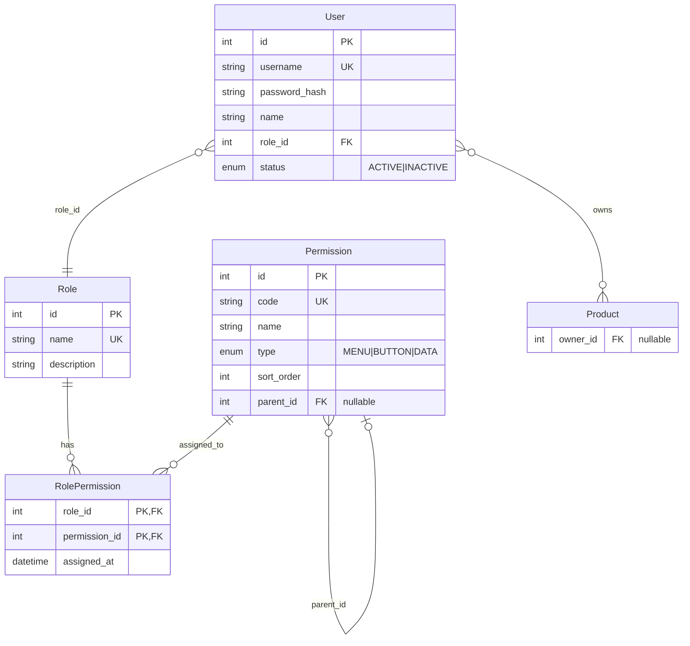
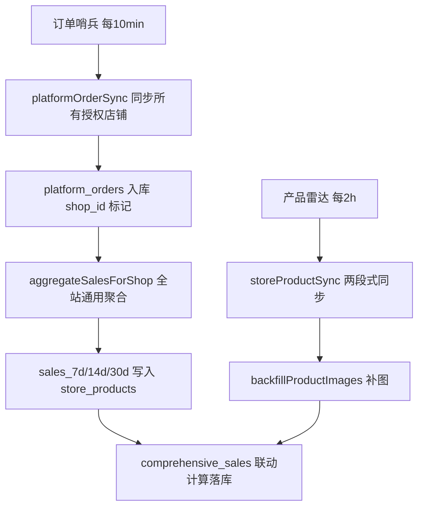

# EMAG 跨境电商管理系统 — 架构文档

> 本文档为开发铁律的落地说明，新功能开发前必须静默读取。重大模块完成后需主动询问是否更新。

---

## 1. 后端目录结构树 (Backend Directory Tree)

```
backend/
├── prisma/
│   ├── schema.prisma          # 唯一数据模型定义，表结构修改仅此入口
│   ├── migrations/            # Prisma 迁移历史
│   └── seed.ts                # 初始化角色、权限、种子数据
├── scripts/                   # 独立运维脚本（迁移、补全、诊断）
│   ├── init-permissions.ts    # ★ 权限菜单初始化（upsert 20个节点+授权超管；含仓储管理/仓库列表/FBE发货单）
│   ├── sync-store-products.ts
│   ├── sync-platform-orders.ts
│   ├── backfill-product-images.ts
│   ├── backfill-product-urls.ts
│   ├── diagnose-sales.ts      # 销量诊断
│   ├── diagnose-sales2.ts
│   ├── diagnose-sales3.ts
│   ├── verify-sales.ts        # 销量核对
│   ├── migrate-data.ts
│   ├── migrate-emag-region.ts
│   ├── migrate-bgn-to-eur.ts
│   ├── cleanup-placeholder-images.ts
│   ├── inspect-emag-product-response.ts
│   ├── inspect-emag-images.ts
│   ├── check-shop-api.ts
│   ├── fetch-order.ts
│   ├── sync-order-by-id.ts
│   ├── fix-site.ts
│   ├── fix-status-mapping.ts
│   ├── reset-status-text.ts
│   ├── wash-status-db.ts
│   ├── test-platform-orders-query.ts
│   └── preload-file-polyfill.js
├── src/
│   ├── index.ts               # 入口：Express 挂载、Cron 启动、健康检查
│   ├── adapters/              # 第三方 API 适配器
│   │   └── onebound.adapter.ts # 万邦 1688 item_get 解析（采购计划规格关联）
│   ├── lib/                   # 基础设施
│   │   ├── prisma.ts          # Prisma Client 单例
│   │   └── syncStatus.ts      # 并发同步锁（防死锁、finally 释放）
│   ├── middleware/
│   │   └── auth.ts            # JWT 认证、requirePermission 权限守卫；req.user 注入 userId/roleId/roleName/permissions
│   ├── routes/                # HTTP 路由（无独立 controllers，路由即入口）
│   │   ├── auth.ts            # POST /api/auth/login  — 登录（实时查库返回 permissions 数组）
│   │   │                      # GET  /api/auth/me     — 当前用户信息（实时权限码，刷新页面用）
│   │   ├── product.ts         # 公海产品(PENDING)查询、意向产品(SELECTED)增删改查、库存SKU管理
│   │   │                      #   ★ 意向产品数据隔离：超管看全部，普通员工只看自己(ownerId)
│   │   │                      #   ★ 库存SKU全员可见（无 ownerId 过滤）；isDeleted=true 自动过滤
│   │   │                      #   DELETE /api/products/inventory/:id — 智能混合删除
│   │   │                      #     → 无关联数据：物理删除（hard），返回 deleteType='hard'
│   │   │                      #     → 有 FK 约束(P2003)：软删除归档（soft），返回 deleteType='soft'
│   │   ├── order.ts           # 采购单、平台订单 CRUD
│   │   ├── user.ts            # 员工管理（增删改查）
│   │   ├── role.ts            # 角色 CRUD（含超管保护）
│   │   │                      #   GET    /api/roles          — 角色列表（含权限数/用户数）
│   │   │                      #   GET    /api/roles/:id             — 角色详情（含 permissionIds/permissionCodes，供权限回显）
│   │   │                      #   POST   /api/roles                 — 新增角色
│   │   │                      #   PUT    /api/roles/:id             — 编辑角色名称/描述
│   │   │                      #   PUT    /api/roles/:id/permissions — 覆盖式更新角色权限（事务原子，超管禁改）
│   │   │                      #   DELETE /api/roles/:id             — 删除角色（超管角色禁删；有用户时禁删）
│   │   ├── permission.ts      # 权限菜单 API（★ 新增）
│   │   │                      #   GET /api/permissions/tree  — 权限树状结构（供前端打勾勾使用）
│   │   │                      #   GET /api/permissions       — 权限平铺列表（供角色回显已选权限）
│   │   ├── shop.ts            # 店铺授权（增删改查）+ GET /api/shops/authorized（仪表盘下拉专用）
│   │   ├── emag.ts            # eMAG 业务（类目、发布、同步触发）
│   │   ├── storeProducts.ts   # 店铺在售产品（同步、补图、综合日销回填、库存绑定、采购建议）
│   │   │                      #   GET  /api/store-products          — 分页列表（mappingStatus=mapped/unmapped/all 筛选；优先 Product 表查图片/成本；批量聚合 purchaseSuggestion）
│   │   │                      #   POST /api/store-products/sync     — 手动全量同步
│   │   │                      #   POST /api/store-products/map      — 绑定库存 SKU（★ SKU 字符串优先匹配，inventorySkuId 兜底；pnk+shopId 或 storeProductId 定位平台产品）
│   │   ├── dashboard.ts       # 业绩看板（stats、shops 下拉）
│   │   ├── analytics.ts       # 运营分析接口（订单日报）
│   │   ├── translate.ts       # 翻译代理（MyMemory API 转发，ro→zh 等）
│   │   ├── fbeShipment.ts     # FBE 发货单管理（在途库存闭环；GET /counts 须在 /:id 前；PUT /:id 严格校验 items）
│   │   ├── inventory.ts       # 进销存核心（POST batch-adjust / PUT purchase-orders receive / GET logs）
│   │   ├── warehouse.ts       # 仓库管理（GET/POST /api/warehouses，PUT /:id — 含 skuCount 聚合、名称唯一性校验）
│   │   ├── alibaba.ts         # 1688 OAuth、规格解析、下单、子单同步
│   │   ├── purchase.ts        # 采购管理（重构版）：create-local（一品一单）/ place-1688-order（解耦下单）
│   │   └── operationDaily.ts  # 运营每日事务登记 + 首页运营作战看板
│   ├── services/              # 核心业务逻辑
│   │   ├── emagClient.ts      # eMAG API 客户端（Adapter）：BaseURL/货币/域名按 region 查表
│   │   │                      # ★ 正向代理：所有 HTTPS 请求经 EMAG_PROXY_URL 代理转发（固定 IP 白名单）
│   │   ├── emagProduct.ts     # product_offer/read、product/read、documentation/find_by_eans
│   │   ├── emagProductNormalizer.ts  # 唯一 Normalizer：解析、图片提纯、输出统一结构
│   │   ├── storeProductSync.ts       # 两段式同步编排（补全 mainImage）
│   │   ├── alibabaOrder.ts           # 1688 下单 payload 组装与发送
│   │   ├── alibabaOrderSync.ts       # 1688 子单详情同步（buyerView），isFetch1688OrderError 类型守卫
│   │   ├── platformOrderSync.ts      # 平台订单同步（多店全量/增量）
│   │   ├── inventorySync.ts          # 库存推送到 eMAG
│   │   ├── syncCron.ts               # 订单哨兵(10min)、产品雷达(2h)、库存同步(1h)
│   │   ├── salesStats.ts             # 全站销量聚合（无 shopId/region 硬编码）
│   │   ├── dashboardStats.ts         # 看板数据（getStatsFromLocalDB / getStatsByDateRange）
│   │   ├── orderDailyAnalytics.ts    # 订单日报：按站点当地自然日聚合 platform_orders
│   │   ├── operationDailyService.ts   # 运营日报登记、个人查询、管理员看板聚合
│   │   ├── emagOrder.ts              # eMAG 订单相关操作
│   │   ├── emagLogistics.ts          # eMAG 物流查询
│   │   ├── emagRateLimit.ts          # 限流与延迟（3 req/s）
│   │   └── importPublicSea.ts        # 公海产品 JSON 批量导入
│   └── utils/
│       ├── shopCrypto.ts      # 店铺凭证 AES-256 加解密
│       └── alibaba.ts         # 1688 API 签名、HTTP 调用、callAlibabaAPIPost
└── package.json
```

### 核心目录职责

| 目录 | 职责 |
|------|------|
| `src/lib` | 数据库连接、同步锁等基础设施，无业务逻辑 |
| `src/middleware` | 认证与权限校验，`req.user` 注入 `{ userId, username, roleId, roleName, permissions[] }` |
| `src/routes` | 接收请求、调用 services、返回统一 `{ code, data, message }` |
| `src/services` | 业务逻辑、API 调用、Normalizer、同步编排 |
| `src/utils` | 纯工具函数，无副作用或可复用加解密 |
| `src/adapters` | 封装第三方平台 API（万邦/1688），提供规范化输出接口 |

---

## 2. 动态权限 RBAC 关联图 (Mermaid ER Diagram)


```mermaid
erDiagram
    User }o--|| Role : "role_id"
    Role ||--o{ RolePermission : "has"
    Permission ||--o{ RolePermission : "assigned_to"
    Permission }o--o| Permission : "parent_id"

    User {
        int id PK
        string username UK
        string password_hash
        string name
        int role_id FK
        enum status "ACTIVE|INACTIVE"
    }

    Role {
        int id PK
        string name UK
        string description
    }

    Permission {
        int id PK
        string code UK
        string name
        enum type "MENU|BUTTON|DATA"
        int sort_order
        int parent_id FK "nullable"
    }

    RolePermission {
        int role_id PK,FK
        int permission_id PK,FK
        datetime assigned_at
    }

    User }o--o{ Product : "owns"
    Product {
        int owner_id FK "nullable"
    }
```

### 数据隔离原则（.cursorrules 约定）

- **菜单/按钮级控制**：前端根据 `permissions` 数组渲染菜单与按钮，无权限则不展示。
- **数据级过滤（三产品池模型）**：

| 产品池 | Prisma 查询条件 | 访问控制 |
|--------|----------------|---------|
| 公海产品 | `{ status: 'PENDING', ownerId: null }` | 全员可见 |
| 意向产品 | `{ status: 'SELECTED' }` | ★ 超管看全部；普通员工加 `ownerId: userId` 过滤 |
| 库存 SKU | `Inventory` 全表 | 全员可见（无 ownerId 过滤） |

- **超管判定逻辑**（`src/routes/product.ts`）：
  ```typescript
  // 优先检查 roleName，再检查超高权限码
  const isSuperAdmin =
    user.roleName?.includes('admin') ||
    user.roleName?.includes('超级管理员') ||
    user.permissions?.includes('*') ||
    user.permissions?.includes('ALL') ||
    (user.permissions?.includes('MANAGE_ACCOUNTS') &&
      user.permissions?.includes('MANAGE_ROLES'));
  ```
- **禁止硬编码角色 ID**：不得出现 `if (roleId === 1)`，一律通过 `roleName` 或 `Permission.code` 判断。
- **角色 CRUD 保护**：`DELETE /api/roles/:id` 内置双重保护——禁止删除名称含"超级管理员"的角色；禁止删除仍绑定用户的角色（返回 409）。

---

## 3. eMAG 核心业务流线图 — 两段式深层抓取 + 库存 SKU 绑定兜底

```mermaid
graph TD
    A[定时任务 / 手动触发] --> B[getEmagCredentials 初始化 Adapter]
    B --> C[product_offer/read Offer API 抓取]
    C --> D[Adapter 按 shop.region 查表获取 BaseURL/货币/域名]
    D --> E[Normalizer 清洗 emagProductNormalizer]
    E --> F[images 数组提取 display_type=1 主图]
    F --> G[StoreProduct Upsert 入库 — 有图覆盖/无图保留旧值]
    G --> H[第二阶段: 提取无图 SKU]
    H --> I{documentation/find_by_eans 预拉 EAN 图}
    I --> J[product/read Catalog API 批量抓图]
    J --> K[Normalizer 再次清洗]
    K --> L[补全 main_image 回写 StoreProduct]
    L --> M[GET /api/store-products 列表接口]
    M --> N[查 Product 表获取 localImage/cost，兜底 Inventory 表]
    N --> O[图片回退: emagImage \|\| localImage]
    O --> P[统一输出 image/imageUrl/main_image]
```

### 流程说明

| 阶段 | 组件 | 说明 |
|------|------|------|
| 触发 | `syncCron` / `POST /api/store-products/sync` | 产品雷达每 2 小时；手动可指定 shopId |
| Adapter | `emagClient.getEmagCredentials` | 从 `shop_authorizations` 读取 region，查 `REGION_*` 字典获取 BaseURL、货币、域名 |
| Offer API | `emagProduct.readProductOffers` | `product_offer/read` 分页拉取 SKU、价格、库存 |
| Normalizer | `emagProductNormalizer.normalizeEmagProduct` | 唯一数据清洗管线，无条件信任 eMAG 返回的图片 URL |
| images 主图 | `extractFirstImageFromArray` | 按 eMAG 官方文档：`display_type===1` 为主图 url，无则取首项；支持 JSON 字符串自动解析 |
| 落库身份 | `saveStoreProductByBusinessIdentity()` | 以 `shopId + emagOfferId / sku / vendorSku / ean` 定位业务售卖实体；PNK 只作为 eMAG 当前 Product 指针，若 eMAG 变更 PNK，更新旧行的 `pnk`，绝不新增脏行 |
| 无图提取 | `StoreProduct.findMany` | `mainImage` 为 null 或空 |
| Catalog API | `emagProduct.readProductsByPnk` | `product/read` 批量查询完整产品详情（含 images） |
| 补全入库 | `prisma.storeProduct.updateMany` | 回写 `mainImage`、`imageUrl` |
| **库存 SKU 绑定兜底** | `StoreProduct.mappedInventorySku` (String?) | 存储 `Product.sku` 字符串（**无 FK 约束**）；列表接口用该值去 `Product` 表查图片/成本，兜底 `Inventory` 表；图片优先级：**平台图 > 本地库存图** |
| 列表接口 | `GET /api/store-products` | 三路图片兜底：①按 SKU 查 `Product.imageUrl`（主路径）→ ②若 Product 命中但 imageUrl 为 null，再查 `Inventory.localImage` 补图（修复漏查 Bug）→ ③按 pnk 查 Product（SKU 路径全失效时保底）；`finalImage = emagImage \|\| localImage`；统一输出 `image`/`imageUrl`/`main_image`。**`in_transit_quantity` 按当前 `shopId` 实时隔离聚合**（条件：`FbeShipmentItem.shipment.shopId === 当前店 AND status='SHIPPED'`），彻底杜绝跨店污染 |

### StoreProduct 业务身份重构（2026-05-14）

- **实体原则**：EAN 是物理实体标识；SKU / Offer 是店铺内售卖业务标识；PNK 是 eMAG Product 当前指针，允许随平台重建/迁移而变化。
- **数据库约束**：`store_products` 保留 `@@unique([shopId, pnk])` 兼容旧定位，同时新增 `@@unique([shopId, sku])`、`@@unique([shopId, vendorSku])`、`@@unique([shopId, emagOfferId])`，并增加 `is_archived` 归档标记与 `shopId+ean` 检索索引。
- **同步幂等**：`storeProductSync.ts` 不再用单纯 `shopId+pnk` upsert；每条 eMAG Offer 先按 `emagOfferId → sku → vendorSku → ean → pnk` 在本店查旧记录，命中则 `update(id)` 并刷新最新 PNK，未命中才 `create`。
- **脏数据清洗**：一次性脚本 `npm run ops:cleanup-store-products` dry-run，`npm run ops:cleanup-store-products:fix` 执行硬删除。保留优先级：`mapped_inventory_sku` 非空 → `synced_at` 最新 → `emagOfferId` 最大 → `id` 最大。
- **前端暴露**：`GET /api/store-products` 及补图、补 URL、利润、库存同步、订单/FBE 相关查询默认过滤 `isArchived=false`，死记录不再进入列表或业务计算。

> **跟卖产品图片说明**：eMAG 的 `product_offer/read` 对跟卖(follow)产品不返回图片。采用【库存 SKU 绑定兜底策略】：通过 `POST /api/store-products/map` 手动绑定。
>
> **绑定接口参数解析优先级（2026-03-12 修正）**：
> - **库存 SKU 定位**：★ 优先按 `inventorySku` 字符串查 `Product.sku`（唯一业务键，最可靠）；字符串未命中时才按 `inventorySkuId` 查 `Product.id` 兜底。原因：前端传的 `inventorySkuId` 可能与 `Product.id` 不一致。
> - **平台产品定位**：支持 `pnk+shopId`（自动查 `StoreProduct` 联合索引）或直传 `storeProductId`。
>
> **架构变更说明（2026-03-12）**：`StoreProduct.mappedInventorySku` 原有 `→ Inventory.sku` 的 DB 级外键约束已移除。"库存 SKU" 主数据现统一在 `Product` 表管理，`Inventory` 表作为历史兜底数据源保留。

---

## 4. 多店销量聚合与综合日销体系

### 4.1 核心字段说明

| 字段 | 所在表 | 说明 |
|------|--------|------|
| `sales_7d` / `sales_14d` / `sales_30d` | `store_products` | 近 7/14/30 天的兼容销量字段；平台产品接口仍返回 `sales7/sales14/sales30`，前端表格继续只展示 7/14/30 天销量 |
| `comprehensive_sales` | `store_products` | 综合日销缓存字段；前台展示、卡片统计和筛选优先使用实时 `calculateComprehensiveSales(salesStats, stock)`，落库字段仅作排序、历史兼容和后台诊断缓存 |

### 4.2 销量聚合管线 (`salesStats.ts`)

**原则：全站通用，绝无 shopId/region 硬编码。**

```
aggregateSalesForShop(shopId)
  └── 从 platform_orders 聚合订单销量
        WHERE shop_id = shopId          ← 动态传入，覆盖所有站点
        AND   status IN (有效状态集)     ← 通过 shopId 关联 region，查表动态匹配
        AND   order_date >= NOW() - INTERVAL '180 days'
  └── 按 sku / ext_part_number / pnk 归一化匹配，统计 d3/d7/d14/d30/d60/d90/d180 与 lastOrderAt
  └── GET /api/store-products 实时返回 d7/d14/d30 兼容字段；d3/d60/d90 仅供后端算法使用或调试返回
  └── 触发 comprehensive_sales 与 productClass 兼容缓存刷新（见 4.3 / 4.5.2）
```

**时区处理**：日期窗口（3/7/14/30/60/90天）使用 UTC 统一计算，不依赖店铺所在时区，避免多站点数据不一致。

**订单状态映射**：通过 `shop_authorizations.region` 查 `REGION_CONFIG` 字典，动态获取该站点的有效订单状态（如 RO=`Finalizat`、BG/HU 对应值），不在聚合函数内硬编码任何状态字符串。

### 4.3 综合日销计算与落库

综合日销统一封装在 `productClassification.ts` 的 `calculateComprehensiveSales(salesStats, stock)`。任何列表展示、卡片统计、分类筛选、回填和库存快照都必须调用该函数，不允许散落手写公式：

```typescript
const baseComprehensiveSales =
  (d3 / 3) * 0.20 +
  (d7 / 7) * 0.20 +
  (d14 / 14) * 0.20 +
  (d30 / 30) * 0.20 +
  (d60 / 60) * 0.10 +
  (d90 / 90) * 0.10;

const stockoutProtectedSales =
  stock <= 0 && (d60 > 0 || d90 > 0)
    ? Math.max(d60 / 60, d90 / 90) * 0.7
    : 0;

const comprehensiveSales = Math.max(
  baseComprehensiveSales,
  stockoutProtectedSales,
);
```

**窗口用途**：`d3` 识别突然起量，`d7` 识别近期趋势，`d14` 识别短中期趋势，`d30` 表达当前稳定表现，`d60` 保护较长周期表现，`d90` 保护历史热销产品；`d180/lastOrderAt` 保留兼容历史逻辑，但不参与主公式。

**断货保护**：只有 `stock <= 0` 且 `d60/d90` 有历史销量时触发，避免历史热销产品断货超过 30 天后综合日销直接归零。断货保护只抬高综合日销参考值，不把断货本身作为主分类。

**触发时机（两处联动）**：
1. **同步管线触发**：`syncCron.ts` 的 `runProductRadar`（每 2 小时）在 `backfillProductImages` 完成后，自动调用 `backfillComprehensiveSales()`，全站无差别回填。
2. **手动 API 触发**：`POST /api/store-products/backfill-comprehensive-sales` 支持按需全量补算。

### 4.4 服务端排序管线 (`GET /api/store-products`)

前端传入 `sortBy`（snake_case 字段名）和 `sortOrder`（`ascend`/`descend`），后端通过 `FIELD_MAP` 将其转换为 Prisma camelCase 字段并动态注入 `orderBy`：

```
req.query.sortBy = 'comprehensive_sales'
req.query.sortOrder = 'descend'
  └── FIELD_MAP['comprehensive_sales'] → 'comprehensiveSales'
  └── 'descend' → 'desc'
  └── prisma.storeProduct.findMany({ orderBy: { comprehensiveSales: 'desc' } })
```

默认排序：`syncedAt: 'desc'`（最新同步优先）。

### 4.5 智能采购建议（`GET /api/store-products`）

平台产品列表在 DTO 中返回 `purchaseSuggestion`，用于前端展示建议采购量。为避免 N+1 查询，接口在当前分页 `StoreProduct` 拉取后批量构建以下 Map：

- `mappedInventorySku / sku / vendorSku` → `Product`，拿到本地 `productId`。
- `WarehouseStock.findMany(productId in ...)`：聚合 `stockQuantity` 为本地可用。
- `PurchaseOrderItem.findMany(purchaseOrder.status in 活跃状态, purchaseOrder.shopId=当前店铺 OR null)`：按 `productIds` JSON 汇总未入库剩余量为采购在途，兼容老采购单/通用备货。
- `Product.findMany(sku in ..., status=PURCHASING, purchaseOrderId=null, shopId=当前店铺 OR null)`：按 SKU 汇总采购计划中数量，兼容通用备货计划。
- `FbeShipmentItem.findMany(productId in ..., shipment.shopId=当前店铺, shipment.status=SHIPPED)`：沿用店铺隔离的 FBE 在途汇总。

计算公式：

```typescript
targetStock = Math.floor(comprehensiveSales * 60);
suggestAmount = Math.max(
  0,
  targetStock
    - platformStock
    - platformInTransit
    - localStock
    - purchasingInTransit
    - planningStock,
);
```

`purchaseSuggestion.inventoryTag` 与实时 `productClass` 保持一致，只输出 `HOT/POTENTIAL/NORMAL/CLEARANCE` 四类，并叠加库存状态输出采购建议主文案：

1. `productClass === CLEARANCE`：有库存压力时 `清仓处理`，少量库存时 `停止补货`。
2. `productClass === NORMAL`：按库存状态输出温和建议：低库存 `少量补货`、预警 `观察补货`、库存充足 `暂不补货`、库存偏多 `暂停补货`、无货有在途 `等待到货`、无货无在途 `待确认补货`。
3. `productClass in (HOT, POTENTIAL) && platformStock === 0`：按平台缺货采购建议输出：无在途为 `立即补货`；有在途时根据 `inTransitStock / max(comprehensiveSales, sales30 / 30)` 是否覆盖 30 天，输出 `等待到货` 或 `仍需补货`。
4. `productClass in (HOT, POTENTIAL) && platformStock > 0 && stockStatus in (LOW_STOCK, WARNING)`：按低库存预警输出：主推低库存 `紧急补货`、主推预警 `建议补货`、成长低库存 `小批量补货`、成长预警 `观察备货`。

DTO 字段：

```typescript
purchaseSuggestion: {
  targetStock,
  platformStock,
  platformInTransit,
  localStock,
  purchasingInTransit,
  planningStock,
  suggestAmount,
  inventoryTag,
  text?,   // CLEARANCE 时为“清仓处理/停止补货”
           // NORMAL 时为“少量补货/观察补货/暂不补货/暂停补货/等待到货/待确认补货”
           // HOT/POTENTIAL 平台缺货时为“立即补货/等待到货/仍需补货”
           // HOT/POTENTIAL 平台低库存时为“紧急补货/建议补货/小批量补货/观察备货”
  label?,  // 与 text 同步，兼容前端不同字段读取
  reason?, // 特殊采购建议原因说明
}
```

#### 4.5.1 采购与库存智能分析引擎 V1.0

**业务背景**：平台产品列表通过智能采购建议解决业务员凭感觉补货、重复下单、忽略在途资产的问题；库存健康度打标用于直观暴露资金滞压风险与潜在断货风险。

**批量聚合查询（防 N+1）**：`GET /api/store-products` 在拿到当前分页 `StoreProduct` 后，不逐行查库，而是一次性聚合当前页关联 SKU / 产品的资产数据：

- `WarehouseStock`：按本地产品汇总 `stockQuantity`，作为本地可用库存。
- `PurchaseOrderItem + PurchaseOrder`：按活跃采购单状态汇总未入库数量，作为采购在途。
- `Product`：按 `status=PURCHASING` 且 `purchaseOrderId=null` 汇总 `purchaseQuantity`，作为计划中数量。
- `FbeShipmentItem`：按当前店铺的 `SHIPPED` FBE 发货单汇总平台在途。

**核心算账公式**：

```typescript
suggestAmount = Math.max(
  0,
  Math.ceil(replenishReferenceDailySales * 60)
    - platformStock
    - platformInTransit
    - localStock
    - purchasingInTransit
    - planningStock,
);
```

**通用备货容错**：计算“采购在途”和“计划中”资产时，必须同时纳入当前店铺与无归属的通用备货，避免历史采购单或通用计划漏算导致缺口虚高：

```typescript
OR: [{ shopId: currentShopId }, { shopId: null }]
```

**库存健康度标签**：库存健康风险由 `stockStatus` 与 `riskTags` 表达，不再把 `NEW/DEAD/OUT_OF_STOCK_WATCH` 作为主分类。新品判断需要真实 `firstSeenAt` 后再扩展，严禁使用 `syncedAt` 强判新品。

### 4.5.2 平台产品业务分类 productClass（2026-06-04，统一实时口径）

`productClass` 是面向运营筛选的主分类。前台列表展示、分类卡片统计、`store-overview.productStructure`、`productClass` 筛选、运营建议和采购建议全部优先使用 `classifyStoreProduct(product, salesStats)` 实时计算结果，确保卡片数量与点击后的列表 total 同口径。

**落库字段兼容**：`store_products.product_class`、`classification_reason`、`classification_metrics`、`classified_at` 继续保留，不删除、不新增 migration、不修改 Prisma schema。`backfillComprehensiveSales()` 与手动重算接口会刷新这些缓存字段，但前台最终口径不直接依赖旧落库值。

**合法主分类**：`HOT`（主推款）、`POTENTIAL`（成长款）、`NORMAL`（常规款）、`CLEARANCE`（清理款）。断货、低库存、无销量等只作为 `riskTags` 风险标签，不作为主分类；旧查询别名 `DEAD/TO_BE_ELIMINATED` 可兼容映射到 `CLEARANCE`，`NEW/OUT_OF_STOCK_WATCH` 可兼容映射到 `NORMAL`，但不会作为主分类输出。

**严格优先级**：

1. `HOT`：满足其一即主推款：`comprehensiveSales >= 0.8`、`d30 >= 15`、或 `stock <= 0 && (d60 >= 20 || d90 >= 30)`。第三条用于历史明显热销但当前断货的保供识别，断货本身仍只进入风险标签。
2. `POTENTIAL`：不属于 HOT，且满足 `d3 > 0 || d7 > 0 || d14 > 0`，或 `comprehensiveSales >= 0.15`。
3. `CLEARANCE`：不属于 HOT/POTENTIAL，且满足 `stock > 0 && d30 === 0 && d60 === 0 && d90 === 0`，或 `stock > 0 && comprehensiveSales < 0.03`。
4. `NORMAL`：未命中以上规则，归为常规款。

**风险标签 `riskTags`**：`getProductRiskTags(product, salesStats)` 输出可叠加标签，包括 `断货`、`低库存`、`库存偏多`、`无销量`、`未关联SKU`、`无图片`、`负毛利`。典型规则：`stock <= 0 && (d30 > 0 || d60 > 0 || d90 > 0)` 标记断货；`stock / comprehensiveSales <= 7` 标记低库存；`stock / comprehensiveSales >= 60` 标记库存偏多；`d30/d60/d90` 全为 0 标记无销量。

**计算入口**：`src/services/productClassification.ts` 提供 `classifyStoreProduct()` 纯函数、`recalcProductClassForShop()` 和 `recalcProductClassForAllShops()`。脚本 `npm run ops:recalc-product-class` 默认 dry-run；追加 `-- --fix` 写库；支持 `-- --shopId=1 --fix` 单店重算。

**API**：`GET /api/store-products?productClass=HOT|POTENTIAL|NORMAL|CLEARANCE|all`。不传或 `all` 不过滤，非法值返回 400。筛选先按 `shopId/mappingStatus/search` 得到候选范围，再批量计算实时分类匹配的 `StoreProduct.id`，最后写入 Prisma `where.id in (...)` 做 `count/findMany`，严禁分页后过滤。DTO 保留 `d7/d14/d30/sales7/sales14/sales30/comprehensiveSales/comprehensive_sales/productClass/classificationName/classificationReason`，可新增 `d3/d60/d90/riskTags`，但前端表格仍只展示 7/14/30 天销量。

**分类统计 API**：`GET /api/store-products/classification-summary?shopId=5` 返回固定字段 `{ total, HOT, POTENTIAL, NORMAL, CLEARANCE }`。统计不再直接 `groupBy store_products.product_class`，而是在与列表一致的候选范围内逐品调用实时分类函数，确保卡片数量与点击分类后的列表 total 一致。

**店铺结构概览 API**：`GET /api/store-products/store-overview?shopId=5` 返回 `{ productStructure, stockRisk, purchaseActions, generatedAt }`。`productStructure` 与 `classification-summary` 共用实时分类函数；`stockRisk` 复用 `calculateStockStatus()`，基于实时 `salesStats` 计算 `comprehensiveSales` 与 `referenceDailySales` 后归入 `OUT_OF_STOCK/LOW_STOCK/WARNING/SAFE/OVERSTOCK`；`purchaseActions` 复用后端采购建议 helper。全店计算使用批量查询本地库存、FBE 在途、采购在途和计划中数量，避免逐品 N+1。

### 4.5.2.1 eMAG 店铺维度链接身份（自建/跟卖）

平台产品列表返回 `linkType/linkTypeLabel/contentPermission/offerCompetitionType/linkActionTips`，用于展示“自建链接 / 跟卖链接 / 待确认”标签。该判断必须是店铺维度：同一个 `part_number_key` 在 A 店铺可能是 `SELF_BUILT`，在 C 店铺可能是 `RESELL`，后端只按当前 `shopId + pnk + ownership` 保存和返回，不做 PNK 级全局缓存。

**禁止判断来源**：不能按品牌判断，`brand === SuooTci` 不代表当前店铺拥有资料维护权；不能按 PNK 是否存在判断，因为自建商品审核通过后也会拥有 PNK；不能用 `number_of_offers` 判断自建/跟卖，它只用于竞争状态。

**字段来源与自动更新**：`product_offer/read` 中的 `ownership`、`number_of_offers`、`best_offer_sale_price`、`main_offer_price`、`buy_button_rank` 经 `emagProductNormalizer.ts` 解析后，在正常平台产品同步流程 `storeProductSync.ts` 中写入 `store_products` 的轻量派生字段。新增店铺首次同步产品、手动刷新平台产品、定时产品雷达同步都会自动重新计算 `linkType/contentPermission/offerCompetition/linkActionTips`；`backfill:emag-link-type` 只用于历史旧数据补齐，不是唯一入口。`emag_offer_meta` 只保存 compact meta，不保存完整 raw response，避免表膨胀。

**运营口径（2026-06-04，最终确认）**：平台产品中的「自建链接 / 跟卖链接 / 待确认」按**当前店铺资料维护权限**判断，**不等同于**历史创建归属。`ownership=1 / true / "1"` => `SELF_BUILT`（可维护标题、图片、描述、属性，来源 `OWNERSHIP_CONTENT_PERMISSION`、可信度 `HIGH`）；`ownership=2 / false / "2"` => `RESELL`（仅报价/价格/库存，来源 `OWNERSHIP_CONTENT_PERMISSION`、可信度 `HIGH`）；`ownership` 缺失或无法识别 => `UNKNOWN`（来源 `OWNERSHIP_UNKNOWN`、可信度 `LOW`）。`contentPermission` 由 `linkType` 派生：`SELF_BUILT=>EDITABLE`，`RESELL=>OFFER_ONLY`，`UNKNOWN=>UNKNOWN`。

**禁止判断来源**：不能用品牌、PNK 是否存在、图片/标题、购物车状态、`buy_button_rank`、`number_of_offers`、多卖家竞争、同公司其他店铺是否创建过来判断自建/跟卖。

**ownership 本地回填脚本**（按库内 `emag_ownership` 批量重算，无需调 eMAG API）：

```bash
npm run backfill:emag-link-type-ownership -- --dryRun=true
npm run backfill:emag-link-type-ownership -- --dryRun=false
npm run backfill:emag-link-type-ownership -- --shopId=5 --dryRun=false
```

`fix:emag-link-type` 为兼容别名，内部同上。按店铺从 API 重拉请用 `backfill:emag-link-type`。

**竞争状态**：`number_of_offers === 0` 返回 `NO_ACTIVE_COMPETITION`（暂无竞争）；`number_of_offers === 1` 返回 `EXCLUSIVE`（独家报价）；`number_of_offers > 1` 返回 `COMPETITIVE`（多卖家竞争）；缺失、空值或非数字返回 `UNKNOWN`（竞争未知）。`number_of_offers` 只用于竞争标签，不参与自建/跟卖判断。自建链接如果出现多卖家竞争，会返回 `['投诉卖家', '检查乱价', '维护品牌']`；跟卖链接多卖家竞争返回 `['关注购物车', '调整报价', '控制毛利']`；暂无竞争时按链接身份返回库存和资料维护类提醒。

**历史回填脚本**：

```bash
npm run backfill:emag-link-type -- --shopId=12 --dryRun=true
npm run backfill:emag-link-type -- --shopId=12 --dryRun=false
npm run backfill:emag-link-type -- --fix
```

脚本按店铺分页调用 `product_offer/read`，逐条以当前 `shopId + pnk` 更新链接身份字段；dry-run 只输出样本和统计，不写库。历史旧店铺应先 dry-run 再按店铺回填，禁止未经确认直接全店铺大范围写入。

### 4.5.2.2 eMAG 购物车状态（Buy Box）

平台产品列表返回 `buyBoxStatus/buyBoxStatusLabel/buyBoxStatusSource/buyBoxStatusConfidence/buyBoxRank/buyBoxActionTips/buyBoxMeta`，用于展示“购物车已抢到 / 未抢购物车 / 无有效购物车 / 购物车未知 / 疑似抢到购物车 / 疑似未抢购物车”。该判断必须是店铺维度，只按当前 `shopId + product_offer/read` 返回的当前 offer 数据计算，不做 PNK、品牌或全局商品维度推断。

**字段来源与自动更新**：`product_offer/read` 中的 `buy_button_rank`、`sale_price`、`best_offer_sale_price`、`main_offer_price`、`stock/general_stock`、`offer_validation_status`、`number_of_offers` 经 `emagProductNormalizer.ts` 解析后，在正常平台产品同步流程 `storeProductSync.ts` 中写入 `store_products` 的 Buy Box 轻量派生字段。新增店铺首次同步、手动刷新平台产品、定时产品雷达同步都会自动重新计算 Buy Box 状态；`backfill:buy-box` 只用于历史旧数据补齐。`buy_box_meta` 只保存 compact meta：`buyButtonRank/salePrice/bestOfferSalePrice/mainOfferPrice/stock/offerValidationStatus/numberOfOffers/checkedAt`，禁止保存完整 raw response。

**高可信规则**：`stock <= 0`、商品状态不可售或 `offer_validation_status` 明确不可售时，返回 `NO_ACTIVE_BUYBOX`（无有效购物车）；`buy_button_rank === 1` 且 offer 可售、有库存时，返回 `WON`（购物车已抢到）；`buy_button_rank > 1` 且 offer 可售、有库存时，返回 `LOST`（未抢购物车）。这些状态来源为 `OFFER_STATE` 或 `BUY_BUTTON_RANK`，可信度为 `HIGH`。

**低可信兜底**：当 `buy_button_rank` 缺失但 offer 可售且有库存时，`sale_price === best_offer_sale_price` 只可返回 `POSSIBLY_WON`（疑似抢到购物车）；`number_of_offers > 1` 且 `sale_price !== best_offer_sale_price` 只可返回 `POSSIBLY_LOST`（疑似未抢购物车）。价格兜底来源为 `PRICE_HEURISTIC`，可信度必须为 `LOW`，不能当作确定购物车归属。

**禁止判断来源**：`number_of_offers` 不能判断是否抢到购物车，它只表示报价竞争数量；多卖家竞争不等于未抢购物车，独家报价也不等于一定抢到购物车；品牌、自建/跟卖身份、PNK 是否存在都不能判断购物车归属。缺少 `buy_button_rank` 且价格兜底不成立时返回 `UNKNOWN`（购物车未知），由运营人工核查或等待接口字段。

**历史回填脚本**：

```bash
npm run backfill:buy-box -- --shopId=5 --dryRun=true
npm run backfill:buy-box -- --shopId=5 --dryRun=false
```

脚本按店铺分页调用 `product_offer/read`，逐条以当前 `shopId + pnk` 更新 Buy Box 字段；dry-run 不写库，并输出 `WON/LOST/NO_ACTIVE_BUYBOX/POSSIBLY_WON/POSSIBLY_LOST/UNKNOWN` 统计。历史旧店铺应先 dry-run，再按店铺正式回填。

**运营动作建议 operationAdvice（实时 DTO，不落库）**：`GET /api/store-products` 每行返回双命名 `operationAdvice/operation_advice`，用于回答“运营接下来做什么”，与 `purchaseSuggestion` 的供应链采购动作分离。规则引擎实时使用四类主分类与风险标签含义：主推款优先保供、补货和广告；成长款观察趋势并适度加广告；常规款正常维护；清理款降价、清仓或停止采购。动作集合：`REPLENISH_NOW/URGENT_REPLENISH/STILL_NEED_REPLENISH/RAISE_PRICE/LOWER_PRICE/JOIN_CAMPAIGN/ADVERTISE/CLEARANCE/PAUSE_PURCHASE/WAIT_FOR_ARRIVAL/OBSERVE`；优先级：`P0/P1/P2/P3`。断货补货规则优先于普通调价、广告、活动和观察兜底：`stock=0 && replenishReferenceDailySales>0 && coverageStock<=0` 返回立即/紧急补货，`coverageStock<targetStock` 返回仍需补货，`coverageStock>=targetStock` 返回等待到货。其他规则按顺序短路：负毛利动销异常、清仓处理、暂停采购、等待到货、建议涨价、建议降价、加广告、参加活动、观察即可。阈值集中配置为 `lowProfitMarginPct=15`、`goodProfitMarginPct=25`、`lowStockDays=30`、`warningStockDays=60`、`overstockDays=120`、`clearanceStockThreshold=10`；`profitMarginPct` 单位是百分数（`15` 表示 15%）。因当前缺少竞品价格、价格历史、广告 ROI、曝光点击转化数据，涨价/降价/广告/活动文案必须表达为“可考虑/测试”，不能作为强结论。

**补货参考日销**：`purchaseSuggestion` 与 `operationAdvice` 统一使用 `replenishReferenceDailySales = max(comprehensiveSales, sales30/30, sales90/90, sales180/180)`。该指标只用于采购建议和运营建议，不改变 `productClass` 分类；`targetStock = ceil(replenishReferenceDailySales * 60)`，`coverageStock = platformStock + platformInTransit + localStock + purchasingInTransit + planningStock`，`suggestAmount = max(0, targetStock - coverageStock)`。当平台库存为 0 且历史/近期有销量时，即使近 7/14/30 综合日销因断货归零，也能基于 90/180 天历史销量给出补货、仍需补货或等待到货建议。

**库存状态 stockStatus（DTO 计算字段，不落库）**：

- `referenceDailySales = max(comprehensiveSales, sales30 / 30)`。
- `referenceDailySales <= 0` 时 `stockDays = null`。
- `stock === 0` → `OUT_OF_STOCK`。
- `stock > 0 && stockDays <= 30` → `LOW_STOCK`。
- `stockDays > 30 && stockDays <= 60` → `WARNING`。
- `stockDays > 60 && stockDays <= 120` → `SAFE`。
- `stockDays > 120` → `OVERSTOCK`。

DTO 输出双命名：`stockStatus/stock_status`、`stockDays/stock_days`、`referenceDailySales/reference_daily_sales`。

**平台产品列表库存分组筛选 stockGroup（查询参数，不落库）**：`GET /api/store-products` 支持 `stockGroup=ALL/STOCK_OK/REPLENISH_WARNING/OUT_OF_STOCK_REPLENISHED/OUT_OF_STOCK_NOT_REPLENISHED`，可与 `shopId/search/productClass/mappingStatus/buyBoxGroup/linkType/sort/page/pageSize` 组合。`ALL` 或非法值不筛选；`STOCK_OK` 匹配 `stockStatus in SAFE/OVERSTOCK`，前端统一显示为“库存充足”，不再突出“库存偏多”；`REPLENISH_WARNING` 匹配 `LOW_STOCK/WARNING`；`OUT_OF_STOCK_REPLENISHED` 匹配平台库存 `stock <= 0` 且当前店铺隔离后的 `inTransitQuantity > 0`；`OUT_OF_STOCK_NOT_REPLENISHED` 匹配平台库存 `stock <= 0` 且当前店铺在途量为空或 `<= 0`。该筛选复用实时库存状态和当前店铺 FBE 在途聚合，不用 `numberOfOffers`，不改变采购建议、四类产品分类或综合日销算法。

### 4.5.3 平台产品每日库存快照（2026-05-29，二阶段数据底座）

为后续计算 `availableDays90` 与 `inStockDailySales90`，新增 `store_product_inventory_snapshots`。该表只记录事实快照，暂不替换现有 `productClass` 分类逻辑；`sales90/sales180/lastOrderAt` 第一阶段从订单历史聚合获得，不依赖库存快照。有货日销将在库存快照积累 30～90 天后实现，严禁用当前不足天数的快照伪造 90 天指标。

**唯一性**：同一个 `store_product_id + snapshot_date` 只能有一条记录，重复执行采用 upsert 更新当日快照，避免重复插入。

**字段口径**：

- `shop_id`：平台店铺 ID。
- `store_product_id`：`StoreProduct.id`。
- `sku`：优先 `StoreProduct.sku`，为空时用 `vendorSku`。
- `snapshot_date`：UTC 日期，按天去重。
- `platform_stock`：`StoreProduct.stock`，eMAG 当前平台库存。
- `in_transit_stock`：当前店铺 `FbeShipment.status=SHIPPED` 的在途数量，按本地 `Product.id` 聚合。
- `sales_7 / sales_14 / sales_30`：复用 `salesStats.ts` 从 `platform_orders.products_json` 聚合出的销量。
- `comprehensive_sales`：复用 `calculateComprehensiveSales(salesStats, stock)`，与平台产品列表、分类统计和回填口径一致。

**脚本**：

```bash
npm run ops:snapshot-store-products                 # dry-run，全店铺
npm run ops:snapshot-store-products -- --shopId=1   # dry-run，单店
npm run ops:snapshot-store-products -- --fix        # 写入/更新当天全店铺快照
npm run ops:snapshot-store-products -- --shopId=1 --fix
npm run ops:snapshot-store-products -- --date=2026-05-29 --fix
```

**定时任务**：`syncCron.ts` 每天 UTC 01:30（北京 09:30）执行一次 `createInventorySnapshotsForAllShops({ dryRun:false })`，写入当天全部活跃 eMAG 店铺的快照。

**后续 90 天指标预留**：

```sql
availableDays90 = COUNT(*) WHERE snapshot_date >= today - 90 AND platform_stock > 0
sales90 = 近90天订单销量聚合
inStockDailySales90 = sales90 / NULLIF(availableDays90, 0)
```

其中 `availableDays90` 的有货判断条件固定为 `platform_stock > 0`。第一阶段/当前二阶段只建数据底座，不伪造历史 90 天有货日销。

### 4.6 多站点数据一致性保障


```mermaid
graph TD
    A[订单哨兵 每10min] --> B[platformOrderSync 同步所有授权店铺]
    B --> C[platform_orders 入库 shop_id 标记]
    C --> D[aggregateSalesForShop 全站通用聚合]
    D --> E[sales_7d/14d/30d 写入 store_products]
    E --> F[comprehensive_sales 联动计算落库]
    G[产品雷达 每2h] --> H[storeProductSync 两段式同步]
    H --> I[backfillProductImages 补图]
    I --> F
```

**防回归机制**：`salesStats.ts` 诊断日志仅输出当前 shopId 下销量最高的 Top3 SKU（动态取值），严禁出现任何硬编码 SKU 或 region 字符串。

### 4.7 双轮防漏单扫描机制（2026-04-03 启用）

**问题根因**：eMAG 订单在创建后如果买家不操作（状态不变化），`modified` 字段保持为 null，仅靠 `modifiedAfter` 无法命中此类订单，导致漏单。

**修复方案**：`readOrdersForAllStatuses` 实现双轮扫描：

| 轮次 | 参数 | 模式 | 策略 |
|------|------|------|------|
| 第一轮 | `modifiedAfter` | 严格 | 任何分页失败立即抛出，防漏单铁律 |
| 第二轮 | `createdAfter` | 宽松 | 单状态失败仅跳过本状态，不中断整体同步 |

**参数格式铁律**（文档 v4.4.7 §5.4）：
- `createdAfter` / `createdBefore` 必须以**顶层扁平字段**传入，格式 `YYYY-mm-dd HH:ii:ss`
- 历史错误：嵌套 `{ created: { from: "..." } }` 会触发 eMAG API `500 "Error processing data"`
- `modifiedAfter` 使用嵌套格式 `{ modified: { from: "..." } }`（两者 API 风格不统一）

**时区处理**：所有时间参数通过 `toRomanianTimeStr(utcDate)` 转换（`date-fns-tz` + IANA `Europe/Bucharest`），自动处理 EET/EEST 夏令冬令切换，避免 2-3h 偏差。

**异常隔离架构**：
- `syncAllPlatformOrders` 使用 `Promise.allSettled`，每店独立隔离，HU 超时不阻断 RO/BG
- created 轮单状态异常仅 `console.warn` 跳过，不向上 throw
- modified 轮失败则整个店铺同步中止并记录到 `result.errors`

**运维补单工具**：
- `scripts/backfill-platform-orders.ts`：7 天串行补单脚本，`createdAfter` 过滤，幂等 upsert
- `scripts/diagnose-orders-dryrun.ts`：只读诊断脚本，按日期统计 API 返回量 vs DB 入库量

### 4.8 订单日报 / 运营看板（Phase 1）

**入口**：`GET /api/analytics/orders/daily?month=YYYY-MM&shopId=5&site=RO&statusMode=valid&currencyMode=original`，由 `routes/analytics.ts` 挂载到 `/api/analytics`，实现位于 `services/orderDailyAnalytics.ts`。

**数据源**：只读取本地 `platform_orders`，不实时请求 eMAG。订单商品仍来自 `products_json`，第一版不新增 `order_items` 表、不新增 migration。

**日期口径**：按站点当地自然日聚合，`shop_authorizations.region` 映射时区：RO=`Europe/Bucharest`、BG=`Europe/Sofia`、HU=`Europe/Budapest`。服务一次性拉取目标月份前后少量 UTC 缓冲区内订单，再在 Node 层按站点时区格式化为 `YYYY-MM-DD` 过滤，避免 UTC 跨日误差。

**状态口径**：
- `valid`（默认）：有效订单 `status IN (1,2,3,4)`。
- `all`：全部订单。
- `completed_only`：仅 `status=4`。
- 退货/退款数量单独统计：`status=5` 或 `raw_json.refunded_amount > 0` 计入 `refundOrderCount/refundAmount`。

**金额与毛利口径**：返回固定字段 `grossSales/refundAmount/netSales/productCost/commissionCost/fulfillmentCost/grossProfit/grossMargin/avgOrderValue`。Phase 3A 起 `grossSales` 固定为 `sum(products_json[].sale_price * quantity)`，即订单商品不含 VAT 成交额；`platform_orders.total` 是客户支付的含 VAT 金额，只汇总到 `amountWithVat` 作为展示/诊断字段，不参与毛利计算。`vatAmount = amountWithVat - grossSales`，允许因退款、四舍五入或订单结构出现小额差异。`grossProfit = netSales - productCost - commissionCost - fulfillmentCost`，仅表示订单毛利估算，不代表最终净利润。第一版只尝试用 `products.purchase_price` + `exchange_rates(CNY→订单币种)` 估算 `productCost`；`commissionCost` 暂不计入并返回 warning；`fulfillmentCost` 因 `products.fbe_fee` 币种口径未最终确认，暂不计入并返回 warning。SKU/PNK 匹配不到本地成本时置 `hasMissingCost=true`。

**税口径字段（Phase 3A）**：`summary/days/currencyGroups.*` 统一返回 `amountWithVat/vatAmount/salesTaxMode/profitFormulaVersion`。`salesTaxMode='ex_vat'`，`profitFormulaVersion='order_profit_v1_ex_vat_phase3a'`。退款订单的 `raw_json.refunded_amount` 经样本验证多为含 VAT 金额；当前优先用 `raw_json.products[].sale_price * storno_qty` 计算不含 VAT `refundAmount`，无法从商品明细还原时才回退到原始退款金额并输出 warning。

**完整毛利成本项（Phase 3B）**：`profitFormulaVersion='order_profit_v2_ex_vat_full_cost_phase3b'`。订单毛利不直接使用 `store_products.estimated_profit * quantity`，而是逐订单商品用真实不含税成交价计算：`commissionCost = sale_price * quantity * commissionRate`，`productCost = products.purchase_price(CNY) * CNY→订单币种 * quantity`，`firstLegCost = calcHeadFreightCny(length,width,height,actualWeight) * CNY→订单币种 * quantity`，`fulfillmentCost = FBE本地币费用 * quantity`，`returnLossCost = purchase_price(CNY) * return_loss_rate * CNY→订单币种 * quantity`。`grossProfit = netSales - commissionCost - productCost - firstLegCost - fulfillmentCost - returnLossCost`，`grossMargin = grossProfit / netSales * 100`。

**订单 FBE 取值优先级（2026-05-30 修正）**：`orderProfitCalculator.ts` 中 `fulfillmentCost` 优先读取命中的 `StoreProduct.profitBreakdown.fbe`，仅当 `store_products.currency` 与 `profitBreakdown.currency` 同订单币种一致时直接使用，并在商品级 `profitBreakdown.fbeFeeSource` 返回 `store_product_profit_breakdown`；若不存在或币种不一致，再读取 `products.fbe_fee`（来源 `product_fbe_fee`）；仍缺失时按 0 估算（来源 `missing`）并输出 `profitWarnings`。这样平台订单页与平台产品页共用平台产品利润预计算出的 FBE 成本口径；注意 `store_products.profit_breakdown` 是缓存，汇率或 FBE 规则变更后需重算平台产品利润才能同步刷新。

**利润可靠性（Phase 3B）**：`summary/days/currencyGroups.*` 返回 `firstLegCost/returnLossCost/profitWarnings/costReliabilityStatus`。`costReliabilityStatus` 可为 `complete/estimated/partial/missing`；`grossProfitReliable=true` 仅当采购成本、汇率、精确佣金率、FBE 运费、头程尺寸/重量等关键成本完整。缺 Product、采购价、汇率会进入 `partial/missing`；佣金率使用字典/默认值、FBE 缺失按 0、头程尺寸重量缺失按 0 会进入 `estimated`。如果 `StoreProduct.profitBreakdown.fbe` 标记 `isEstimatedFbe=true`，订单利润同样保持 `estimated` 可靠性状态。`returnLossRate` 为空时按 0 估算并记录 `profitWarnings`，但不单独拉低可靠性。FBE 运费本阶段沿用平台产品现有口径，按站点本地币种处理，不做二次 CNY 折算。

**毛利展示控制字段（2026-05-30）**：订单日报 `summary/days/currencyGroups.*` 统一返回 `profitDisplayable` 与 `profitDisplayStatus`，用于区分“可展示但含估算”和“确实不可算”，前端不应再把 `grossProfitReliable=false` 直接等同于隐藏毛利。状态含义：`complete`=关键成本完整且可靠，`estimated`=主要成本已计入但存在默认值/预计算缓存/估算项，`partial`=部分成本缺失但仍有参考毛利，`unavailable`=净销售额无效、商品成本为 0、成本大面积缺失或毛利数值无效。`grossProfitReliable` 继续表示“是否完全可靠”，`profitDisplayable` 表示“是否允许展示估算毛利”。例如 RO 2026-05 当前 `costReliabilityStatus=estimated`、`grossProfitReliable=false`，但成本已全部命中且毛利已算出，因此 `profitDisplayable=true`、`profitDisplayStatus=estimated`。

**共享订单利润服务**：订单日报与平台订单页共用 `services/orderProfitCalculator.ts`，避免两套公式漂移。`GET /api/orders` 与 `GET /api/orders/:id` 在原有 DTO 上兼容新增 `profitSummary`，并在 `products[].profitBreakdown` 返回商品级费用拆解；不删除原订单字段、商品字段或图片富化字段。计算过程按当前页订单批量解析 `products_json`，批量查询 `store_products/products/exchange_rates` 后用内存 Map 匹配，禁止逐商品 N+1 查询。

**店铺主体多授权查询（2026-05-30）**：订单日报 `GET /api/analytics/orders/daily` 支持 `shopIds=5,6,7` 查询同一店铺主体下多站点授权，`shopIds` 优先于 `shopId`，并严格校验为逗号分隔正整数数组；`shopIds=abc`、空值、0 或负数返回 400，禁止降级为全部店铺。查询时先限定 `shop_authorizations.id IN shopIds`，再应用 `site=RO/BG/HU/ALL` 过滤，`site=ALL` 也只能在传入授权范围内统计。`currencyGroups[]` 增强返回 `site/region/shopId/shopIds/shopName/shopNames`，前端无需再用 `currency` 反推站点。`GET /api/orders` 已同步支持并严格校验 `shopIds`，用于订单日报每日“查看订单”跳转。

**成本完整性字段**：`summary/days/currencyGroups.*` 统一返回 `costStatus/costMatchedItemCount/costMissingItemCount/grossProfitReliable`。有订单且有商品时，全部成本命中为 `complete` 且 `grossProfitReliable=true`；部分命中为 `partial`；全部缺失为 `missing`；`partial/missing` 时 `grossProfitReliable=false`，前端不得把 `grossMargin=100` 当作真实毛利展示。无订单日期固定返回 `complete` 与 `grossProfitReliable=true`。

**订单商品成本匹配（Phase 2A）**：`products_json.sku/pnk` 保留原始大小写收集为候选 SKU，Prisma 查询 `products.sku IN (...)` 时严禁使用统一小写后的值；查询结果回到内存后再用 lower-case Map 做兼容匹配。优先级：`shopId + orderItem.sku → store_products.sku`、`shopId + orderItem.sku → store_products.vendor_sku`、`shopId + orderItem.pnk → store_products.sku/vendor_sku`，命中店铺商品后依次用 `mapped_inventory_sku/vendor_sku/sku/orderItem.sku/orderItem.pnk` 查 `products.sku`。第一版禁止商品名模糊匹配自动算成本；`purchase_price <= 0`、Product 缺失或汇率缺失均计入 `costMissingItemCount`。

**币种口径**：单币种结果直接返回 `summary/days`；多币种默认不混加金额，`summary/days` 只保留订单数/件数等非金额字段并标记 `currency=MULTI`，真实金额查看 `currencyGroups`。如传 `currencyMode=converted&baseCurrency=CNY|EUR|RON|HUF`，且 `exchange_rates` 存在对应汇率，则额外输出统一折算后的 `summary/days`。

**平台订单日期跳转兼容**：`GET /api/orders?date=YYYY-MM-DD&shopId=5&site=BG&page=1&pageSize=50` 会按站点当地自然日筛选订单 ID，再复用原有平台订单列表 DTO 和图片富化链路；未传 `date` 时保持原有 `startDate/endDate` 行为。

### 4.9 运营每日事务登记与首页运营作战看板（Phase 1）

**模块定位**：新增独立 `/api/operation-daily` 后端模块，支持员工登记每日运营动作，并给老板首页提供运营作战看板聚合；不复用 `SyncLog`、`InventoryLog`，不影响订单日报、订单同步、产品同步、库存同步和 1688 采购同步。

**数据模型**：`OperationDailyReport` 是日报主表，`user_id + work_date` 唯一，控制“每个员工每天一张日报”和 `edit_count` 修改次数；`OperationDailyLog` 是明细行，保留原有散落日志字段，并新增可选 `report_id` 关联日报主表（`onDelete: Cascade`），用于兼容已存在的旧日志。`work_date` 使用 PostgreSQL DATE 作为业务自然日。任务类型枚举保留旧值 `QUALIFICATION/ADJUSTMENT/REVIEW_FIX/AFTER_SALES` 兼容历史数据，同时新增 `APPROVED_COUNT/SHIPMENT_COUNT`；新日报 API 只接受 `PRODUCT_SELECTION/PRODUCT_LISTING/APPROVED_COUNT/SHIPMENT_COUNT/OTHER`。

**API**：新日报接口为 `GET /api/operation-daily/my-report?date=YYYY-MM-DD`、`POST /api/operation-daily/reports`、`PUT /api/operation-daily/reports/:reportId`、`GET /api/operation-daily/users/:userId/report?date=YYYY-MM-DD`。首页新版月度接口为 `GET /api/operation-daily/monthly-overview?month=YYYY-MM`，返回顶部 KPI、昨日未登记名单、本月积分榜 Top 5 和员工任务热力图。旧接口 `POST /api/operation-daily/logs`、`GET /api/operation-daily/my-today`、`GET /api/operation-daily/my-logs`、`GET /api/operation-daily/users/:userId/logs` 暂时保留，避免前端未切换时报错。`POST /reports` 和 `PUT /reports/:reportId` 均在 Prisma transaction 内整体写入 5 条固定明细，缺失事项自动补 0。

**权限与统计口径**：所有接口必须登录；`dashboard`、`monthly-overview` 是公开看板，所有已登录用户均可查看，但登记对象和团队统计对象只包含运营专员。运营专员判断复用当前登录态/角色数据，兼容 `roleName/roleCode/role/roles/permissions` 中的 `运营专员/operation/operations/operator/OPERATION_SPECIALIST/operations_specialist`，不把超级管理员或仓库专员默认计入运营。非运营岗位提交 `POST /reports`、`PUT /reports/:reportId` 或旧 `POST /logs` 返回 403；运营专员只能提交、查看、修改自己的日报，提交后仅允许修改一次，`edit_count >= 1` 时再次修改返回 400。管理员/老板可看 dashboard、monthly-overview、任意员工 report/logs，但 Phase 1 不开放管理员修改别人日报，避免审计风险。管理员判断兼容 `roleName` 含 `admin/超级管理员`，或 permissions 含 `* / ALL / ADMIN_FULL / VIEW_OPERATION_DASHBOARD / MANAGE_OPERATION_LOGS`。新版月度总览只统计新 5 类：`PRODUCT_SELECTION` 选品数量、`PRODUCT_LISTING` 上新数量、`APPROVED_COUNT` 合规数量、`SHIPMENT_COUNT` 发货数量、`OTHER` 其他说明；旧 `QUALIFICATION/ADJUSTMENT` 不自动映射为合规/发货，避免历史口径失真。昨日未登记名单、本月积分榜 Top 5、热力图员工行、dashboard 人员排名和趋势累计均基于运营专员 userId 集合过滤，非运营专员历史误提交日志不计入团队统计。积分预留使用临时规则 `PRODUCT_SELECTION=1`、`PRODUCT_LISTING=2`、`APPROVED_COUNT=2`、`SHIPMENT_COUNT=1`、`OTHER=0`。热力图按月份 `workDate` 范围查询 reports/logs 并补齐整月日期，未来日期标记 `isFuture=true`，OTHER 仅返回短摘要，完整内容由 report 详情接口查看。

### 4.10 员工任务中心（Phase 1）

**模块定位**：新增独立 `/api/employee-tasks` 后端模块，支持员工之间创建、指派、跟踪个人相关任务；它不是全员任务管理后台，也不复用 `OperationDailyReport/OperationDailyLog`。所有员工任务中心查询都必须限制为 `creatorId = 当前用户 OR assigneeId = 当前用户`，管理员在本模块内也只看自己的任务，全员任务管理后续单独开发。

**数据模型**：`EmployeeTask` 记录任务标题、说明、任务类型、平台、可选店铺、优先级、状态、创建人、被指派人、截止时间、完成/取消时间、SKU/SKC 文本和备注；`EmployeeTaskLog` 记录创建、状态变更、内容修改、取消、截止日期调整和评论操作，包含操作者、动作、前后状态和备注；`EmployeeTaskComment` 记录任务沟通评论与 `mentionedUserIds`（Json 数组）。任务状态只包含 `TODO/IN_PROGRESS/DONE/CANCELLED`（API 展示 TODO 为「待完成」），逾期不入库，由 `status != DONE/CANCELLED && dueDate < now` 动态计算。任务不做物理删除，取消统一使用 `CANCELLED`。

**API**：`POST /api/employee-tasks` 创建任务（默认 `TODO`）；`GET /api/employee-tasks/my-dashboard?weekStart=YYYY-MM-DD` 查询我的任务中心；`GET /api/employee-tasks/received` 与 `GET /api/employee-tasks/created` 分页查询我收到/我发起的任务；`GET /api/employee-tasks/:id` 查询任务详情和操作日志；`PATCH /api/employee-tasks/:id/status` 更新状态（被指派人可从 `TODO/IN_PROGRESS` 直接 `DONE`，无需 start；仅创建人或管理员可 `CANCELLED`）；`POST /api/employee-tasks/:id/start` 保留兼容（TODO→IN_PROGRESS）；`PATCH /api/employee-tasks/:id/due-date` 修改截止日期（仅 `YYYY-MM-DD`，被指派人/创建人/管理员）；`GET/POST /api/employee-tasks/:id/comments` 任务沟通评论；`GET /api/employee-tasks/mention-users` 可 @ 的 ACTIVE 用户；`PATCH /api/employee-tasks/:id` 仅允许创建人有限编辑未完成/未取消任务；`GET /api/employee-tasks/assignable-users` 返回 ACTIVE 用户供选择指派人。所有响应保持 `{ code, data, message }`。

**权限与统计口径**：所有接口必须登录。创建任务时 `creatorId` 只能取 `req.user.userId`，禁止读取前端传入的 creator；`assigneeId` 必须是 ACTIVE 用户。assignee 只能把自己收到的任务改为 `TODO/IN_PROGRESS/DONE`，creator 只能取消自己创建的任务，不能替 assignee 标记 DONE；`DONE/CANCELLED` 后第一期禁止再改状态。`my-dashboard` 返回 `weekStart/weekEnd/lastWeekStart/lastWeekEnd`（可选 `weekStart` 参数指定当前周）；`summaryCards` 保留 `weeklyPendingCount/weeklyDoneCount/monthlyCompletionRate/receivedTaskCount`，并新增 `todoTaskCount/overdueTodoTaskCount/todayDueTaskCount`。`todoTasks`（兼容字段 `weeklyTasks` 同值）返回 `assigneeId=当前用户` 且非 `DONE/CANCELLED` 的全部待办，按逾期优先 → 截止日从近到远 → 同日内优先级高→中→低 → `updatedAt desc` 排序，不再限制本周截止。本周统计卡片仍按 `dueDate/completedAt` 落在所选周计算。`historyTasks` 仅返回 `assigneeId=当前用户` 且 `DONE/CANCELLED` 的归档任务（最多 200 条），每条含 `completedAt/cancelledAt/closedAt`（`closedAt = completedAt ?? cancelledAt ?? updatedAt`），按 `closedAt desc` 排序；前端可按 `closedAt` 落在 `lastWeekStart~lastWeekEnd`（上周）、`weekStart~weekEnd`（本周）或全量（全部）做切片，供后续 AI 周报汇总。`createdTasks` 返回当前用户创建且指派给他人的**待跟进**任务（非 `DONE/CANCELLED`，最多 50 条）；`collaborationTasks` 返回非 CANCELLED、非指派给当前用户、且满足「我创建 / 我评论 / 被 @」的协同任务（按 taskId 去重）；任务详情对评论参与者与被 @ 用户开放查看。

**上周汇总**：`GET /api/employee-tasks/weekly-summary?weekStart=YYYY-MM-DD` 实时聚合当前登录用户自己的周数据，返回规则汇总 + AI 缓存（**GET 绝不实时调用 DeepSeek**）；`POST /api/employee-tasks/weekly-summary/ai-generate` 手动/强制生成 AI 总结（body: `weekStart`, `force`）。`weekStart` 不传时默认上周周一；POST 若传入合法非周一日期会自动修正为该周周一。不允许传 `userId`。日报部分只查当前用户 `OperationDailyReport/OperationDailyLog` 的新 5 类任务；收到任务只查 `assigneeId=当前用户` 且 `dueDate/completedAt` 落周内；发起任务只查 `creatorId=当前用户` 且 `createdAt/dueDate/completedAt` 落周内。日报缺失统计仅按 `WorkdayCalendar.status=WORKDAY`（用户可见文案称「运营日」）计算应登记/已登记/缺失；`REST/PENDING` 不计入。AI 缓存表 `EmployeeWeeklyAiSummary` 按 `userId+weekStart` 唯一，`sourceHash` 不变且 `READY` 时复用；`aiSummary` 固定 6 字段（overview/highlights/risks/completionAnalysis/nextWeekSuggestions/managerNote）。环境变量 `WEEKLY_AI_ENABLED` / `DEEPSEEK_API_KEY` 控制启用；`WEEKLY_AI_CRON_ENABLED` 默认 false。

**运营日历**：`GET /api/workday-calendar?year=YYYY` 返回全年 365/366 天（未配置日期默认 `PENDING`，`statusName` 为待定/运营日/休息日）；`PUT /api/workday-calendar/:date` 与 `POST /api/workday-calendar/batch` 仅管理员/上级可编辑（upsert `WORKDAY/REST/PENDING`，内部 enum 不变）。模型 `WorkdayCalendar` + enum `WorkdayStatus`。运营月度总览 `GET /api/operation-daily/monthly-overview` 昨日未登记仅在运营日（WORKDAY）时统计；REST/PENDING 返回空名单与提示；热力图单元格新增 `workdayStatus/registrationRequired/displayStatus/missingRequired`，REST/PENDING 不算缺失。

### 4.11 运营每日提醒 / 今日必做清单（Phase 1）

**模块定位**：新增独立 `/api/daily-reminders` 后端模块，用于员工每日 SOP 检查提醒；它不是 `EmployeeTask`，不写入员工任务中心任务，也不影响每日任务总览、订单日报、登录和权限主流程。第一期只做模板管理、员工今日提醒、员工检查 upsert，不做积分、不接 AI、不做全员检查统计页。

**数据模型**：`DailyReminderTemplate` 保存提醒标题、分类、优先级、频率、`weekdays(1-7)`、建议完成时间、平台、店铺、说明和启停状态；`DailyReminderTemplateAssignment` 保存模板适用对象，支持 `USER/ROLE`；`DailyReminderCheck` 保存员工每天对模板的检查结果，按 `templateId + userId + checkDate` 唯一 upsert。逾期不入库，由 `checkStatus=PENDING + suggestedTime + 当前时间` 动态计算。

**API**：员工接口为 `GET /api/daily-reminders/today?date=YYYY-MM-DD` 和 `POST /api/daily-reminders/:templateId/check`；管理员/上级接口为 `POST /api/daily-reminders/templates`、`GET /api/daily-reminders/templates`、`GET /api/daily-reminders/templates/:id`、`PATCH /api/daily-reminders/templates/:id`、`PATCH /api/daily-reminders/templates/:id/status`、`DELETE /api/daily-reminders/templates/:id`（无历史 `DailyReminderCheck` 时硬删模板及 assignments；已有检查记录普通删除返回 409；`?force=true` 时同步删除 checks + assignments + template）。所有接口保持 `{ code, data, message }`。

**权限与匹配口径**：所有接口必须登录。模板管理复用运营管理员判断：`roleName` 含 `admin/超级管理员`，或 permissions 含 `* / ALL / ADMIN_FULL / VIEW_OPERATION_DASHBOARD / MANAGE_OPERATION_LOGS`。普通员工只能查看分配给自己的今日提醒并提交自己的检查记录；管理员进入 today 也只看自己适用的提醒。today 仅返回 `isActive=true` 且 assignment 命中当前 `userId` 或 `roleId` 的模板，并按 `DAILY/WORKDAY/WEEKLY` 频率过滤日期；`ABNORMAL` 检查必须填写 note。

---

## 5. 1688 采购计划规格解析（万邦 API）

| 组件 | 说明 |
|------|------|
| `src/adapters/onebound.adapter.ts` | 万邦 1688 item_get Adapter，读取 `ONEBOUND_API_KEY`、`ONEBOUND_API_SECRET` |
| `POST /api/alibaba/parse-link` | 解析 1688 链接 → 调用 `get1688Item(numIid)` → `normalizeOneboundSkus` 提纯 |

**数据提纯**：绝不返回万邦原始 JSON。遍历 `res.item.skus.sku`，映射为 `{ skuId, specName, price, stock }[]`，兼容前端 `specId`/`specName`/`price`/`imageUrl` 结构。

**防坠毁**：`try...catch` 包裹万邦调用，超时 15s，失败返回 `{ code: 500, message: '万邦接口解析失败，请重试或检查链接' }`。

---

## 6. 采购管理（重构版 —— 建单与 1688 下单解耦）

### 6.1 采购单完整生命周期

```
采购计划页（GET /api/products/purchasing）
  │  只显示: status=PURCHASING + purchaseOrderId=null + ownerId=当前用户
  │  ★ Product.shopId 记录采购计划归属店铺；老数据可为空，查询 DTO 返回 shopId/shopName/shop
  │
  ├── 移除产品: POST /api/products/remove-from-plan
  │     MAN- → 物理删除  |  真实产品 → SELECTED（退意向池）
  │
  ├── 修改数量: PATCH /api/products/:id/plan-quantity
  │     只操作计划中(purchaseOrderId=null)的产品
  │
  ▼  POST /api/purchases/create-local（warehouseId 必传，shopId 可选，纯本地 DB，绝不调 1688）
  │  ★ 一品一单：每个产品独立一条 PurchaseOrder + PurchaseOrderItem
  │  ★ 若传 shopId：写入 PurchaseOrder.shopId + shopNameSnapshot；未传时从 Product.shopId 自动透传
  │  ★ 产品状态 PURCHASING → ORDERED，purchaseOrderId=PO.id（进入采购管理）
  │  ★ rollback 时：ORDERED → PURCHASING，purchaseOrderId=null（重回计划列表）
  │  ★ 【在途联动】事务内 WarehouseStock.upsert(inTransitQuantity += qty)
  │  状态 → PENDING（待下单）
  │
  ├── POST /:id/place-1688-order  → PLACED（1688 API 自动下单）
  ├── POST /:id/bind-1688-order   → PLACED（手动回填 1688 单号）
  ├── POST /:id/mark-purchasing   → PLACED（线下采购标记，无需 1688 交互）
  │
PLACED（采购中）→ IN_TRANSIT（运输中，待后续物流同步）
  │
  ▼  POST /:id/stock-in { warehouseId, items? }     （首次或继续入库）
PARTIAL（部分入库）←→ 继续 stock-in 直至累计量 >= 计划量
  ★ 累加 PurchaseOrderItem.receivedQuantity（历次到货总量）
  ★ WarehouseStock.stockQuantity += 本次实盘量
  ★ GREATEST(0, inTransitQuantity - 本次实盘量)（在途联动扣减）
  ★ 判断：totalReceived >= totalPlan → RECEIVED；否则 → PARTIAL
  │
  ├── 方案 A：继续 stock-in（等后续批次到货）
  └── 方案 B：POST /:id/force-complete（人工宣告终止，清理残留在途）
        ★ 强制 status → RECEIVED
        ★ 遍历欠量（item.quantity - item.receivedQuantity）
        ★ GREATEST(0, inTransitQuantity - undeliveredQty)（永不到货量归零，防虚高）
RECEIVED（已全部入库）
  ★ 写 PURCHASE_IN 库存流水 + 产品 status 回归 SELECTED
```

### 6.1.1 采购单归属店铺物理隔离（Phase 1）

**业务背景**：多店铺集中采购后进入同一仓库，仓库收货需要按店铺物理区分归属，避免同 SKU 跨店混放导致后续 FBE 发货、补货判断和资产统计污染。

**底层设计**：`PurchaseOrder` 增加可选 `shopId Int? @map("shop_id")` 关联 `ShopAuthorization`，并增加 `shopNameSnapshot String? @map("shop_name_snapshot")` 保存建单时店铺名快照，避免店铺改名影响历史单据展示。

**兼容性逻辑**：存量老采购单和“通用备货”单据允许 `shopId=null`。采购单列表与详情查询不强制过滤 `shopId`，DTO 对 `shop/shopName` 做空值兜底；库存建议计算在统计采购在途和计划中资产时同时纳入 `shopId=null` 的通用资产，保证历史数据平稳过渡。

### 6.2 新增 API

| 接口 | 文件 | 说明 |
|------|------|------|
| `GET /api/products/purchasing` | `routes/product.ts` | 采购计划列表（动态视图）：查 `status=PURCHASING AND purchaseOrderId IS NULL`；返回 `shopId/shopName/shop`；**已通过 create-local 建单的产品自动隐藏** |
| `PUT /api/products/batch-to-purchasing` | `routes/product.ts` | 从库存SKU/平台产品批量推入采购计划；支持顶层 `shopId` 或每行 `items[].shopId` 写入 `Product.shopId`；**★ 必须同时清空 `purchaseOrderId: null`**，防止二次入计划的产品因残留旧采购单ID被过滤掉 |
| `PUT /api/products/:id/publish` | `routes/product.ts` | 意向产品确认采购（SELECTED→PURCHASING）；支持可选 `shopId` 写入采购计划归属店铺；**★ 同上，需清空 `purchaseOrderId`** |
| `POST /api/products/remove-from-plan` | `routes/product.ts` | **从采购计划移除产品**（body: `{ productIds: number[] }`）；只操作 `status=PURCHASING + purchaseOrderId=null` 的计划中产品；MAN- 手工产品物理删除，真实 eMAG 产品退回 SELECTED |
| `PATCH /api/products/:id/plan-quantity` | `routes/product.ts` | **修改计划中产品的预定采购数量**（body: `{ quantity: number }`）；只允许修改 `PURCHASING + purchaseOrderId=null` 的产品，已建单的拒绝修改 |
| `POST /api/purchases/create-local` | `routes/purchase.ts` | **采购计划→建单（warehouseId 必传，shopId 可选）**；若请求传 `shopId`，校验活跃店铺并写入 `PurchaseOrder.shopId + shopNameSnapshot`；若未传则从计划商品 `Product.shopId` 自动透传；一品一单；建单后产品 `status→ORDERED + purchaseOrderId=PO.id`，从计划列表彻底消失进入采购管理；**★ 同时 `WarehouseStock.inTransitQuantity += qty`（在途库存+）** |
| `POST /api/purchases/fix-in-transit` | `routes/purchase.ts` | **【历史修复接口】** 遍历所有 `status IN (PENDING,PLACED,IN_TRANSIT)` 的活跃采购单，按 `(productId, warehouseId)` 分组重算在途数量，幂等覆盖写入 `WarehouseStock.inTransitQuantity` |
| `GET /api/purchases` | `routes/purchase.ts` | 采购单分页列表（含子单、关联产品、仓库、归属店铺信息），支持 `tabStatus`/`keyword` 过滤搜索，返回 `tabCounts` 徽标计数；老数据 `shopId=null` 时返回 `shop/shopName=null` |
| `GET /api/purchases/:id` | `routes/purchase.ts` | 采购单详情（深度 include items + products + warehouse + shop），`shopName` 优先取 `shopNameSnapshot`，为空时安全返回 null |
| `POST /api/purchases/:id/place-1688-order` | `routes/purchase.ts` | 手动触发 1688 真实下单，仅 PENDING 状态可执行；调用 `createAlibabaOrder` → 回填订单号 → PLACED |
| `POST /api/purchases/:id/bind-1688-order` | `routes/purchase.ts` | 手动绑定 1688 订单号（线下已下单回填），事务更新 item.alibabaOrderId + PO.status→PLACED + Product.externalOrderId |
| `POST /api/purchases/:id/mark-purchasing` | `routes/purchase.ts` | 线下采购标记：直接 PENDING→PLACED，无需 1688 交互，可选回填外部单号 |
| `POST /api/purchases/:id/stock-in` | `routes/purchase.ts` | **精准入库（支持分批）**：接收 `warehouseId` + 可选 `items[]{productId,receivedQuantity}`；累加 `PurchaseOrderItem.receivedQuantity`；WarehouseStock.upsert(stockQuantity += 实盘量) + `GREATEST(0,inTransitQuantity-实盘量)`；重聚合 stockActual + PURCHASE_IN 流水；**★ 状态判断：totalReceived≥totalPlan → RECEIVED，否则 → PARTIAL** |
| `POST /api/purchases/:id/force-complete` | `routes/purchase.ts` | **强制结单**：PARTIAL/PLACED/IN_TRANSIT→RECEIVED；**★ 核心：遍历欠量(item.quantity-item.receivedQuantity)，对每个产品执行 `GREATEST(0,inTransitQuantity-undeliveredQty)` 清理永不到货的在途残量，防止在途库存虚高** |
| `POST /api/purchases/:id/rollback` | `routes/purchase.ts` | **高危撤销（任意状态→PENDING）**：若原为 RECEIVED，事务内逐 SKU 扣减 WarehouseStock + 重聚合 stockActual + MANUAL_ADJUST 流水；**★ 同时 `inTransitQuantity += qty`（还原在途）**；清空 items.alibabaOrderId；主单 status→PENDING + warehouseId→null；产品 status→PURCHASING + externalOrderId→null |
| `PATCH /api/purchases/:id/warehouse` | `routes/purchase.ts` | 前置绑定目标入库仓库（RECEIVED 状态禁止修改）；校验仓库存在且 ACTIVE；更新 PO.warehouseId 并返回 warehouse 实体 |
| `PATCH /api/purchases/:id/logistics` | `routes/purchase.ts` | 手动回填物流信息（支持线下采购）；可更新 logisticsCompany / trackingNumber / logisticsStatus / supplierName / alibabaOrderId；至少传一个字段；任意状态可操作 |
| `POST /api/purchases/:id/sync-1688` | `routes/purchase.ts` | 一键同步 1688 订单状态、供应商名称、物流单号；调用 `alibaba.trade.get.buyerView`；无 alibabaOrderId 则 400；1688 接口失败返回 502 |
| `POST /api/purchases/:id/sync-logistics` | `routes/purchase.ts` | **专项物流落库**：调用 `alibaba.trade.getLogisticsInfos.buyerView`，提取 `logisticsCompanyName`/`logisticsBillNo`/`logisticsId` 写入主单 |
| `GET /api/purchases/:id/logistics-trace` | `routes/purchase.ts` | 查询物流轨迹流转节点（三级降级）：①优先 `alibaba.trade.getLogisticsTraceInfo.buyerView`（按订单号直查）→ ②已落库 `trackingNumber` + `alibaba.logistics.trace.info.get` → ③先 `buyerView` 拿运单号再查轨迹；节点统一倒序（最新在前），返回 `source` 字段标记数据来源 |
| `GET /api/alibaba/product-specs` | `routes/alibaba.ts` | 根据 offerId 拉取 1688 商品规格列表（三级降级：万邦 → 1688 官方 → 历史订单反查），返回 `{ specId, specName, price, stock }[]` |
| `PATCH /api/alibaba/quick-map` | `routes/alibaba.ts` | 快捷单点更新产品 `externalSkuId`（specId）；32位 MD5 强校验；供下单弹窗内联选规格后即时补全映射 |
| `GET /api/purchases/:id/products` | `routes/purchase.ts` | 采购单子表明细（前端展开行专用）；按 Product.purchaseOrderId 反向查产品 + PurchaseOrderItem 1688字段，productIds JSON 精准桥接，合并后返回完整行数据 |

### 6.3 采购单 Tab 状态过滤与深度搜索

`GET /api/purchases` 支持以下过滤维度：

| 参数 | 说明 |
|------|------|
| `tabStatus` (兼容 `tab_status`/`tab`/`status`) | ALL=全部, PENDING=未下单, PURCHASING=采购中(PLACED/IN_TRANSIT), COMPLETED=已完成(RECEIVED) |
| `keyword` (兼容 `search`) | 穿透搜索：主单号 OR 1688子单号(items.alibabaOrderId) OR 关联产品SKU(products.sku) |

返回数据额外包含 `tabCounts: { ALL, PENDING, PURCHASING, COMPLETED }` 计数，供前端渲染 Tab 徽标。

### 6.3.1 下单前置校验（防呆规则）

`place-1688-order` 和 `mark-purchasing` 均在执行前强制检查：
1. `PurchaseOrder.warehouseId` 不为 null（必须先通过 `PATCH /:id/warehouse` 绑定仓库）
2. `status === PENDING`（仅未下单状态可执行）
3. 无已存在的 `alibabaOrderId`（防重复下单）

### 6.4 Schema 变更（OrderStatus 枚举 + PurchaseOrder 模型）

- `OrderStatus` 新增 `PENDING` 值（待下单，内部建单完成，尚未调 1688）
- `OrderStatus` 新增 `PARTIAL` 值（部分入库，累计已收 < 计划数量，等待剩余货物或人工强制结单）
- `PurchaseOrderItem` 新增 `receivedQuantity Int @default(0)`（累计已入库数量，支持分批到货追踪）
- `Product` 新增 `shopId Int? @map("shop_id")`，作为采购计划归属店铺字段；关联 `ShopAuthorization` 且 `onDelete: SetNull`，存量老计划可为空。
- `PurchaseOrder` 新增：`warehouseId`（目标入库仓）、`shopId`（可选归属店铺，关联 `ShopAuthorization`，`onDelete: SetNull`）、`shopNameSnapshot`（建单时店铺名快照，老数据为空）、`remark`、`updatedAt`
- `PurchaseOrder` 扩充物流与供应商字段：`alibabaOrderId`（1688 主订单号）、`supplierName`（供应商名称）、`logisticsCompany`（物流公司）、`trackingNumber`（运单号）、`logisticsStatus`（物流状态文本）
- 新建 `src/services/alibabaService.ts`：封装五个 1688 服务函数：
  - `syncOrderDetail`（`alibaba.trade.get.buyerView`）— 同步订单状态 + 供应商 + 物流单号；**物流解析路径已修正**：1688 实际字段为 `result.nativeLogistics.logisticsItems[]`（而非 `result.logisticsOrders[]`），每项取 `logisticsBillNo`（运单号）和 `logisticsCompanyName`
  - `syncLogisticsInfos`（`alibaba.trade.getLogisticsInfos.buyerView`）— 专项物流单列表（注：当前 1688 应用权限不含此 API，返回 `gw.APIUnsupported`，已降级容错）
  - `getLogisticsTrace`（`alibaba.logistics.trace.info.get`）— 按运单号查轨迹（旧路径兜底）
  - `getLogisticsTraceByOrder`（`alibaba.trade.getLogisticsTraceInfo.buyerView`）— **按订单号直查轨迹（首选路径）**，节点字段 `acceptTime` + `remark`，内部已排倒序
  - `syncPurchaseOrderFromAlibaba(orderId, alibabaOrderId, orderNo)`— **单订单完整同步（Cron 与手动共用）**，调用 `syncOrderDetail`、更新 `PurchaseOrderItem` 子单状态、原子落库主单物流字段
- `src/services/syncCron.ts` 新增 **【1688采购同步】** 任务（`SyncType: alibaba_purchase_sync`）：
  - Cron 表达式 `0 */6 * * *`（每 6 小时执行一次）
  - 精准筛选：`status IN (PLACED, IN_TRANSIT)` 且 `alibabaOrderId IS NOT NULL`；排除 `RECEIVED`、`PENDING`
  - 串行 `for...of` 执行，单条失败不中断全局，每条独立 `try/catch`
  - 执行结果写入 `SyncLog` 表（`syncType=alibaba_purchase_sync`）

### 6.5 1688 下单拆单与防错位（原有规则不变）

| 规则 | 说明 |
|------|------|
| **严格 ID 匹配** | `cargoParamList` 每项 `offerId`/`specId` 必须取自当前 product，禁止循环外共用变量；`specId` 强制 `String()` 转换 |
| **按 offerId 拆单** | 1688 不支持跨店，按 `offerId` 分组，每组独立调用 `alibaba.trade.fastCreateOrder` |
| **脏数据过滤** | 过滤 `externalProductId` 为空或无效的 product，返回友好提示 |
| **强制日志** | 发起 HTTP 请求前打印 `=== FINAL 1688 ORDER PAYLOAD ===` + `=== 1688 ORDER SUBMIT PAYLOAD ===` |
| **specId 双轨** | 1688 期望 specId 为 32 位 MD5 哈希；万邦返回 `spec_id`，优先于纯数字 `sku_id`；cargoParamList 同时传 `specId` 与 `skuId` 双重保险 |

---

## 7. 仪表盘店铺下拉框数据源

| 接口 | 用途 | 过滤条件 |
|------|------|----------|
| `GET /api/shops` | 店铺管理页全量列表 | 无，返回所有店铺 |
| `GET /api/shops/authorized` | 仪表盘下拉框专用 | `platform=emag`、`status=active`，无 region 硬编码 |
| `GET /api/dashboard/shops` | 同上（别名） | 同上 |

**RBAC**：当前架构无 `UserShop` 表，所有已登录用户可见全部 eMAG 活跃店铺，无按 userId 的数据隔离。

**调试日志**：上述接口返回前打印 `=== DASHBOARD SHOPS ===` + `shopName+region` 列表，便于核实后端是否查出完整数据。

---

## 8. 仪表盘统计接口（全局大盘）

**入口**：`GET /api/dashboard/stats`（同时挂载 `POST`）

**设计原则**：
- **永远全量扫描**，无视 `shopId` 参数，前端无需传参。
- **彻底废弃 GMV**，只做 `count`，降低数据库负载。
- **单次 DB 查询 + 内存派生**：拉取近30天订单（仅 `shopId + orderTime`），内存分组后同时生成两块数据。

### 响应结构

```json
{
  "today": "2026-03-31",
  "dailyTrends": [
    { "date": "2026-03-02", "shopId": 9, "shopName": "本土B店", "region": "RO", "orderCount": 35 }
  ],
  "storeSummaries": [
    { "shopId": 9, "shopName": "本土B店", "region": "RO", "yesterdayOrders": 32, "last7DaysOrders": 178, "last30DaysOrders": 1559 }
  ],
  "dataSource": "platform_orders"
}
```

### 数据块说明

| 字段 | 用途 | 维度 |
|---|---|---|
| `dailyTrends` | 多折线图原始数据，前端按 `shopId` 分组画线 | 30天 × 9店 = 270条，含零值保证连续 |
| `storeSummaries` | 昨日/近7天/近30天统计表，按近30天单量降序 | 每店1条 |

**实现方式**：单次 `prisma.platformOrder.findMany` + 内存双层 Map（`shopId → date → count`），无 raw SQL，无并发查询。

---

## 9. 一站式全局大盘接口（推荐使用）

**入口**：`GET /api/dashboard/global-stats?startDate=YYYY-MM-DD&endDate=YYYY-MM-DD`

- `startDate` / `endDate`：趋势图日期区间（可选，默认近 7 天）。绝不需要 `shopId`。
- 汇总周期（昨日/7天/30天）固定，不受趋势区间影响。

**查库策略（Promise.all 并行 2 查）**：
| 查询 | 方式 | 目的 |
|---|---|---|
| Q1 | `shopAuthorization.findMany` | 店铺元数据（~10行，极快） |
| Q2 | `prisma.$queryRaw GROUP BY shop_id, DATE(order_time)` | DB 层直接聚合，返回每日每店单量行 |

**终极 JSON 结构**：
```json
{
  "generatedAt": "2026-03-31T09:25:28.301Z",
  "dateRange": { "start": "2026-03-25", "end": "2026-03-31" },
  "globalSummary": {
    "totalOrdersInRange": 444,
    "yesterdayOrders": 69,
    "last7DaysOrders": 444,
    "last30DaysOrders": 2872
  },
  "storeSummaries": [{
    "shopId": 9, "shopName": "本土B店", "region": "RO",
    "ordersInRange": 178,
    "yesterdayOrders": 32,   "yesterday_orders": 32,
    "last7DaysOrders": 178,  "last_7_days_orders": 178,
    "last30DaysOrders": 1559,"last_30_days_orders": 1559
  }],
  "dailyTrends": [{
    "date": "2026-03-25", "shopId": 9, "shopName": "本土B店", "region": "RO",
    "orderCount": 35, "order_count": 35
  }],
  "dataSource": "platform_orders"
}
```

**字段命名规则**：camelCase（标准）+ snake_case（别名）双输出，前端任意约定均可命中。

---

## 8. API 路由总览

| 路由前缀 | 文件 | 主要功能 |
|---------|------|---------|
| `POST /api/auth/login` | `routes/auth.ts` | 登录（用户名+密码，返回 JWT + 实时权限码数组） |
| `GET /api/auth/me` | `routes/auth.ts` | 获取当前用户信息（实时查库返回最新权限码，供刷新页面恢复状态） |
| `GET/POST/PUT/DELETE /api/roles` | `routes/role.ts` | 角色 CRUD；超管保护、有用户禁删 |
| `GET /api/roles/:id` | `routes/role.ts` | 角色详情（含 `permissionIds`/`permissionCodes`，供权限回显） |
| `PUT /api/roles/:id/permissions` | `routes/role.ts` | 覆盖式更新角色权限（事务原子；超管禁改） |
| `GET /api/permissions/tree` | `routes/permission.ts` | ★ 权限树状结构（前端角色配置打勾用） |
| `GET /api/permissions` | `routes/permission.ts` | 权限平铺列表（角色回显已选权限） |
| `GET/POST/PUT/DELETE /api/users` | `routes/user.ts` | 员工管理 |
| `GET /api/products` | `routes/product.ts` | 公海产品列表（全员可见） |
| `GET /api/products/private` | `routes/product.ts` | 意向产品列表（★数据隔离：超管全看/员工看自己；★强制过滤：`status=SELECTED AND pnk NOT LIKE 'MAN-%'`，手动导入老 SKU 不进意向池，正常 eMAG 产品建库后继续留在意向池直到 PURCHASING） |
| `GET /api/products/inventory` | `routes/product.ts` | 库存 SKU 列表（全员可见，**含 warehouseStocks 多仓分布 + stockTotal 汇总**） |
| `GET /api/store-products` | `routes/storeProducts.ts` | 店铺平台产品分页列表（含图片兜底、排序；`mappingStatus=mapped/unmapped/all` 关联状态筛选；`search` 参数对 **sku/ean/pnk/name/vendorSku 五维 OR 模糊匹配**，支持扫码枪作业） |
| `POST /api/store-products/sync` | `routes/storeProducts.ts` | 手动触发全量同步 |
| `POST /api/store-products/backfill-comprehensive-sales` | `routes/storeProducts.ts` | 综合日销全量回填 |
| `POST /api/store-products/map` | `routes/storeProducts.ts` | 绑定平台产品与库存 SKU（★ SKU 字符串优先 → inventorySkuId 兜底；pnk+shopId 或 storeProductId 定位平台产品） |
| `GET/POST /api/shops` | `routes/shop.ts` | 店铺授权管理 |
| `GET /api/shops/authorized` | `routes/shop.ts` | 仪表盘下拉专用（eMAG 活跃店铺） |
| `GET /api/dashboard/*` | `routes/dashboard.ts` | 业绩看板数据 |
| `GET/POST /api/orders` | `routes/order.ts` | 采购单/平台订单（**含图片富化链路**：订单 SKU → StoreProduct.mainImage → Product.imageUrl 兜底，列表/详情共用 `buildOrderImageMap`） |
| `POST /api/alibaba/*` | `routes/alibaba.ts` | 1688 OAuth/解析/下单/子单同步 |
| `POST /api/emag/*` | `routes/emag.ts` | eMAG 类目同步/产品发布 |
| `POST /api/translate` | `routes/translate.ts` | 翻译代理（MyMemory API 转发，罗马尼亚语→中文等，需登录） |
| `POST /api/fbe-shipments` | `routes/fbeShipment.ts` | 创建 FBE 发货单（**shopId 必填**，`items[].storeProductId` 优先；批量解析 `StoreProduct.mappedInventorySku → Product.sku → Product.id`，兼容旧前端只传 `sku` 时按 `StoreProduct.sku/vendorSku/pnk/mappedInventorySku` 降级匹配；shipmentNumber 可选自定义） |
| `GET /api/fbe-shipments` | `routes/fbeShipment.ts` | 发货单列表（分页 + 明细 + `productCount`/`totalQuantity` 聚合字段）|
| `GET /api/fbe-shipments/counts` | `routes/fbeShipment.ts` | 各状态发货单数量（`groupBy status`）；**必须注册在 `GET /:id` 之前**，否则 `counts` 会被误匹配为 `:id` |
| `PUT /api/fbe-shipments/:id` | `routes/fbeShipment.ts` | 编辑发货单（改单号/备注/明细数量；**支持追加新SKU行**；仅 PENDING/ALLOCATING 可编辑）。`items` 数组两种元素：`{id, quantity}` 更新已有行；`{storeProductId, quantity}` 追加新行（同一事务内执行锁仓）。**无合法 `id` 且无合法 `storeProductId` 的元素 → 400，禁止静默跳过**。 |
| `GET /api/fbe-shipments/:id` | `routes/fbeShipment.ts` | 发货单详情 |
| `PUT /api/fbe-shipments/:id/status` | `routes/fbeShipment.ts` | **4阶段状态机（核心）**：PENDING→ALLOCATING(仅改状态)，ALLOCATING→SHIPPED(**★强校验 stockActual≥qty 否则400回滚**，-stockActual+FBE_OUT流水,+inTransitQty)，SHIPPED→ARRIVED(-inTransitQty+receivedQty)，PENDING/ALLOCATING→CANCELLED(无库存变动)，SHIPPED→CANCELLED(-inTransitQty,+stockActual归还) |
| `PATCH /api/fbe-shipments/:id/costs` | `routes/fbeShipment.ts` | 登记/更新运费：接收 `overseasFreight`（海外头程）和 `domesticFreight`（国内运费），任意状态可更新；返回含 `totalCost = totalProductValue + overseasFreight + domesticFreight` 的汇总 |
| `DELETE /api/fbe-shipments/:id` | `routes/fbeShipment.ts` | **超管专属删除**（`requireSuperAdmin`，非超管→403）；$transaction 内按状态回滚库存：PENDING/ALLOCATING→释放 lockedQuantity；SHIPPED→归还 stockQuantity + 扣减 inTransitQuantity + 写 MANUAL_ADJUST 流水；ARRIVED/CANCELLED→无库存操作；最后级联删除 items + 主单 |
| `POST /api/inventory/batch-adjust` | `routes/inventory.ts` | 人工批量盘点调库，写 MANUAL_ADJUST 流水 |
| `PUT /api/inventory/purchase-orders/:id/receive` | `routes/inventory.ts` | 采购单确认入库，**+stockActual**，写 PURCHASE_IN 流水，状态→RECEIVED |
| `GET /api/inventory/logs` | `routes/inventory.ts` | 库存流水查询（分页，支持 productId/type/referenceId 过滤）|

### FBE 在途库存流转规则（4 阶段状态机）

> `FbeShipmentStatus` 枚举：`PENDING` → `ALLOCATING` → `SHIPPED` → `ARRIVED`（终态），任意阶段可 `CANCELLED`

| 状态流转 | stockActual 变化 | inTransitQuantity 变化 | 库存流水 | 防呆规则 |
|---|---|---|---|---|
| PENDING → ALLOCATING | 无 | 无 | 无 | 仅改单据状态 |
| ALLOCATING → SHIPPED | `- quantity` | `+ quantity` | FBE_OUT | **★ 强校验：lockedQty < qty 时 400 回滚；per-SKU try-catch 精准定位失败 SKU；多仓模式直接写 inventoryLog（不走 applyStockChange）** |
| SHIPPED → ARRIVED | 无 | `- quantity`（≥0 防负） | 无 | receivedQuantity 回填 |
| PENDING/ALLOCATING → CANCELLED | 无 | 无 | 无 | 未出库，无需处理 |
| SHIPPED → CANCELLED | `+ quantity` 归还 | `- quantity`（≥0 防负） | MANUAL_ADJUST | 撤销出库，归还本地库存 |
| PENDING → CANCELLED | 无变化 | 未发出直接取消 |

> `Product.inTransitQuantity`（`in_transit_quantity` INT）为 ERP 内部维护字段，与 `stockInTransit`（eMAG 平台同步值）并列独立存储。  
> `GET /api/store-products` 透出 `in_transit_quantity` 字段，该值按当前 `shopId` 实时从 `FbeShipmentItem` 聚合（状态=SHIPPED），严格隔离跨店数据，不再使用全局 `Product.inTransitQuantity`。

#### SHIPPED 多仓模式 InventoryLog 写入规则（v2，已修复）

> **历史 Bug**：原代码在多仓 SHIPPED 循环中先调用 `product.update({ stockActual: totalStock })`，再调用 `applyStockChange()`。后者内部会再次读取 `stockActual`（此时已被修改为 `totalStock`，即出库后的值），导致 `InventoryLog.beforeQuantity` 记录的是**出库后中间态**而非**出库前原始库存**，产生审计账单污染。
>
> **修复机制（2026-03-31）**：
> 1. 循环前统一快照所有 SKU 的 `stockActual`（`beforeStockMap`）。
> 2. 循环内直接调用 `tx.inventoryLog.create()`，使用快照 `beforeStock` 作为 `beforeQuantity`，`totalStock`（WarehouseStock 汇总值）作为 `afterQuantity`，保证账单绝对准确。
> 3. 不再在多仓 SHIPPED 路径调用 `applyStockChange()`（该函数仅用于兼容模式和其他场景）。

### 进销存闭环（InventoryLog）

| 触发场景 | stockActual 变化 | 流水 type | referenceId |
|---------|-----------------|-----------|-------------|
| `PUT /api/inventory/purchase-orders/:id/receive` | `+ purchaseQuantity` | PURCHASE_IN | 采购单 orderNo |
| `PUT /api/fbe-shipments/:id/status` → SHIPPED | `- quantity` | FBE_OUT | FBE 发货单 id |
| `POST /api/inventory/batch-adjust` | `newStock - oldStock` | MANUAL_ADJUST | null |

> `inventory_logs` 表完整记录每次库存变动的前后值（beforeQuantity / afterQuantity），实现可追溯的进销存台账。  
> `applyStockChange()` 函数（`routes/inventory.ts` 导出）是库存变动的通用原子工具，**在多仓 SHIPPED 路径中不再使用**（避免中间态读写冲突）。内置防负库存保护：当 `before + changeQty < 0` 时，`afterQuantity` 截止为 0 并打印 warn 日志，绝不静默吞没异常。

---

## 9. 待前端补充

- 前端目录结构（React 18 + Vite + Ant Design）
- 路由与页面映射（React Router）
- 权限码与菜单树对应关系
- 公海/入选/采购单/角色管理等核心页面交互流
- 环境变量 `.env.local` 与 Vite `proxy` 联调配置说明

---

### 多仓架构（Multi-Warehouse）

> 从单仓 `Product.stockActual` 升级为多仓 `Warehouse × WarehouseStock` 中间表架构。

#### 数据模型

| 模型 | 表名 | 说明 |
|------|------|------|
| `Warehouse` | `warehouses` | 仓库主表，字段: id/name/type(LOCAL/THIRD_PARTY)/status(ACTIVE/DISABLED) |
| `WarehouseStock` | `warehouse_stocks` | Product × Warehouse 中间表，联合唯一 (productId, warehouseId)，字段: stockQuantity/lockedQuantity |

#### 数据流

| 场景 | 逻辑 |
|------|------|
| 老数据迁移 | `scripts/migrate-to-multi-warehouse.ts`：自动创建默认主仓 → upsert Product.stockActual 至 WarehouseStock |
| 库存列表 | `GET /api/products/inventory` 返回 `warehouseStocks[]`（各仓分布）+ `stockTotal`（ACTIVE 仓汇总） |
| 向后兼容 | `stockActual` 保留原值，前端优先使用新字段 `stockTotal`，逐步迁移 |

*文档版本：基于 backend + prisma/schema.prisma 生成，最后更新：多仓架构重构（Warehouse + WarehouseStock）*

---

## 10. 公海产品池导入管线（Public Sea Import Pipeline）

### Phase 1：JSON 批量入库

- **入口脚本**：`scripts/import-public-sea.ts` → 调用 `src/services/importPublicSeaFromDisk()`
- **数据目录**：`prisma/data_uploads/public_sea_raw/*.json`（每个文件为一个类目批次）
- **快捷命令**：`npm run ops:import-public-sea`
- **Upsert 铁律**：`create` 新记录时 `status = PENDING`；`update` 已有记录时**绝对不写 `status` 字段**，防止已入选/采购产品被打回公海
- **自动归档机制**（v2，2026-04-08）：每个文件处理完毕后自动移动至 `prisma/data_uploads/processed/`，文件名追加 Unix 秒时间戳防止同名覆盖（如 `Componente PC_1744113600.json`）。下次执行脚本时 `readdirSync` 只读取 `public_sea_raw/` 中的**新文件**，彻底避免对已入库数据的无意义全量 Upsert，实现真正的增量导入。解析或入库失败时文件**绝对保留**在 `public_sea_raw/` 中，跨挂载卷（EXDEV）时自动降级为 `copyFile + unlink`。

#### `category` 字段回退策略（v2，2026-04-08 修复）

> 旧逻辑：`category = cleanStr(三级类)`  
> 新逻辑：`category = cleanStr(三级类) || cleanStr(二级类) || cleanStr(一级类) || null`

仅有 L1/L2 分类、没有 L3 的产品，`category` 不再为空，改用最深一级有值的类目作为 fallback，确保前端"类目"列正常显示。

### Phase 1.5：category 回退补数（一次性脚本）

- **脚本**：`scripts/patch-category-fallback.ts`
- **快捷命令**：`npm run ops:patch-category`
- **修复逻辑**：扫描 `category = null AND (categoryL2 IS NOT NULL OR categoryL1 IS NOT NULL)` 的记录，按三级→二级→一级优先级回填 `category`
- **已执行状态**：2026-04-08 已成功修复 **1,708 条**，修复后 `category = null` 降至 517 条（1.6%，均为源 JSON 三级全空的无类目产品）
- **安全机制**：只写 `category` 字段，`finally` 强制 `$disconnect`，不触碰任何业务状态字段

### Phase 2：OSS 图片迁移

- **脚本**：`scripts/backfill-public-sea-images.ts`
- **快捷命令**：`npm run ops:migrate-sea-images`
- **机制**：p-limit 并发下载外链图 → 上传至 Sealos OSS（S3 兼容）→ 更新 `products.imageUrl` 为 OSS 公网 URL
- **依赖环境变量**：`OSS_ENDPOINT`、`OSS_BUCKET`、`OSS_ACCESS_KEY`、`OSS_SECRET_KEY`、`OSS_REGION`、`OSS_PUBLIC_BASE_URL`
- **容错**：失败记录写 `/tmp/oss-image-errors.jsonl`

### 字段映射总览

| JSON 字段 | DB 字段 | 说明 |
|-----------|---------|------|
| `PNK码` | `pnk` | 唯一键，Upsert where 条件 |
| `产品标题` | `title` | 缺失时 fallback 为 `Product {pnk}` |
| `前端价格` | `price` | parseDecimal 清洗 |
| `评论分数` | `rating` | parseRating 清洗 |
| `评价数量` | `reviewCount` | parseInt10 清洗 |
| `一级类` | `categoryL1` | cleanStr |
| `二级类` | `categoryL2` | cleanStr |
| `三级类` | `categoryL3` | cleanStr |
| `四级类` | `categoryL4` | cleanStr |
| `三级类 \|\| 二级类 \|\| 一级类` | `category` | 三级优先回退策略（v2） |
| `品牌` | `brand` | cleanStr，源为空时 null |
| `链接打标` | `linkTag` | cleanStr |
| `产品图片` | `imageUrl` | Phase 2 后替换为 OSS URL |
| `产品链接` | `productUrl` | cleanStr |

---

## 11. 预估毛利引擎（Profit Estimation Engine）

### 数据模型

| 模型 | 表名 | 说明 |
|------|------|------|
| `ExchangeRate` | `exchange_rates` | 汇率缓存：`@@unique([source, target])`，`rate` Decimal(18,8) |
| `StoreProduct` 新增字段 | `store_products` | `commission_rate`、`estimated_profit`（当地货币）、`estimated_profit_cny`（CNY）、`profit_margin_pct`（%）、`profit_calculated_at`、`profit_breakdown`（JSON 明细） |
| `Product` 新增字段 | `products` | `return_loss_rate`（Float, default 0.0）退货损耗率 |

### 核心公式（v3，含退货损耗，2026-04-09）

```
预估毛利(当地) = 售价 - 佣金(售价×佣金率) - FBE费 - 头程(CNY→当地)
                - 采购成本(CNY→当地) - 退货损耗(采购成本CNY × returnLossRate × CNY→当地)
预估毛利(CNY) = 预估毛利(当地) × 汇率(当地→CNY)
头程运费(CNY) = MAX(实重kg, 长×宽×高/6000) × 17
```

### 数据流与触发时机

| 触发场景 | Cron / 钩子 | 说明 |
|----------|-------------|------|
| 汇率每日更新 | `0 0 * * *`（UTC，=北京08:00） | `syncExchangeRates()` → 成功后级联 `recalcProfitForAllShops()` |
| 产品雷达同步后 | `syncStoreProducts()` 完成 | 按 shopId 增量重算（待挂钩子） |
| 成本/规格变更后 | `inventory-batch-update` | `recalcProfitBySkus()` 按 SKU 反查重算（待挂钩子） |
| 手动触发 | `POST /api/store-products/recalc-profit` | 可指定 shopId，不传则全店铺 |
| 汇率手动同步 | `POST /api/store-products/sync-exchange-rates` | 测试/紧急更新用 |

### `PUT /api/products/inventory-batch-update` 入参兼容（2026-05-13）

- **主键别名**：每行支持 `id` / `productId` / `product_id`。
- **camelCase + snake_case**：采购链等字段同时读取两套命名（例如 `purchaseUrl` 与 `purchase_url`），避免 Body 仅带 snake_case 时组装出的 `data` 为空、循环内 `continue` 导致 **从未执行 `updateMany`**，却误报 `code:200, count:0`。
- **空结果语义**：`count===0` 时若存在「空 payload」行 → **400** 明确提示字段名；若全部行 id 无效 → **400**；否则 → **404**（产品不存在或无权限）。调试日志：`[inventory-batch-update] updateMany` 输出 `where` 与 `dataKeys`（Prisma 默认不打印完整 SQL）。

### 冷启动兜底（v3，2026-04-09 更新）

| 缺失数据 | 策略 |
|----------|------|
| 无佣金率 | 三级降级：① `sp.commissionRate`（精确）→ ② `guessCommissionRate()`（字典匹配）→ ③ `DEFAULT_COMMISSION_RATE=0.18`；`profitBreakdown.commissionRateSource` 标记来源，`isEstimatedCommission=true` 标记已估算 |
| 无 FBE 费 | **`DEFAULT_FBE_CNY = 7` 换算为当地货币兜底**（≈5 RON/1 EUR/2000 HUF），严禁按 0；`isEstimatedFbe=true` 标记已估算 |
| 无退货损耗率 | `returnLossRate` 默认 0.0（即不扣减），不影响存量计算；前端录入真实值后自动生效 |
| 无头程数据 | 按 0 计算 |
| 无采购价 | 跳过，不写利润字段，前端显示 "-" |
| 无汇率 | 保留上次结果，日志 warn |

### 跨店 SKU 继承（Phase 2 Scheme A，2026-04-09）

同 PNK 产品若本店 `mappedInventorySku` 为 null，自动从全平台其它店铺查找已绑定的同 PNK 记录，继承其 `mappedInventorySku` 获取采购价与尺寸。
- **实现**：`recalcProfitForShop()` 开始前，对本店无映射 PNK 发起一次全局 `findMany`（`distinct: ['pnk']`），构建 `inheritedSkuMap: Map<pnk, sku>`，零 N+1。
- **优先级**：本店自有绑定 > 跨店继承 > PNK 直查 > 跳过。
- **效果**：有利润数据的产品从 590 条提升至 **1524 条**（覆盖率 80%+）。

### 列表接口改造

`GET /api/store-products` 利润字段已从"实时计算"切换为"直读缓存"，零额外查询、零计算开销。
返回字段（同时提供 snake_case + camelCase 双命名，向前兼容）：
`estimated_profit` / `estimatedProfitLocal`、`estimated_profit_cny` / `estimatedProfitCny`、`profit_margin_pct` / `profitMarginPct`、`commission_rate` / `commissionRate`、`profit_calculated_at` / `profitCalculatedAt`。

**v3 新增 breakdown 字段**（`profit_breakdown` / `profitBreakdown`）：JSON 对象，前端可直接渲染各项扣费明细及估算标识，无需二次计算。结构示例：
```json
{
  "salePrice": 40.00, "currency": "RON",
  "commissionRate": 0.18, "commissionRateSource": "dictionary", "isEstimatedCommission": true,
  "commission": 7.20,
  "fbe": 4.46, "isEstimatedFbe": true,
  "headFreightLocal": 0.30, "headFreightCny": 0.47,
  "purchaseCostLocal": 11.34, "purchaseCostCny": 17.80,
  "returnLossRate": 0.03, "returnLossLocal": 0.34, "returnLossCny": 0.53,
  "exchangeRateCnyToLocal": 0.637073, "exchangeRateLocalToCny": 1.56967883,
  "profitLocal": 16.36, "profitCny": 25.69, "profitMarginPct": 40.90
}
```

### 文件清单

| 文件 | 用途 |
|------|------|
| `src/services/exchangeRateSync.ts` | 汇率拉取（open.er-api.com）+ DB upsert + `loadExchangeRateMap()` |
| `src/services/freightCalculator.ts` | `calcHeadFreightCny()` 头程运费工具函数 |
| `src/services/profitCalculator.ts` | `recalcProfitForShop()` / `recalcProfitForAllShops()` / `recalcProfitBySkus()` |
| `src/services/syncCron.ts` | 新增 Cron `0 0 * * *` 汇率+利润级联 |
| `src/routes/storeProducts.ts` | 新增 `POST recalc-profit`、`POST sync-exchange-rates`；列表接口直读缓存 |

---

## 7. EAN 数据一致性架构（2026-04-15 启用）

### 问题根因

eMAG API 在部分情形下将 EAN 字段以 **number 类型**返回（而非 string），导致前导零丢失：
- 正确：`"0786188447478"` (13位字符串)
- 错误：`786188447478` (数字转 string 后 12位，缺前导零)

### 修复架构

#### 7.1 EAN 归一化层（`src/services/emagProductNormalizer.ts`）

`normalizeEanString()` 内部函数，规则如下：

| 条件 | 处理 |
|------|------|
| EAN 为 number 类型 | `Math.round()` 转 string 后再归一化 |
| 纯数字字符串 < 13 位 | `padStart(13, '0')` 补齐，并输出审计日志 |
| 纯数字字符串 = 13 位 | 原样保留 |
| 非纯数字（含字母等旧格式）| 原样保留，不干预 |

**审计日志格式**：
```
[EAN Normalize] pnk=XXXXXXX EAN 前导零补全: "786188447478" → "0786188447478"
```

#### 7.2 双格式搜索容错（`src/routes/storeProducts.ts`）

当 `search` 参数为 12~13 位纯数字时（扫码枪场景），同时生成两个 EAN 搜索候选：
- 带前导零的 13 位标准格式
- 去掉前导零的短格式

使用 `ean: { equals: term }` 替代 `contains`，走 **B-tree 索引**（`store_products_ean_idx`），避免大数据量下全表扫描。

#### 7.3 `ean` 字段索引

`prisma/schema.prisma` 新增 `@@index([ean])`，已通过 `prisma db push` 同步至 PostgreSQL（索引名：`store_products_ean_idx`）。

#### 7.4 历史数据处理策略

- **存量数据**：873 条 12 位 EAN 将在产品雷达（每 2 小时）下次同步时由归一化逻辑自动修正入库。
- **立即修复**：针对 `shopId=5`（跨境A店 RO）已触发一次手动全量重同步（`scripts/manual-sync-shop5.ts`）。

---

## 8. 进程管理与 1688 换链下单（2026-04-15）

### 8.1 PM2 持久化（Sealos / 生产）

| 项 | 说明 |
|----|------|
| 配置 | `backend/ecosystem.config.cjs`，进程名 `emag-backend` |
| 启动 | `npm run pm2:start` 或 `bash scripts/start-prod.sh`（内部执行 `pm2 start` + `pm2 save`） |
| 持久化列表 | 发版后执行 `npm run pm2:save`，宿主机重启后需配合 `pm2 resurrect` 或一次性配置 `pm2 startup`（systemd） |
| 日志 | `npm run pm2:logs` |

依赖：`package.json` 的 `dependencies` 含 `pm2`，避免仅全局安装导致 CI/容器内找不到命令。

### 8.2 1688 采购链接变更与下单熔断

- **入口**：`product.ts` 中 `extractOfferIdFromUrl` + `buildPurchaseUrlUpdate` —— URL 中 offerId 变化时清空 `externalSkuId` 并重置 `externalSynced=false`。
- **下单前**：`purchase.ts` 的 `POST /api/purchases/:id/place-1688-order` 校验 `externalSynced`；失败时若 1688 返回 `500_003` /「不属于商品」等，自动清空本地规格映射并提示重新选规格。

---

## 9. 产品同步弹性管道（Best-effort Delivery）（2026-04-15）

### 9.1 架构升级：逐页 upsert（`storeProductSync.ts`）

将原"全量拉取后统一处理"模式升级为 **"拉一页 → 立即 upsert 一页"**，确保网络抖动只影响当前页，已落库页绝对安全。

| 配置项 | 值 | 说明 |
|-------|-----|------|
| `PAGE_SIZE` | 20 | 从 100 降至 20，减小单次响应体积 |
| `DELAY_MS` | 1000ms | 页间冷却，降低代理并发压力 |
| `PRODUCT_OFFER_TIMEOUT` | 180s | 产品同步专属超时，不影响其他接口 60s 默认值 |
| `MAX_CONSECUTIVE_PAGE_FAILURES` | 3 | 连续失败 3 页后安全中止，输出已入库条数 |

**EAN 图片预取**也随之改为逐页批量（而非全量完成后一次性批量），进一步降低内存峰值。

---

## 10. StoreProduct SKU 字段技术债（待重构）（2026-04-15）

### 10.1 已知设计缺陷

`schema.prisma` 对 `StoreProduct` 定义了两个从意图上应有区别的字段：

| 字段 | 映射列名 | 注释意图 |
|------|---------|---------|
| `sku` | `sku` | eMAG part_number（平台侧 SKU） |
| `vendorSku` | `vendor_sku` | part_number / 供应商 SKU |

但 `emagProductNormalizer.ts` 的实现是：

```typescript
const sku = raw?.part_number != null ? String(raw.part_number).trim() : null;
const vendorSku = sku;  // ← 两者恒等，设计意图未实现
```

两字段存储完全相同的值（`raw.part_number`），`vendorSku` 字段的独立语义被浪费。

### 10.2 全局脏数据扫描结果（2026-04-15 审计，shopId=5）

运营人员需在 eMAG 后台核查并修正以下记录，下次产品雷达自动同步入库：

**① PNK 格式误填（确认脏数据，1 条）**

卖家上传时 `part_number` 误用了 eMAG 自动生成 ID 而非自有 SKU：

| PNK | 数据库存储的 sku/vendorSku | 应填值 | 商品名 |
|-----|--------------------------|--------|-------|
| `DKWY832BM` | `D92HPMYBM` ❌ | `KFB001-Black` | Cana termos SuooTci 510ml negru |

**② 纯数字老格式（历史遗留，4 条，运营确认是否需修正）**

| PNK | 当前 sku/vendorSku | 商品名 |
|-----|-------------------|-------|
| `DY9V9QBBM` | `00005765` | Comutator Intrerupator ghidon Moto |
| `D9119QBBM` | `00003660` | Priza auto suplimentara incorporabila |
| `DXXZYYMBM` | `00003142` | Set tampoane anti vibratii |
| `DHJNWZYBM` | `1200969009` | Set de saci pentru aspirator Xiaomi |

**③ 正常供应商 SKU（满足扫描正则但实际合规，29 条，无需处理）**

格式如 `WXJSQ005`、`SBCDQ001`、`LYJSQ001` 等，已人工判定为合规卖家自定义 SKU。

### 10.3 根因已确认（2026-04-15 复盘更新）

经与 eMAG API 文档 v4.4.7 核对（`order/read` 章节字段说明）以及代码交叉比对：

| eMAG API 字段 | 含义 | 正确映射目标 |
|--------------|------|------------|
| `part_number_key` | eMAG 内部目录 ID（PNK） | `StoreProduct.pnk` |
| `part_number` | 平台侧编码，与 PNK 对应 | `StoreProduct.sku`（平台 SKU，可选保留） |
| `ext_part_number` | **卖家自有唯一标识（卖家 SKU）** | `StoreProduct.vendorSku` ← **修复目标** |

同一语义已在 `emagOrder.ts`（订单同步）中正确实现：
```typescript
pnk: p?.part_number ?? null,      // 平台编码
sku: p?.ext_part_number ?? null,  // 卖家 SKU（ext_part_number）
```

`emagProductNormalizer.ts`（产品同步）错误地将 `raw.part_number` 同时赋给了 `sku` 和 `vendorSku`，而未读取 `ext_part_number`。

### 10.4 修复方案（待老板审批后实施）

**修改文件**：`backend/src/services/emagProductNormalizer.ts`，第 187-188 行

```typescript
// ── BEFORE（Bug）──────────────────────────────────────────────
const sku = raw?.part_number != null ? String(raw.part_number).trim() : null;
const vendorSku = sku;   // ← 两者恒等，vendorSku 语义丢失

// ── AFTER（修复，带降级回退）──────────────────────────────────────
const sku = raw?.part_number != null ? String(raw.part_number).trim() : null;
// ext_part_number = 卖家自有 SKU（来源：eMAG API 文档 & emagOrder.ts 已验证）
// 降级回退：若 ext_part_number 为空（旧产品可能没有此字段），退回使用 part_number
const extPn = raw?.ext_part_number != null ? String(raw.ext_part_number).trim() : null;
const vendorSku = (extPn && extPn.length > 0) ? extPn : sku;
```

**修改原则**：
- `sku` 保持不变（仍为 `raw.part_number`，保留平台侧语义）
- `vendorSku` 优先取 `raw.ext_part_number`，无值时降级回退至 `raw.part_number`（零破坏性）

### 10.5 清洗执行记录（2026-04-15 已完成）

| 步骤 | 状态 | 说明 |
|------|------|------|
| 代码修复 `emagProductNormalizer.ts` | ✅ 已完成 | 第 187-190 行，增加 `extPn` 读取 `raw.ext_part_number`，`vendorSku` 降级回退至 `sku` |
| 外科手术直修 `DKWY832BM` | ✅ 已完成 | `vendorSku`: `D92HPMYBM` → `KFB001-Black`（老板会话中已确认） |
| 全库 PNK 格式脏数据扫描 | ✅ 零残留 | `'^D[A-Z0-9]{6,8}BM$'` 模式扫描 shopId=5，返回 0 条 |
| 代理恢复后全量重同步 | ⏳ 待执行 | 执行 `DRY_RUN=false npx tsx scripts/clean-dirty-vendor-sku.ts`，验证 `ext_part_number` 字段覆盖全量产品 |

**新同步行为**：代理恢复 + 产品雷达 Cron 触发后，所有产品的 `vendorSku` 将自动由 `ext_part_number` 填充（无值则降级至 `part_number`），本次 Bug 的影响范围将被彻底消除。

---

## 11. 采购单号生成与错误透出规范（2026-04-21 重构）

### 11.1 背景与故障根因

线上出现 P0：用户对 SKU（如 `JKC001`）重新关联 1688 链接后，`POST /api/purchases/create-local` 反复返回 HTTP 500，前端兜底文案"创建采购单失败"无法暴露真实原因。

从真实运行日志提取到的错误堆栈：

```
prisma:error
Invalid `tx.purchaseOrder.create()` invocation in
/home/devbox/project/backend/src/routes/purchase.ts:106:43
Unique constraint failed on the fields: (`order_no`)
```

**根因**：旧实现使用 `prisma.purchaseOrder.count({ where: { orderNo: { startsWith: prefix } } })` 作为序号起点。一旦当天有单被 `rollback` 或物理删除（`DELETE /api/purchases/:id`），`count()` 返回的值就**小于实际最大序号**，`seq++` 会命中仍然存在的单号，触发 Prisma `P2002` 唯一键冲突。

### 11.2 Layer 3 —— 单号生成铁律（废弃 `count()`）

**绝对禁止**使用 `count()` 生成任何业务单号。所有带日前缀 + 自增后缀的单号（`PO-yyyymmdd-XXX`、未来可能新增的 `FBE-*`、`STK-*` 等）必须统一使用下面的 "最大序号 +1" 模式：

```ts
const lastRecord = await prisma.xxx.findFirst({
  where:   { orderNo: { startsWith: prefix } },
  orderBy: { orderNo: 'desc' },
  select:  { orderNo: true },
});
const lastSeq = lastRecord
  ? parseInt(lastRecord.orderNo.slice(prefix.length), 10) || 0
  : 0;
let seq = lastSeq;
```

- 正确性：`findFirst + orderBy desc` 直接拿当前最大值，天然绕开历史删除留下的序号空洞。
- 兜底：`parseInt(...) || 0` 防异常格式（例如人为改单号）导致 `NaN`。
- 并发：若未来需求遇到每秒多建单的高并发，再叠加"创建失败自动重试 +1"循环即可（当前一品一单场景无需）。

### 11.3 Layer 1 —— Prisma 错误分级透出规范

所有关键写入接口的 `catch` 块**必须**按 Prisma 错误码分级返回，取代写死的兜底文案。统一范式：

```ts
import { Prisma } from '@prisma/client';

} catch (err: any) {
  console.error('[接口名]', {
    code: err?.code, message: err?.message, meta: err?.meta, stack: err?.stack,
  });

  if (err instanceof Prisma.PrismaClientKnownRequestError) {
    if (err.code === 'P2002') { // 唯一键冲突
      const target = Array.isArray(err.meta?.target)
        ? (err.meta!.target as string[]).join(',')
        : String(err.meta?.target ?? 'unknown');
      return res.status(409).json({ code: 409, data: null, message: `唯一键冲突（${target}），请稍后重试` });
    }
    if (err.code === 'P2003') { // 外键约束
      return res.status(400).json({ code: 400, data: null, message: `外键约束冲突：${err.meta?.field_name ?? '未知字段'}` });
    }
    if (err.code === 'P2025') { // 记录不存在
      return res.status(404).json({ code: 404, data: null, message: '关联记录不存在，请刷新页面' });
    }
  }

  res.status(500).json({ code: 500, data: null, message: `操作失败：${err?.message ?? '未知错误'}` });
}
```

**铁律**：严禁将错误 message 写死为"XX 失败"一类的无信息文案（除非发生非 `Error` 的兜底情况）。所有写接口的 `catch` 必须**透传真实 `err.message`**，这与 `.cursorrules` 第 4 条"失败返回真实后端错误信息"完全一致。

### 11.4 本次修复落地记录

| 项目 | 状态 | 说明 |
|---|---|---|
| `backend/src/routes/purchase.ts` L10-L12 | ✅ 已完成 | 新增 `import { Prisma } from '@prisma/client'` |
| `create-local` 单号生成重构 | ✅ 已完成 | `count()` → `findFirst + orderBy desc`，L85-L108 |
| `create-local` catch 块升级 | ✅ 已完成 | P2002→409 / P2003→400 / P2025→404，兜底透出 `err.message`，L188-L228 |
| 服务重启验证 | ✅ 已完成 | Devbox 直接重启 `npm run dev` 进程；生产 PM2 需 `pm2 delete emag-backend && pm2 start ecosystem.config.cjs`（避免 tsx 模块缓存残留） |
| Layer 2（`externalSynced=false` 前置拦截） | ❎ 本次不做 | 线下采购 `mark-purchasing` 路径允许无 1688 规格建单，硬拦会误伤业务。保留 `place-1688-order` L1338 已有的 Layer 2。 |

---

## 12. 采购单取消释放机制（2026-04-22 新增）

### 12.1 业务背景

当 1688 交易取消（`alibabaOrderStatus = 'cancelled' / 'closed'`）时，业务方需要重新建单下单。由于旧 `PurchaseOrder` 涉及财务退款对账，**绝对禁止清空 `alibabaOrderId` 等 1688 痕迹**，旧单须完整冻结作为历史凭据。

### 12.2 状态机扩展

`prisma/schema.prisma` 的 `OrderStatus` 枚举新增 `CANCELLED` 状态：

| 状态 | 含义 |
|---|---|
| `PENDING` | 待下单（本地建单，尚未提交 1688） |
| `PLACED` | 已下单（1688 订单已创建） |
| `IN_TRANSIT` | 运输中 |
| `PARTIAL` | 部分入库 |
| `RECEIVED` | 已全部入库 |
| `CANCELLED` | **已取消冻结**（1688 交易取消后写入，历史信息完整保留，需求已释放） |

### 12.3 新增 API

**`POST /api/purchases/:id/cancel-and-release`**

| 步骤 | 操作 | 说明 |
|---|---|---|
| ① 前置校验 | 订单存在 + `status === 'PLACED'`，或 `status === 'PENDING'` 且主单 `logisticsStatus` 已体现 cancel/closed；子单 `alibabaOrderStatus` 或主单物流状态任一路径存在取消语义 | 防止误操作，同时兼容 1688 已取消但本地主状态未推进的坏账单 |
| ② 冻结主单 | `PurchaseOrder.status → CANCELLED` | **绝不清空** `alibabaOrderId`、`supplierName`、`logisticsCompany` 等任何 1688 字段 |
| ③ 释放需求 | 主路径解析 `PurchaseOrderItem.productIds`，再执行 `Product.purchaseOrderId → null`，`Product.status → 'PURCHASING'`，`Product.externalOrderId → null` | 产品重回采购计划列表（`GET /api/products/purchasing`）；不再依赖易断裂的 `order.products` FK |
| ④ 保留规格 | `Product.externalSynced / externalSkuId / externalProductId` **原封不动** | 保留用户绑定 1688 规格的劳动成果，下次建单可直接复用 |
| ⑤ 库存回滚 | 在同一个 Prisma `$transaction` 内复用 `tx`，按子单 `quantity` 汇总扣减 `products.in_transit_quantity` 与 `warehouse_stocks.in_transit_quantity` | SQL 使用 `GREATEST(0, in_transit_quantity - qty)`，从数据库层防止负库存 |
| ⑥ 子单冻结 | `PurchaseOrderItem` 不做任何修改 | 子单作为历史凭据，alibabaOrderId 等信息一字不改 |

### 12.4 列表接口兼容

`GET /api/purchases` 的 `tabCounts` 新增 `CANCELLED` 字段，`statusFilter` switch 新增 `CANCELLED` 分支，前端可通过 `?tab=CANCELLED` 单独查看已取消的历史凭据单。

### 12.5 数据同步命令

```bash
# 此次使用 db push（非交互式环境）
cd backend && npx prisma db push
```

> 生产部署注意：若需要生成迁移文件（版本管理），在可交互终端执行：
> `npx prisma migrate dev --name add_cancelled_status`

---

## 13. 仓库库存统计重构与明细接口（2026-04-23）

### 13.1 问题诊断

`GET /api/warehouses` 旧版使用 Prisma `include.stocks` + Node.js `.filter(stockQuantity > 0)`，
等效 `INNER JOIN + 内存过滤`：`warehouse_stocks` 表按需写入（稀疏），未经过操作的 SKU 无行，
导致仓库卡片的 `skuCount` 严重偏小（如 EMAG备货仓只显示 3）。

### 13.2 统计口径

采用**口径 B（全局覆盖）**：以全局未删除 Product（`is_deleted = false`）为基准，
CROSS JOIN 每个仓库，LEFT JOIN warehouse_stocks，无记录时 COALESCE 为 0。

### 13.3 修改文件

| 接口 | 文件 | 变更说明 |
|---|---|---|
| `GET /api/warehouses` | `warehouse.ts` | 改用 `$queryRaw` CROSS JOIN + GROUP BY，一次聚合全部仓库，零 N+1 |
| `GET /api/warehouses/:id/inventory` | `warehouse.ts`（新增） | 全局 SKU × 仓库 LEFT JOIN，Promise.all 双查询（count + data），排序/分页全下推 PG |

`GET /api/warehouses` 额外返回 `inTransitTotalValue`（在途总货值），公式为：

```sql
SUM(
  COALESCE(ws.in_transit_quantity, 0)
    * COALESCE(NULLIF(ws.unit_cost, 0), p.purchase_price::float, 0)
)
```

该字段必须复用库存明细的智能成本兜底逻辑，禁止直接使用 `in_transit_quantity * unit_cost`。

`GET /api/warehouses/:id/inventory` 的 `totalValue` 表示库存总货值，口径为：

```sql
(COALESCE(ws.stock_quantity, 0) + COALESCE(ws.locked_quantity, 0))
  * COALESCE(NULLIF(ws.unit_cost, 0), p.purchase_price::float, 0)
```

即“物理库存（可用 + 锁定）× 智能兜底成本价”；`sortBy=totalValue` 映射 SQL 别名 `total_value`，排序必须保留 `p.id ASC` 作为分页稳定 tie-breaker。

SKU 级 `inTransitTotalValue` 表示在途总货值，口径为：

```sql
COALESCE(ws.in_transit_quantity, 0)
  * COALESCE(NULLIF(ws.unit_cost, 0), p.purchase_price::float, 0)
```

`sortBy=inTransitTotalValue` 映射 SQL 别名 `in_transit_total_value`，同样必须保留 `p.id ASC` 作为分页稳定 tie-breaker。

### 13.4 新接口 Query 参数

```
page, pageSize, sortBy（SORT_WHITELIST 白名单防注入）, sortOrder, keyword, onlyActive
```

### 13.5 架构铁律

- 禁止 `COUNT(*) OVER()` 窗口函数（大表 OFFSET 触发全表 Sort）→ 改用 `Promise.all` 双查询
- 排序字段必须通过 `SORT_WHITELIST` 白名单过滤后再 `Prisma.raw` 拼接
- BigInt / Decimal 在 DTO 层统一转 `Number`

---

## 14. FBE 发货单延迟锁库状态机（2026-04-23）

### 14.1 核心口径

FBE 发货单支持“无库存预建单，延迟锁库”：

- `POST /api/fbe-shipments`：只创建 `PENDING` 单据和明细，不校验库存、不增加 `lockedQuantity`。新建入参以 `items[].storeProductId` 为主路径，后端批量查询 `store_products` 并通过 `mapped_inventory_sku` 定位本地 `products.sku`；仅传 `sku` 的旧前端请求作为降级路径，按同店铺 `StoreProduct.sku/vendorSku/pnk/mappedInventorySku` 批量匹配，禁止逐行查库。
- `PENDING → ALLOCATING`：唯一锁库点。在 Prisma `$transaction` 内校验 `warehouse_stocks.stock_quantity >= quantity`，满足后执行 `stockQuantity -= quantity`、`lockedQuantity += quantity`，再更新状态。
- `ALLOCATING → SHIPPED`：只释放 `lockedQuantity` 并增加 `Product.inTransitQuantity`，禁止再次扣减 `stockQuantity`。
- `PENDING → CANCELLED`：无库存动作。
- `ALLOCATING → CANCELLED` / 强删：`lockedQuantity` 退回 `stockQuantity`，并同步 `Product.stockActual`。

### 14.2 并发红线

延迟锁库的实际扣减必须使用条件更新：

```sql
UPDATE warehouse_stocks
SET stock_quantity = stock_quantity - :qty,
    locked_quantity = locked_quantity + :qty
WHERE product_id = :productId
  AND warehouse_id = :warehouseId
  AND stock_quantity >= :qty;
```

若影响行数不是 1，视为库存被并发占用，抛出业务异常并回滚事务。

---

## 15. 1688 下单错误分类与专供品声明（2026-04-23）

### 15.1 错误分类红线

`POST /api/purchases/:id/place-1688-order` 调用 1688 失败时，禁止把所有错误兜底视为规格失效。

- 只有 `isAlibabaSpecInvalidError()` 明确命中 `spec_not_found` / `invalid_specid` / `cargo_not_match` / `规格不存在` / `不属于商品` / `商品已下架` 等绑定失效语义时，才允许清空 `Product.externalSkuId / externalSkuIdNum` 并设置 `externalSynced=false`。
- `专供品购买未勾选声明`、余额不足、地址错误、起批量、权限等业务错误必须原样返回前端，`autoReset=false`，不得篡改本地规格绑定。

### 15.2 跨境专供声明

1688 下单 payload 统一在 `src/services/alibabaOrder.ts` 注入：

```ts
{
  flow: 'general',
  fenxiaoChannel: 'kuajing',
  message: '跨境采购专供品声明已确认',
  addressParam,
  cargoParamList,
}
```

其中 `fenxiaoChannel=kuajing` 对齐 1688 官方 fastCreateOrder 的下游平台枚举“跨境-kuajing”。

### 12.6 PurchaseOrderItem.productIds（JSON）铁律与坏账修复（2026-04-23）

- **唯一关联桥**：子表无 `productId` 外键，必须通过 `product_ids` 存 `"[123]"` 形式 JSON；列表/详情 Mapper 由此解析出顶层 `items[].productId` 供前端调用 `PUT /api/alibaba/bind`。
- **建单**：`POST /api/purchases/create-local` 写入 `JSON.stringify([pid])`，并兼容请求体 `productId` / `product_id` / `product.id`（不使用行项目自身的 `id`）。
- **回填**：`POST .../place-1688-order` 与 `POST .../bind-1688-order` 在落库 1688 单号时**同步**调用 `buildProductIdsJsonForItem`，保证子单与产品 ID 链不断裂。
- **只读兜底**：`GET /api/purchases`（含按单 `purchaseOrderId` 补查、`offerId` 全局匹配）与 `GET /api/purchases/:id` 优先按 `product_ids` 直接补查 Product，即使 `Product.purchaseOrderId` 已释放为 null，也能返回完整 `items[].productId / externalSynced / externalSkuId`。
- **数据补救脚本**：`backend/scripts/backfill-purchase-order-item-product-ids.ts`（`npx tsx scripts/backfill-purchase-order-item-product-ids.ts`）。
- **KFB03 专项坏账修复**：`npm run ops:fix-kfb03-stale` 默认 dry-run，只打印 `Product.inTransitQuantity` 与 `WarehouseStock.inTransitQuantity` 对比及计划结果；`npm run ops:fix-kfb03-stale:fix` 才写库。仅当 `purchaseUrl` 解析出的 offerId 与 `Product.externalProductId` 完全一致，且 `externalSkuId` 是 32 位 MD5 specId 时，才允许自动恢复 `externalSynced=true`。
- **绑定接口**：`PUT /api/alibaba/bind` 支持 `productId` 主路径，也支持 `purchaseOrderItemId` 兜底从 `PurchaseOrderItem.productIds` 精准反查产品；绑定写库保持单次 `Product.update`，响应 `data.resolvedFrom` 标识来源。
